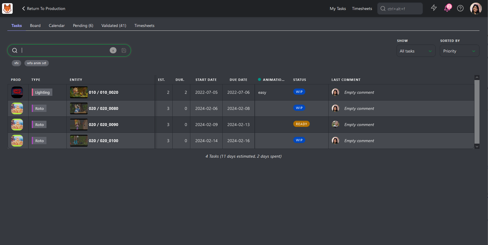

# Getting Started as an Artist

This guide will help you get started and understand the Kitsu's key features as an artist.

---

## Initial Setup and Profile Customization

Start by setting up your profile to update your personal details and customize Kitsu’s interface. This will help your team recognize you and allow you to tailor notifications and settings to fit your workflow.

1. **Access Your Profile**:  
   Click your avatar at the top right of the screen, then select **Profile**.

2. **Customize Your Experience**:  
   - Update your name, email, phone number, timezone, and website language.  
   - Upload an avatar photo to help others recognize you.  
   - Choose notification preferences (email or Slack).  
   - Customize the **Theme** color and toggle the **Support Chat** visibility.

:::tip Pro Tip
This section also provides quick links to **Documentation**, **Tutorials**, our **Discord** community, **YouTube** channel, and our public **Roadmap**, ensuring you have access to helpful resources at any time.
:::

For security purposes, it’s highly recommended to replace the default password with a strong and unique one.

---

## Managing Your Assignments

Your **My Tasks** page is your main hub for assignments and opens automatically upon login. Here you can see a list of tasks you are assigned along with some key information.

### Key Information Available:
- **Production**: The project your task is associated with.
- **Entity**: The specific asset or shot assigned to you.
- **Estimates & Duration**: Time-related information for your tasks.
- **Due Date**: The deadline for completing your task.
- **Status** and **Priority**: Key details to understand task urgency.

### Additional Features:
- Under the **Show** dropdown, you can choose to display **All Tasks** or focus on those **Due This Week**.
- Under the **Sorted By** dropdown, you can sort tasks by **Name**, **Priority**, **Status**, **Estimation**, or **Last Comment**.
- Use these filters to narrow down your list of tasks, or use the search box to find a specific task.

You can access **My Tasks** via:
- The shortcut at the top of the screen.
- The **User** section of the main menu under **MY TASKS**.
- Clicking the Kitsu logo. 

---

## Updating Task Progress

Once you've made progress on your task, you'll want to update your team on its status.

### Updating Task Statuses
1. Click the task’s **Status** icon on the **My Tasks** page or the relevant asset page.
2. Add comments to provide updates or ask questions.
3. Change the status (e.g., from "Ready" to "WIP").
4. Click **Post** to save changes.

You can edit your most recent comment by clicking the **History** button and selecting **Edit**. 

---

## View Your Assignments (Board View)

The **Board Tab** displays tasks organized in columns based on their status. Each task card includes:
- A Thumbnail
- Task type name
- Entity name

- Clicking a card opens a panel on the right to view or add comments.  
- To update a task’s status, drag it to the desired column.

---

## View Your Assignments (Calendar View)

The **Calendar View** displays tasks according to their **Start** and **Due Dates**. Tasks spanning multiple days are visually extended across the calendar.

- Clicking a task opens the right-side panel for updates and comments.  
- Like other views, you can sort and filter tasks here.

---

## Share Your Concepts

If you're a **Concept Artist**, you can upload and share concepts for review.

### Uploading Concepts:
1. From the **Todo Page**, click **Return to Production** to access the dashboard.
2. Navigate to the **Concepts** page via the main menu.
3. Click **Add a new reference to concepts** and upload your files.

### Linking Concepts to Assets:

Once a concept has been uploaded, you'll want to link it to an asset to ensure it is associated with the correct production element, making it easier for your team to reference and provide feedback within the proper context.

1. Open the concept’s comment panel and click **Link**.
2. Select the assets you want to associate with the concept.

---

## Request a Review

Once your task has been completed, you can submit it for review. To do this:
1. Change the task status to **Waiting for Approval (WFA)**.
2. Attach a preview file by dragging it into the upload area or clicking **Attach Preview**.
3. Click **Post** to finalize your submission.

Previous revisions are saved and remain accessible for reference.

---

## Complete Your Timesheet

If your production requires it, you can log your time spent using the **Timesheets** tab or the **Timesheets** shortcut button at the top of the screen.

### How to Log Time:
- Use the slider next to each task to record hours spent.
- For quick input, use the **1**, **4**, or **8 hours** buttons.

### Missed a Day?  
Click the date picker to backfill entries. You can also mark days as **Day Off** if you weren't working on that day.

