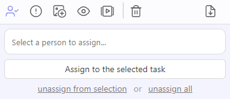

# Assign a task
Assign a task to a user will help you on several ways:
- You know exactly who is doing what
- The user knows what they have to do
- they can enter timelog per task
- You can see per users what they have to do
- You can see the task groupes by users on the detailed taks type page
- you have an overview of your studio thanks to the team schedule
- You can forcast the speed of your team
- you can see the real speed of your team

## Add a User to the Team

On the **Introductions to Kitsu Basics** - **Preparation of your Team** we cover how to add people to Kitsu, set them a level of permission, and link them to a department.

You need to add someone to a production to assign him a task.

On the dropdown menu at the top of the page, select the **TEAM** page.

On the **Team** page, you can see all the assignations for a specific project.
Switch to the page's top if you want to check another project team.

::: warning
Permission and department are set to the **Studio Level**.
You can't adjust it at the production level.
:::

## Assign Tasks from global page

We can now return to an entity page via the dropdown menu (asset/shot/sequence/episode/edit)

Now it's time to do your first assignment!

Click on the task (1) you want to assign.

::: tip Definition
A task is the intersection of an Entity and a Task Type.

It's visually represented in Kitsu by the Status on the task cell.
:::

The **comment panel** appears on the right of the screen with the action tools.

You can now do the assignment. Click on the text input to see
the list of available people. Click on a person's name to perform and select
him. Then click on the confirmation button to complete the assignation.

You can assign tasks to the same person in one step (1). Once the blue menu is visible, press **ctrl** on your Keyboard and select
multiple tasks. You can even use the **shift** key to choose a range of tasks
(2). When you have chosen everything you need, apply with the **Confirm**
button.

In the same way, once you have selected someone, you can click on
 **or unassign from selection** to remove this assignation.

When you finish all the assignations, quit this mode using the **Escape** key,
or the cross on the top right corner of the action box.

Now you can see the avatar of the Artist next to each status.

To unclutter the list, you can hide this information with the **Hide
assignations** button on the top of the spreadsheet .

Once you assign someone, he is part of the production team. Depending
In his position (Artist, Supervisor, Vendor), he only sees the production where
he's assigned.

Now, everybody knows what to do and who is doing what!

## Assign tasks from detailed Task Type page

You can decide to assign task from the detailed task type page.
the advantage if that you can focus in only one task type and have more information, as for the lenght for a shot or focus on a specific asset type.

In the Detailed Task Type page, click on a status to open the comment panel.

From here you ahve the same option as for the global page.

You can select one or several task at the same time to assign a user.

