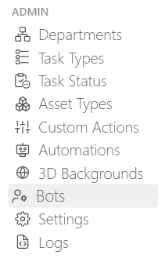
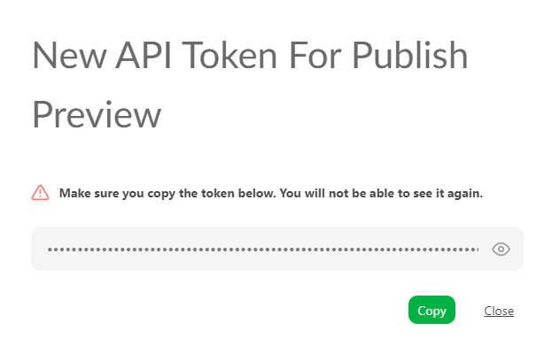

# Bots

Bots are used to avoid having to log in as users, and to have a non-physical user who publishes scripts.

::: tip
Bots don't count as active users, idenpendently of your subscription, you can create as many bots as you need.
:::

The Bots page allows you to manage your bots like any user;
* with a role, 
* an expiration date, 
* satus as active or inactive

## Why use a bot

The main use is for scripting with gazu, and anything else that can use our API.

You have access to all the API except for certain routes limited to real users.

::: warning
When you first create a bot, you get a window with a **JWT token**, which you need to keep, it's with this token that you connect to the API
:::

## How to create a bot

On the **Main Menu**, under the **Admin** part, go to the **Bots** page.



On the **Bots** page, click on the  button.

A popin will open, you can fill the 
- Name of the bot
- An Expiration date (if needed)
- Link the bot to a departement
- Define the role of the bot
- Activate it or not


Here is an example of the creation of a bot:


Once you click on **Create user** on new popin with the **API token** for your bot will be displayed



## Bot example

This example is used to retrieve the entire project **MyProduction**.

```js
import gazu
gazu.set_host("yourkitsu.cg-wire.com/api/")
gazu.set_token("my_jwt_token")
p = gazu.project.get_project_by_name("MyProduction")
```

The aim is to avoid using a user, with login and password, but to still have an identifier to know who does what.


Depending on your needs, if you have a bot that publishes comments, you can think about permission, and give it the same rights as a physical user.

The advantage in terms of security is that if ever the token has leaked somewhere, you can regenerate a new token, which revokes the old one.


