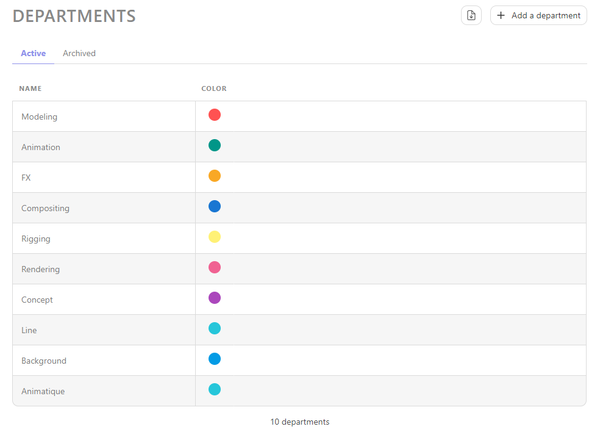
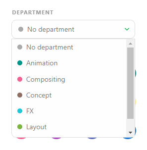
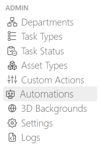
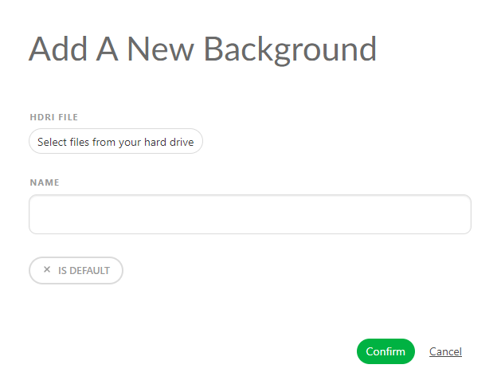

# Getting started with Kitsu

With Kitsu, users can track various production projects, encompassing 2D and 3D production, VFX, video games, and other related endeavors.

The content tracked by Kitsu can be as simple as still-frame advertisements, to extensive 3-hour feature films, accommodating projects with varying numbers of elements

But before jumping into our production, we must first configure our **Studio Workflow**.

::: warning Definition
A workflow is defined as the structured coordination of tasks constituting the operational processes within a production.
:::

For example, within a CGI production, tasks such as modeling, rigging, and shading are undertaken to finalize an asset.

::: warning Definition
- Processes such as modeling, shading, etc., are referred to as a **Task Type**. 
- An individual objects such as asset, shot, etc., are called **Entities**.
- A **task** can be defined as a specific action or activity that needs to be done. Tasks can be attributed to **entities** and will usually be categorized with a **task type**.

:::

Entities with corresponding tasks form foundation of your asset workflow. Each task will then be assigned to an artist. Once you have determined your assets workflow, you will do the same for the shots, sequences, etc.

Once the workflow for tasks is defined, the next step involves establishing an **Approval Workflow**, which entails defining all the statuses utilized for communication within the team. Statuses will also be useful for tracking the progress of your production.

The **Workflow** of your production is the sum of your Tasks and Status.

In Kitsu, you have two kinds of **libraries**:
- The first is the **Global Library** at the studio level.
Only the Studio manager has access to it.

- The second is the **Production Library**, where you will pick elements created in the global library to fill out.

The idea is to keep each production separated with a specific workflow.

Your **Global Library** is where you can create and modify departments, task types, task statuses, asset types, and status automation. You can create as many elements as needed, name them as you wish, and select the best colors and options to suit your needs.

Once your **Global Library** is populated, you can fill out the **Production Library** with the newly created elements from the **Global Library**.

## Create Departments

Departments are designed to help supervisors and artists focus on their tasks. Once a user is linked to one or more departments, supervisors and artists gain direct access to a filtered view of all tasks associated with that task type. Departments are also used to define what metadata columns appear for users within that department.

If a metadata column is linked to a department, then they will only show up for users in that department. If a metadata column is not associated with a department, they will show up for everyone.

::: tip 
By default, Kitsu provides some example departments to help you get started.
:::

Defining your studio's Departments is typically the first step in setup, as multiple objects such as people and task types are linked to a department.

On the main menu  select the
**DEPARTMENT** page under the **Admin** section.

If you need to create more departments, you can click on the  button.

When adding a department, you need to define:

- The name of the department
- A color (it will be displayed as a small round circle next to a column task type or a custom column)

Click on **Confirm** to save your changes.

Once you finish creating the department, your page should look like this. Whereby each department has a unique name and corresponding color. 

## Studio Workflow: Create a New Task Type

Next, let's create all the **Task Types** needed to manage and track our production. Task types could be associated with multiple entities such as assets, shots, sequences, episodes, or edits.

From the main menu  select
the **TASK TYPES** page under the **Admin** section.

::: tip 
By default, Kitsu provides some example task types that can be used for a CGI production. You can rename or remove any that are not relevant to your production.
:::

You will notice that these **Task Types** are already linked to a department.

You can click on the 
button to create new **Task Type**.

Next, you will need to supply some information about your task type, including:

- The name of the task type
- If team members need to time log their work for tasks with this task type
- For which entity it will be used
- To which department it should be linked
- The color (this will be reflect in the background color on the main spreadsheet page)

You'll notice that the **Departments** we created previously are available as an option to link task types to. Connecting a department to a specific task type can help your team stay organized.

Click on **Confirm** to save your changes.

::: warning 
Newly created task types will appear at the bottom of the list
:::

To adjust the order, simply click on the **Task Type** and drag it to its appropriate position in the list.

Congratulations, your task type has now be created in your **Global Library**. 

::: warning
Once you have created your production, you need to add the **Sequence**, **Episode**, and **Edit** task types to your **Production Library**.
:::

::: tip
At any point during production, you can revisit this section to create additional **Task Types** as necessary and add them into your workflow.
:::

## Specific Asset Types Workflow

Once you have created your global Workflow, you can then define your **Asset Types**

Much like how shots can be organized by a sequence, an asset can be organised by it's **Asset Type**. Think of it as using folders to organize all your assets by category.

On the main menu  select the
**ASSET TYPES** page under the **Admin** section.

::: tip
By default, Kitsu provides some example asset types that can be used for a CGI production.
:::

To create new **Asset Type**, click on the  button.

Next, you will need to supply some information about your **Asset Type**, including:

- The name of the asset type
- A workflow for the specific asset type

Different Asset Types will have distinct workflows. For instance, you might have fewer tasks for an Environment compared to a Character, as Environment assets typically don't require Rigging tasks.
 

When you **create** or **edit** an **Asset Type**, you can add a specific **task type**; if you don't select a specific workflow for this asset type, your production asset workflow will be applied.

However, if you choose specific Task types for this Asset type, only these will be applied to production.

Click on **Confirm** to save your changes.

Your new **Asset Type** is now created in your **Global Library**. It will be available to use when you create your production.

::: tip
At any point during production, you can revisit this section to create additional **Asset Types** as necessary and add them into your workflow.
:::

## Approval Workflow: Task Status

Next, let's create the statuses we intend to use during our **Approval Workflow**.

On the main menu  select the
**TASK STATUS** page under the **Admin** section.

::: tip
By default, Kitsu already provides some examples Statuses.
:::

A status represents a specific stage or condition that a task or must pass through as part of the review and approval process.

For example, the **Ready**  status indicates that the artists have everything they need to start working and should not begin their tasks without reaching this status.

**WIP** : The **Work in Progress** status is used by artists to inform their team that they are actively working on the task, indicating that there is no need to assign it to someone else.

**WFA**: The **Waiting-For-Approval** status is used by artists to notify their supervisors that they have completed their work and are awaiting review. Supervisors can also use a similar status to inform directors that work is ready for review.

**Done** : The **Done** status indicates that all work has been validated and approved. This indicates that the current task is complete and the next step in the process can commence.

**Retake** : The **Retake** status indicates that a comment has been made, prompting the artists to continue working on their task and publish a new version until validation is achieved.

These **statuses** are just examples of what is achievable in Kitsu. You are free to create your own as needed.

To do this, from the main page, click on the  button.

You'll then need to define some details about you **Task Status**, including:

- **NAME**, the explicit name of the status that will be displayed when you hover your mouse over it in the.
- **SHORT NAME**, what will be displayed in Kitsu.
- **IS DEFAULT**, the first status that Kitsu will display by default on all tasks. You can only have **ONE** default status in Kitsu.
- **IS DONE**, if this status is utilized to validate a task (which is beneficial for quota management, organizing the to-do list, and updating episode statistics).
- **HAS RETAKE VALUE**, if this status is used for commenting on a task (helpful for tracking the back-and-forth discussions on the task type page and for the episode stats page).
- **IS ARTIST ALLOWED**, are artists allowed to set tasks to this status? If **No**, the artist won't see this status in their list of available statuses. However, they can still post comments on it.
- **IS CLIENT ALLOWED**, Can the client use this Status? If **No**, the client won't see this status in their list of available statuses.
- **IS FEEDBACK REQUEST**, if this status is used to request a review (helpful for quota tracking if you don't use a timesheet, it will appear in the Pending tab of the to-do list, and all these statuses will be grouped on the **My Check** page. Kitsu will prompt you to **publish a preview** each time you use this status).
- Finally, choose a background **color** you prefer for this status.

Click on **Confirm** to save your changes.

Your **Status** is now created in your **Global Library** and will be available to use in your production.

::: tip
At any point during the production, you can return here and create more **Task Status** if needed, 
and then add them to your production.
:::

::: warning
You'll notice a few tasks statuses listed under the category of *Concept Status*. These are used by the system and while you can modify them here, you cannot create new ones.
:::

## Automation

### Create a New Status Automation

A **Status Automation** defines rules or conditions that automatically trigger changes in the status of tasks based on predefined criteria. You can set up **Status Automation** for both asset and shot tasks.

For assets, you can establish **Status Automations** between tasks. For example, when the concept task status is set to `done`, the downstream modelling task status is automatically changed to `ready`.

Additionally, you can create **Status Automations** that update the **Asset Status** based on task statuses. For example, when the concept task is set to `done` , then the linked asset status is set to ``ready``.

::: tip
You can also ask Kitsu to **copy the latest preview** with the Automation.
:::

Go to the main menu   and select **Automation**.

From this page, you can create **Status Automations** by clicking the **+Add status automation** button.

You have the option to create **Status Automation** for either the **asset** or the **shot**.

Next, you can select the **task type** and the **status** that will trigger the Automation.

You can specify which **Task Type** will respond to the Automation and select the **Status** that will be changed.

You need to change the trigger from "Status" to **Ready For** in order to initiate the change in **Ready For** status.

You will notice the **Applied Task Type** will now display **Shot task type**.

To create a **Status Automation** for shots, you must change the **Entity Type** to shots.

Your new **Status Automation** is now created in your **Global Library**.

::: warning
You must add status automations to your **Production Library** once you have created your production.
:::

::: tip
At any point during the production, you can return here and create more **Status Automations** if needed, and then add them to your production.
:::

## 3D Backgrounds

### Create your global library of HDR files

The 3D Backgrounds feature enhances your review of 3D files (`.GLB`) by incorporating an `.HDR` background to make things easier to review.

The `.GLB` file format is a binary container that encompasses various 3D assets and resources. These assets may comprise 3D models, textures, materials, and animations.

::: warning Definition
It means you can review your 3D files with lighting information.
:::

In this section, you can create your own. `.HDR` files library that you can use in your production.

Go to the main menu , and select **3D Backgrounds**.

From here, you can add a `.HDR` Background by clicking the **+Add a new background** button.

From this point, you'll need to select your `.HDR` background, provide a name for it, and decide whether you want this `.HDR` to serve as the default background.

::: tip
Checking the `Is Default` option means this HDR will be applied across your entire production instead of the default grey background.
:::

Once you have uploaded all your `.HDR` files, Kitsu will display them as a list.

Your new **3D Background** is now created in your **Global Library**.

::: warning
You must add them to your **Production Library** once you have created your production.
:::

## Settings

Several global settings can be configured that apply to your studio, such as replacing the default Kitsu logo with your studio's logo.

To do this, click on the main menu button 
, then under the **Admin** section, click on the **Settings**.

Click on the **Set studio logo** and select an image to use. This will replace the Kitsu logo on your site and in various places across the app. You can also change the **Studio Name** to be used in your Kitsu instance.

The remaining settings on this page are global settings that affect every production. Some of these include:

- How many hours per day should your team be working.
- You can opt to use original file names for downloads.
- Display images in HD quality by default. Use this option only if you have a very fast internet connection.
- Regarding the timesheet, you can also restrict artists from modifying timesheets older than one week.

Finally, you will also find settings relating to various chat integrations. Please refer to [Chat Integration](../chat-integration/README.md) section for more information on how to configure this.

::: warning
Remember to **Save Settings** at the end once you are finished.
:::
