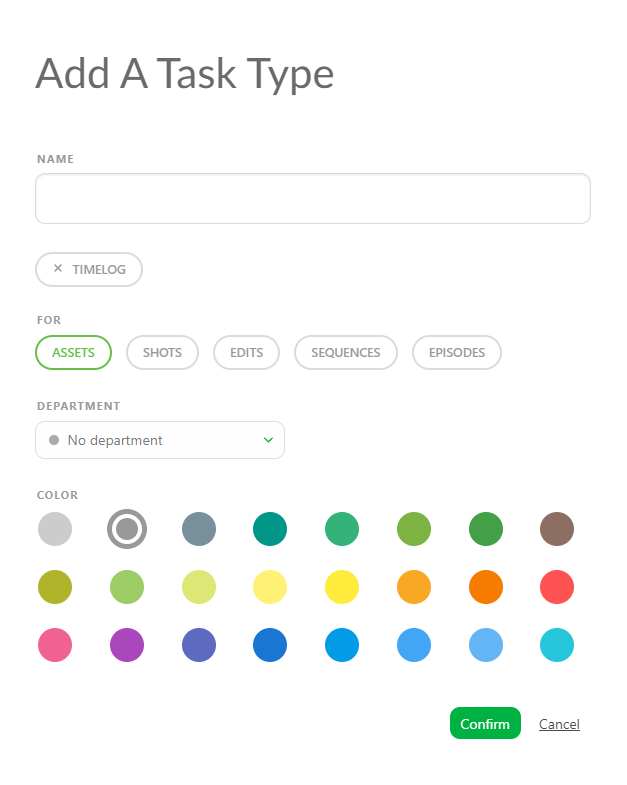
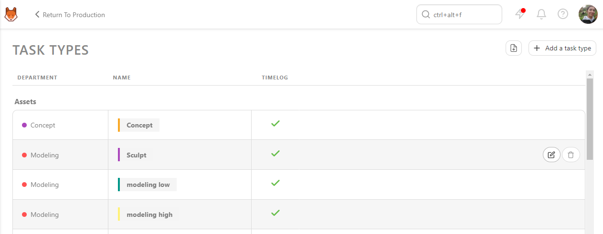
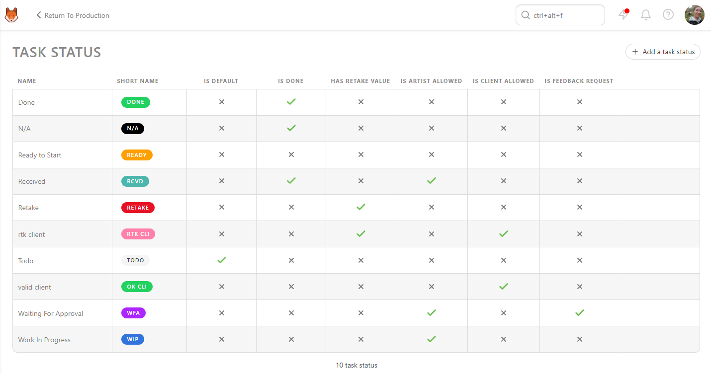
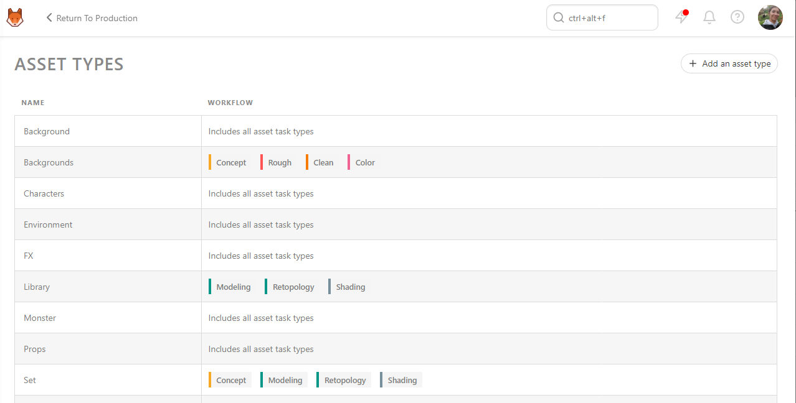
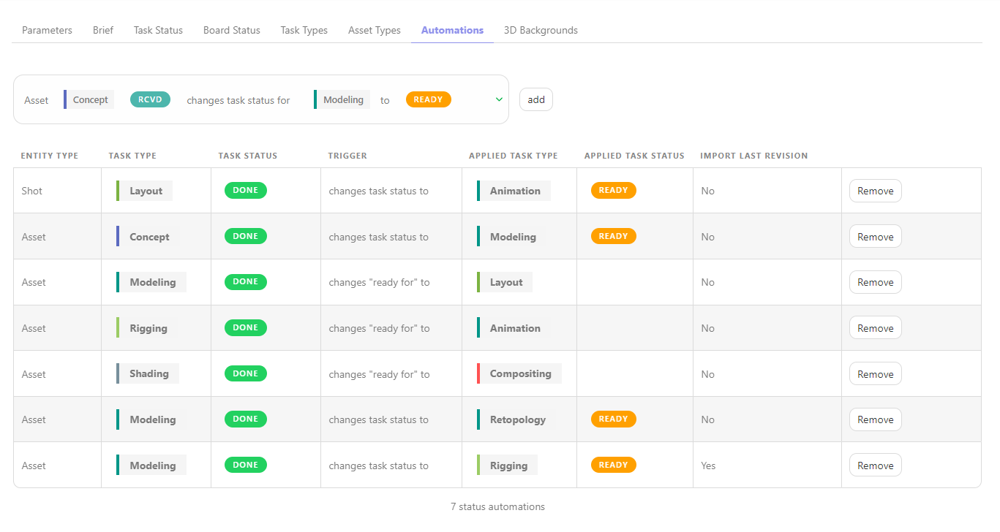

# Pipeline customization

You can modify Kitsu to fit your **studio vocabulary** for the asset / Pre-production, task type, Status, etc.

You can also **add custom metadata columns** on the global page of the asset, edit, episode, sequence, and shot.

In Kitsu, you have two kinds of **libraries**:
- The first is the **Global Library** at the studio level.
Only the Studio manager has access to it. 

- The second is the **Production Library**, where you will pick elements created on the global library to fill it.

The idea is to keep each production separated with a specific pipeline.

You can create and modify the department, task type, task status, asset type, and status automation on the **Global Library**.

You can create as many elements as possible, give the name you want, and choose the best color and options that fit your needs.

Once your **Global Library** is populated, you can fill the **Production Library** with the newly created element from the **Global Library**.
 

## Task Type

### Create a new Task Type

On the main menu  select 
the **TASK TYPES** page under the **Admin** section.

On the main page, click on the 
button.

On the new pop-up, you can define your personalized task:

- The name of the task type
- For which entity it is used
- If the artists need to time log their work for tasks with this task type
- To which department is it linked
- The color 

Click on **Confirm** to save your changes.

Per default, the new task type will be at the bottom of the list. 
To change the order, grab the **Task Type** and move it to its rightful place.

Now your task is created on your **Global Library**. 
You need to add it to your **Production Library** to be able to use it.

You need to return to your production with the **Return To Production** button on top of the screen.

Then, with the navigation menu, choose **Settings** 

On the **Drop down menu**, you can choose which **Task Type** you want to add to this production.

 
Validate your choice with the **add** button.

You can return to the **global asset or shot page** and add the new **task type column** to your production.

### Modify an existing Task Type

On the main menu  select the 
**TASK TYPES** page under the **Admin** section.

On the main page, you can edit all the tasks already created 
.

You can change: 

The order of the tasks by dragging and moving them to the wanted position.

- The name of the task type
- If the artists need to time log their work on this task type
- To which department is it linked
- The color 

Click on **Confirm** to save your changes. 
Now your changes are applied on all the productions the **Task Type** is used.

## Task Status

### Create a new Task Status

On the main menu  select the 
**TASK STATUS** page under the **Admin** section.

On the main page, click on the  button.

On the new pop-up, you can define your personalized task : 

- The name of the Status
- His short name, useful for the filters
- If this Status is used to validate a task (useful for the quota, to clean the todo list, and episode stat page)
- If this Status is used to comment on a task (useful to keep track of the back and forth in the task type page and for the episode stats page)
- Can the artist use this Status? If **No** the artist won't see this Status on his list. But he can post on top of it.
- Can the client use this Status? If **No** the client won't see this Status on his list
- Choose a color you like

Click on **Confirm** to save your changes.

Now your **Status** is created on your **Global Library**. 
You need to add it to your **Production Library** to be able to use it.

You need to return to your production with the **Return To Production** button on top of the screen.

Then, with the navigation menu, choose **Settings**.

On the **Drop down menu**, you can choose which **Status** you want to add to this production.

Validate your choice with the **add** button.

You can return to the **global asset or shot page** and use the new **Status** on your comments.

### Modify an existing Task Status

On the main menu  select the 
**TASK STATUS** page under the **Admin** section.

On the main page, you can edit some statuses already created 
. 
Except , which is part of the core
system.
But you can create a new custom **Default** status if needed.

 
You can change : 
- The name of the Status
- Its short name, useful for the filters
- If this Status is used to validate a task (useful for the quota, to clean the todo list, and episode stat page)
- If this Status is used to comment on a task (useful to keep track of the back and forth in the task type page and for the episode stats page)
- Can the artist use this Status? If **No** the artist won't see this Status on his list. But he can post on top of it.
- Can the client use this Status? If **No** the client won't see this Status on his list
- This option is linked to the quotas. This designed Status will stop the calculation of the quota
- Choose a color you like

Click on **Confirm** to save your changes. Now your changes are applied on all the production the Status is used.

## Asset Types

### Create a new Asset Types

On the main menu  select the 
**ASSET TYPES** page under the **Admin** section.

On the main page, click on the  button.

On the new pop-up, you can define your personalized **Asset Type**:

You will be able to choose a name and a specific workflow for this new **Asset Type**.

Click on **Confirm** to save your changes.

Now your new **Asset Type** is created on your **Global Library**. 
You need to add it to your **Production Library** to be able to use it.

You need to return to your production with the **Return To Production** button on top of the screen.

On the **Navigation Menu**, choose on the drop-down menu the **Setting**.

On the **Asset Types** tab, you can choose which **Asset Types** you want to add or remove on this production, 

Validate your choice with the **add** button.

You can now create a new asset under this **Asset Type**.

### Modify an existing Asset Types

On the main menu  select the 
**ASSET TYPES** page under the **Admin** section.

On the main page, you can edit some **Asset Types** already created 
. 

 
You can change the name of the **Asset Type** and define its workflow. 

For example, characters and backgrounds won't have similar **Task Yypes** pipeline.
The background won't use the rig for example.

Per default, all the **Asset Types** will use all the **task types**. 
You can select the task type you want to use for each asset types.

Click on **Confirm** to save your changes.

Your changes are applied to all the productions where the **asset type** is used, same 
for its workflow.

## Status Automation

### Create a new Status Automation

**Status Automation** is here to do the heavy lifting for you.

You can create **Status Automation** for the asset and the shot tasks.

For the **asset**, you can choose to create **Status Automation** between tasks. 
For example, the modeling status must be ready when the concept is validated. 

You can also create status automation that changes the asset status according to a task status; for example, when the concept is validated, the asset is ready for the storyboard.

Go to the main menu, and select **Status Automation**.

Once on the new page, you can create **Status Automation** by clicking the **+Add status automation** button.

You can choose between creating **Status Automation** for the **asset** or the **shot**.

Then you can choose the **task type** and the **Status** that will trigger the Automation.

Then you can select which **Task Type** will react to the Automation 
and choose the **Status** that will be changed.

To trigger the change of **Ready For** Status, you need to change the trigger from Status to **Ready For**.

You will notice the **Applied task type** will now display **Shot task type**.

To create **Status Automation** for shots, you must change the **Entity Type** to shots.

Now your new **Status Automation** is created on your **Global Library**. 
You need to add it to your **production Library** to be able to use it.

You need to return to your production with the **Return To Production** button on top of the screen.

On the **Navigation Menu**, choose on the drop-down menu the **Setting**.

On the **Status Automation** tab, you can choose which Automation you want to add or remove on this production, 

Validate your choice with the **add** button.

You can see your Status updating thanks to the Automation.
