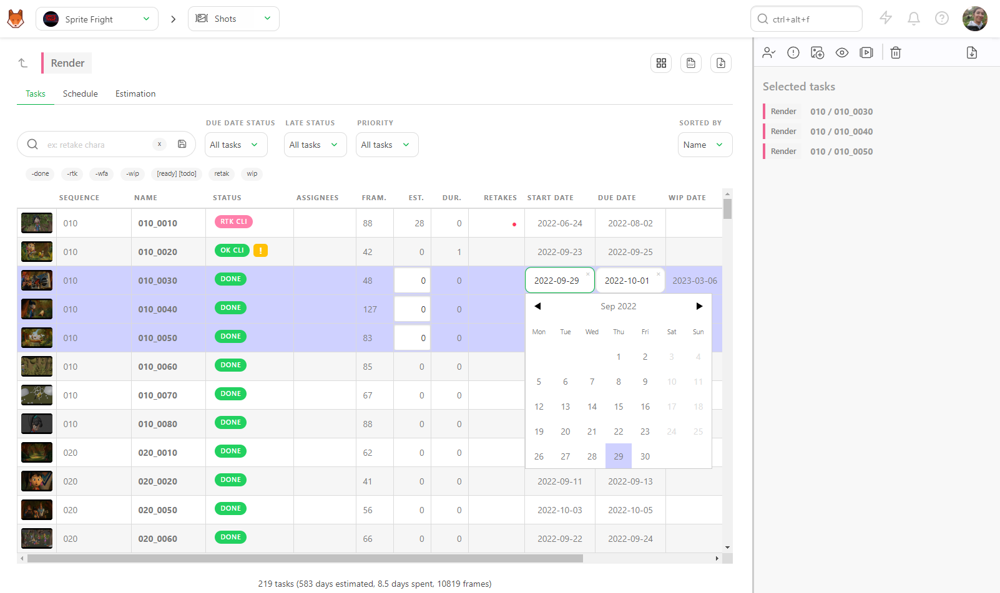

# Estimation and Team Speed (Quotas)

Estimating the time for each task can feel overwhelming, but the benefits far outweigh the effort. By filling out task estimations, you can:

- Clearly see the estimated days for any task in your production.
- Easily compare task estimates with actual time taken, allowing you to more accurately forcast tasks in the future.
- Adjust tasks from the entity schedule or team schedule once they have estimations, start, and due dates.
- Help your artists stay organized and be aware of the time they should spend on each task.
- Improve forecasting for your current and future productions.

Kitsu offers various features to help you easily track, review, and forecast task estimates. Let's look at some of the features that enable you to do this.

## Add an Estimation for a Task

To get started, click on the name of a task type.

You'll then be taken to the Detailed Task Type view. Here you can see a list of of every task of that specific task type, along with additional details.

To add an estimate to a task, click on the **Estimate (Est.)** field and input the number of days. You can select multiple tasks with **ctrl / cmd** or **shift** and apply the same estimate across all selected tasks.

::: tip
The duration represents how long your task actually took and is calculated automatically from logged time. We will cover this in more detail later.
:::

You can also define a **Start date** by clicking into the field, and choosing a data from the pop-up calendar.

The **Due date** is automatically calculated based on **Estimate** and **Start Date** provided.

### Detailed Task Type View Features:
Here is a summary of the cases and features you can leverage from the detailed task type view.

- See and change the status of tasks
- Assign people to tasks
- Add an estimate for the task (in days)
- View the cumulative sum of logged time from an artists timesheet
- Track the number of back-and-forths with the retake status
- Add a start date for the task using the calendar picker
- View the auto-generated due date based on the start date and estimate
- See the WIP and Feedback dates automatically filled in
- Monitor the latest comment section to keep an eye on the latest activity for this task type

## Forecast Your Team's Speed Using Estimated Quotas

To help you set accurate estimates, you can use the **Estimation** tab.

The left half lists the tasks with their assignments and the number of frames (1). Based on the **FPS** you have set for the production, the number of **seconds** will be automatically calculated (2).

::: tip Definition
**Quotas** visualize your **team speed**. 

You can see on average how many shots, frames, or seconds the artist needs to complete daily to finish all tasks within the **estimated number of days**.
:::

The right half shows the entire department team (based on the assignments you made), the number of shots they need to complete, the number of frames and seconds, and the average quota. You will also see the **Remaining** line, which gives you the current status of your team.

The last column is the **Estimation**. To modify the estimate, hover over the row with your mouse and click the editable area.

You can also select multiple tasks simultaneously to edit them all at once.

Every time you change the **Estimation** (in the number of days) on the right side, you will see that the **Average Quota** updates in real time.

For more information about the **Schedule** tab, refer to [Task Type Schedule](../schedules/README.md#Set-a-Task-Estimation).

## Team Real Speed: Quotas

Kitsu has two ways to calculate quotas per **task type**.

### Quotas Based on Timesheets
The first method is linked to the timesheet:
Shots are considered complete when the first feedback request is made. Quotas are then weighted according to the time spent on the task, as recorded in the timesheet by the artist.

In this example, Kitsu weights the daily quota based on the timesheet entries.

### Quotas Based on Status Changes
If no timesheet is filled out, Kitsu uses status changes to estimate the duration:
- The task is considered started when the first status change to WIP occurs.
- The task is considered completed on the day the feedback request is made.

Kitsu then distributes the completed frames across all business days between the start and end dates. It calculates the number of frames (or seconds, or tasks) completed per day/week/month per artist.

You can click on a number at any time to see its details in the right panel.

## Change Priorities

Priorities are often changing during a production, and you may want to easily highlight this change in priority to your team.

To do this, click on the space near a task's status (1).

The action box will appear.

Click on the icon in the action menu to choose **Change Priority**.

There are four levels of priority: **Normal**, which is the default value for all tasks, **High**, **Very High**, and **Emergency**. Save the changes with the **Confirm** button. 

As with changing statuses or assignments, you can change the priority across multiple tasks at the same time by selecting the tasks, and choosing **Change priority of the selected tasks**.

You will now see exclamation marks next to the task status. The more exclamation marks there are, the more urgent the task is.

* (1) is **Normal**
* (2) is **High**
* (3) is **Very High**
* (4) is **Emergency**

