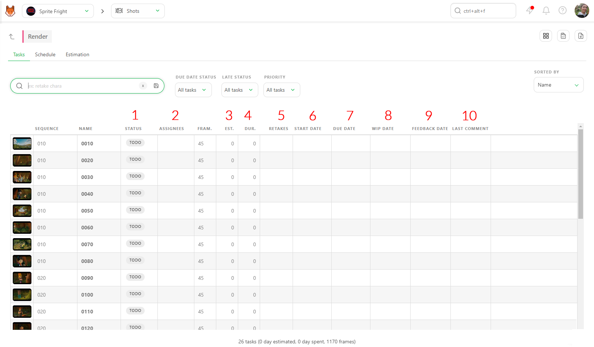
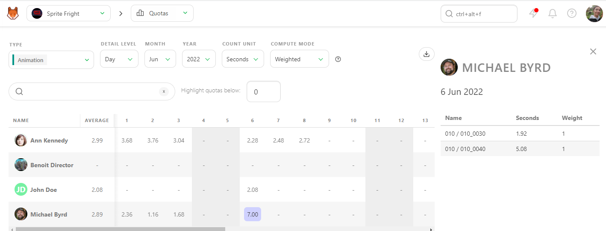

# Estimation and Team speed (quotas)

Filling estimation for each tasks can feel a bit overwhelming, but the benefit is worst the time spent.

If you fill each task estimation it will help you to:
- always see the estimated days for any task, task type, sequence, asset type, entity etc.
- With estimation and timesheet you are able to compare estimation vs reality
- Once a task is filled with estimation, start and due date, you will be able to adjust it from the entity schedule, or the teamschedule
- Help your artists to get better organize and selfaware of the time they should spend on a task.
- Better forecast your production and the next!

## Add an Estimation for a Task

Click on the name of a task type.

The new page is the **Detailed Task Type view**. You have more detailed information specific to this specific **task type**.

To add an estimation to a task, click on the line and type the number of days you estimate. You can select multiple assets or shots at the same time.

You can also define a **Start date** by clicking on it.
A calendar will open and let you choose your start date.

The **Due date** is automatically calculated with the **Estimation**.

To go further in detail with the detailed Task type's view :
-  You can see and change the status of a task
-  You can assign people to tasks

- You can add an estimation for the task (in day unit)
-  Kitsu calculates the sum of the timesheet fed by the artists
- The number of back-and-forths with the retake status
- You can add a start date for the task (with the calendar)
-  Kitsu calculates the due date with the Start Date and the estimation
- the Wip and Feedback dates are automatically filled
- The last comment section helps you keep an eye on the last activity of this task type.

## Forecast your team speed - Estimated Quotas

To help you set a correct estimation, you can use the **Estimation** Tab.

The left part of the screen lists the shots with the assignation and the number of frames (1).
Depending on the **FPS** you have set for the production, the number of **Seconds** will be automatically calculated (2).

::: tip Definition
**Quotas** is a way to visualize your **team speed**. 

You can see in **average** how many shot/frame or second artist has to do per day to finish all the task with the **estimated number of days**.
:::

 On the right part of the screen, you can see the full team of the department (depending on the assignments you made), the number of shots they have to do, the number of frames and seconds, and the average Quota.
 You will also have the **Remaining** line, which gives you the actual situation of your team.

 And the last column is the **Estimation**. To modify the estimation, hover the line with your mouse and click the editing zone.

 You can also select multiple shots simultaneously to edit them all at once.

 

 Every time you change the **Estimation** (in the number of days) on the right part, you can see in real-time that the **Average Quota** is updated.

 For more information about the **Schedule** tab, go to the
 [Task Type Schedule](../schedules/README.md#Set-a-Task-Estimation)

## Team real speed : Quotas

Kitsu has two ways to calculate the quotas per **shot Task Type**.

The first is linked to the timesheet :
Shots are considered ended on the first feedback request. Then, quotas are weighted following the time spent on the task (when the Artist fills his timesheet).

In this example, Kitsu has weighted the daily quota linked to the timesheet.

If no timesheet is filled, then Kitsu considers that:

The task was started at the first status change to WIP.

The task was done the day the feedback request was made.

Kitsu will split the done frames among all business days between the start and the end and grab the number of frames (or seconds, or tasks) submitted per day/week/month per Artist.

You can click on a number and see its details on the right panel anytime.

## Change Priorities

At some point in the production, you may want to prioritize some tasks and
pinpoint these urgent tasks to your team.

For this, we use the same technique as before. Click on the space
near a status task (1).

The action box appears.

Click on the icon of the action menu to choose
**Change priority**.

There are four levels of priority: **Normal**, which is the fundamental level of all the
tasks **High**, **Very High**, or **Emergency**. Save the changes with the
**Confirm** button.

As we have done for the assignation or the status, select the shots (1), select
the level of priority (2), and apply with **Confirm** (3).

You can now see next to the status of the task some **exclamation marks**. The
more there are, the more urgent the task is.

* (1) is **Normal**,
* (2) is **High**,
* (3) is **Very High**
* (4) is for **Emergency**.

