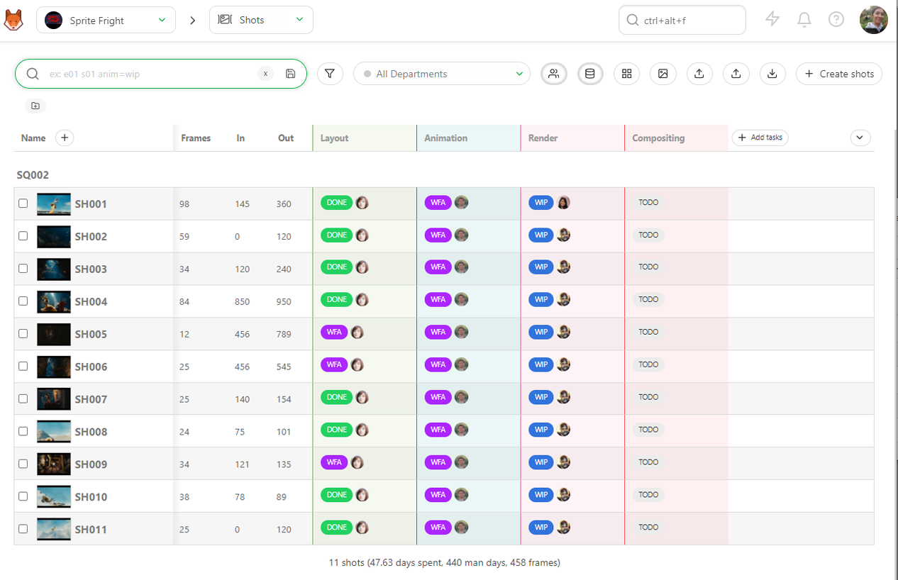
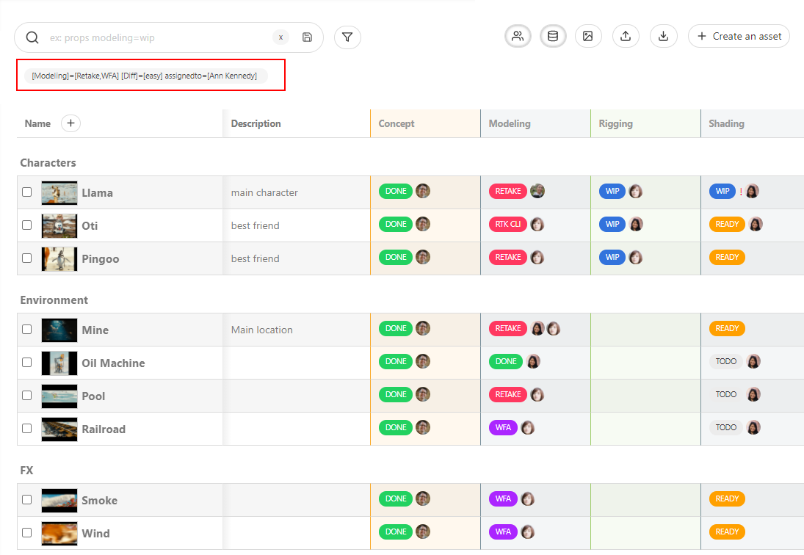
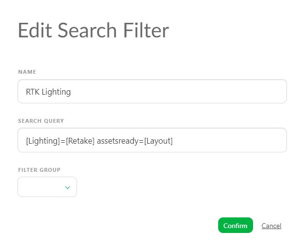

# Filters

## The Search Bar

In **Kitsu**, the filters are set through the **search bar**. It allows you to
**save** your search query. Once done, you can rerun your query with a
simple click.

You can find the **search bar** and the **save** option . in the following pages:

* Assets
* Shots
* Sequences
* Todo-lists

NB: The **search bar** is available too in the people episodes list.

The **search bar** query is applied every time a new character is typed. You
You don't need to type everything to get a quick result.

For example, on the assets page, type the letter `Ot`, and you get the
result of all the assets starting with an `Ot`.

You can also search for some specific **type of asset**: `Props`, `Character`,
`Environment`, `Fx` ... The result displays all the assets of this type.

For example, let's search all the **FX** assets.

Another example gets **shots page** of a specific **sequence**.
For example, you can only see the shots of the second sequence of the first episode.

Select the first episode on the drop-down menu, then search `sq002`, the result
 gets all the shots of all the episodes from sequence SQ002.

In the same way, you can search **specific status** link to the task.

::: tip
You can create **filters** about **entities**:

* **Sequences** : `se01`, `se02` etc. or exclude : `-se01`, `-se02` etc.
* **Asset Type** : `characters`, `environment`, `fx` etc., or exclude `-characters`, `-fx`, etc.

You can also create **filters** about **task status** by following this syntax:
**task=status**.

Examples:

* Layout is a work in progress (wip) : `layout=wip`
* Concept is waiting for approval (wfa) only for the fx: `concept=wfa fx`
* On sequence 2, Layout is wip: `se02 layout=wip`
* Animation is retaken, and Render is waiting for approval (wfa) `animation=retake render=wfa`.
:::

## Filter Builder

The easiest way will be to use the filter builder.

Under the **Task Status** click on the **+** and select the **Task Type** and the **Status** you want to filter.

Valid with **Confirm**.

You can be even more specific. Let's focus on the shots that are still in retake at the animation stage and have already started at the render stage.

On the **Filter Builder**, Search for task type and status (add more task types with the **+** below the first task type) and a metadata column.

Valid with **Confirm**.

You can also search for an **assigned** or **unassigned** task for a specific type of task.

Next to the search bar, you have the icon of the **Filter Builder**

When you click on it, a pop up opened and gives you several choices for your filtering;

You can filter per **Status** on a **Task Type**, you can also filter through the custom metadata column,

You can filter the global page by assignation, per artist, or lack thereof.

Finally, you can filter by the presence of thumbnails.

You can add several filters. Once done, validate your choice with the **Confirm** button.

You may need to filter, for example, all the tasks that are in **WIP** and **Done** status

When you click on it, a pop up opened and gives you several choices for your filtering;

Under the **Task Status**, choose the name of the task type you want to filter. Then, instead of **Equal**, choose **IN**.
You can now add more status to this filtered task type.

For example, we want to see the modeling tasks in WFA **AND** in RETAKE.

Click on the filter builder and choose the task type Modeling, IN retake, and WFA

Then validate with **Confirm**.

You can now see the result.

You can save your filter with the  save button.

## Save and Organize your Filter Queries

Kitsu allows you to save your research. You can save them by pressing the
**Enter**, or click on the **Save** button
.

Now, under the **search bar**, you can see your saved queries as buttons.

The buttons are there every time you return to this page. They help you run common queries faster.

::: details Rename a Saved Filter

Once you have created your filter and saved it, it will appear as a button under the search bar.
The Search can be complex and not easy to read.

You can rename the filter with a more explicit choice of words.

For example, you want to filter the tasks in RETAKE and WFA in modeling, making the difficulty easy and assigning them to Ann.

The saved filter is quite long and hard to read. Hover your mouse over the saved filter. You will see two icons, one to edit and the other to delete.

You can now change the name displayed in the **Name** section in the pop-up window.

:::

::: details Delete a Filter

If you have created a **filter button** by mistake, click on the cross next to
it .

The result of the filter is displayed, but the button is not. Just
cancel your research by deleting the text or use the cross next to the Search
bar 
:::

## Pre-build Filters
