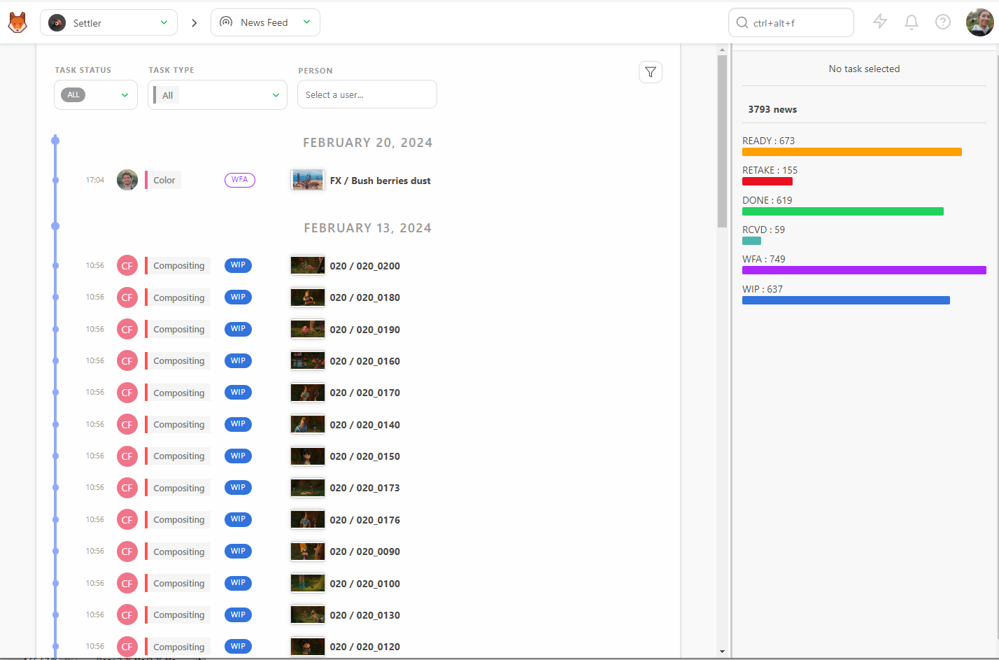
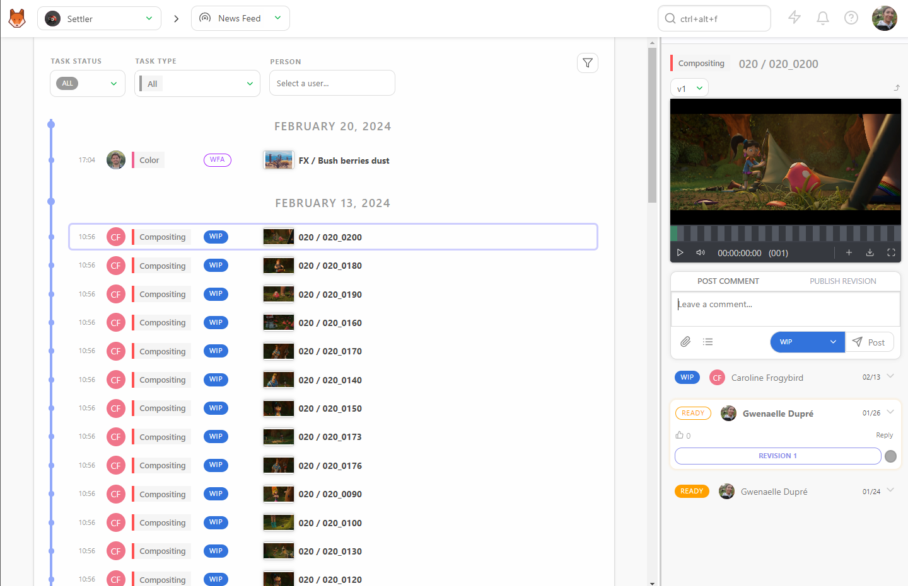
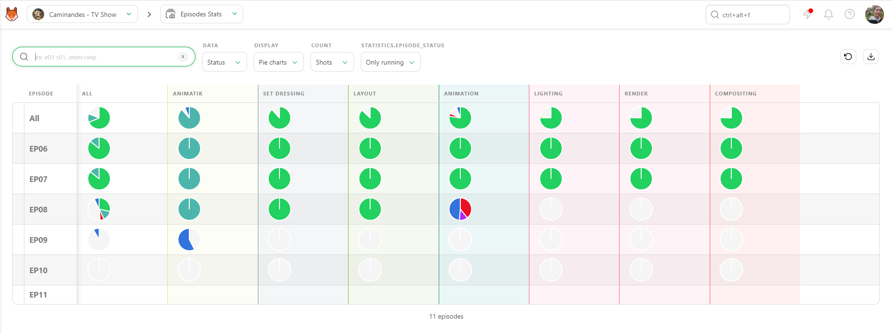
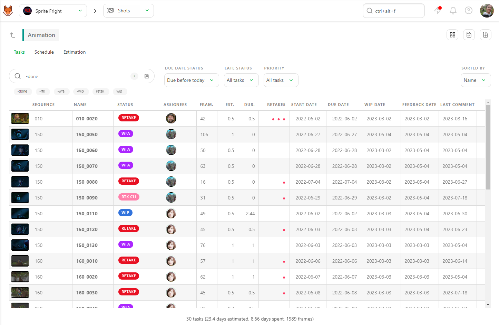
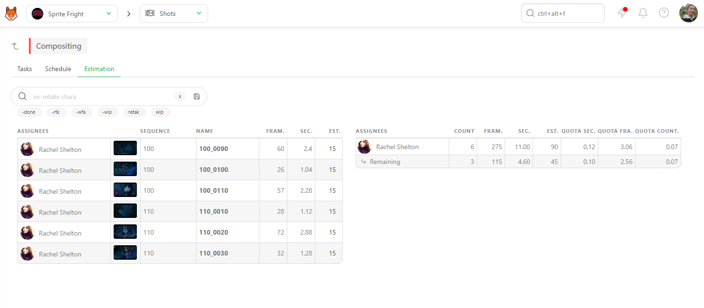
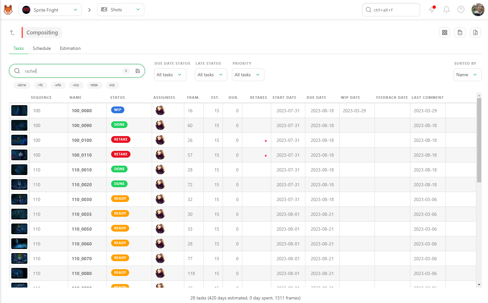
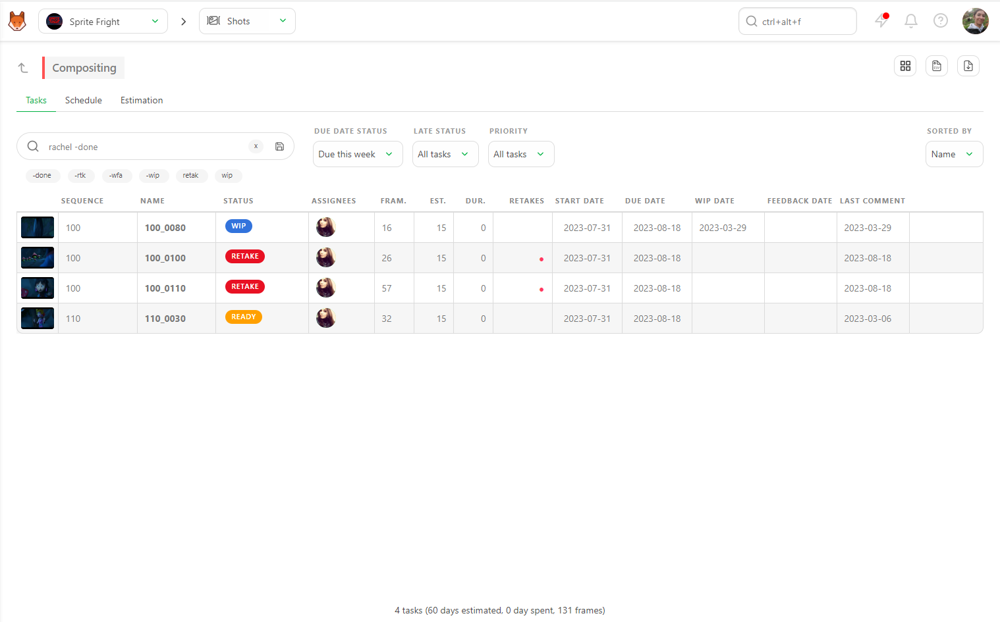
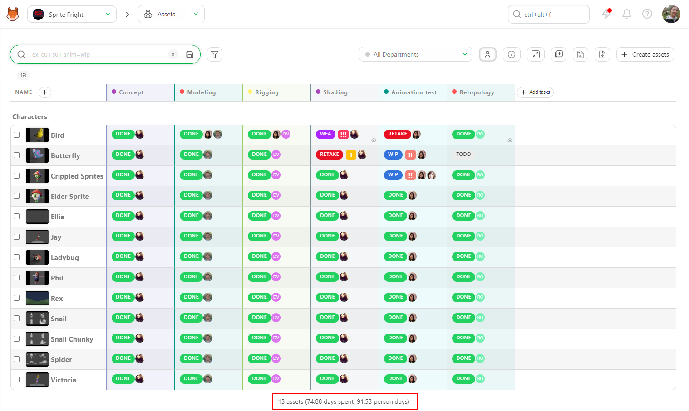
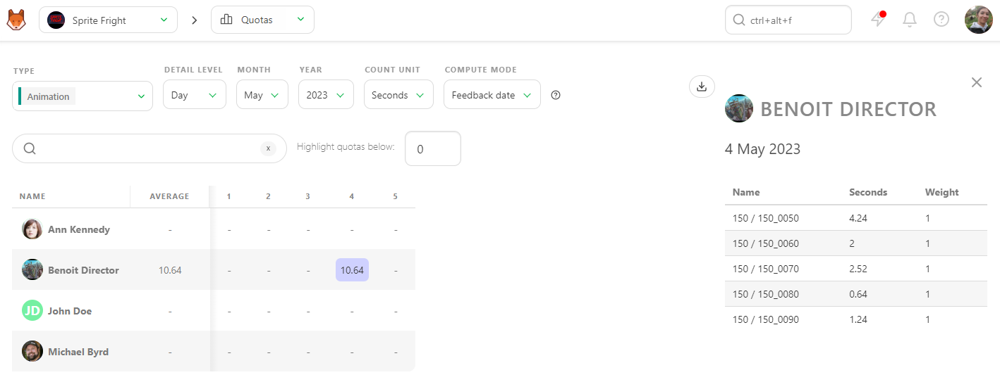
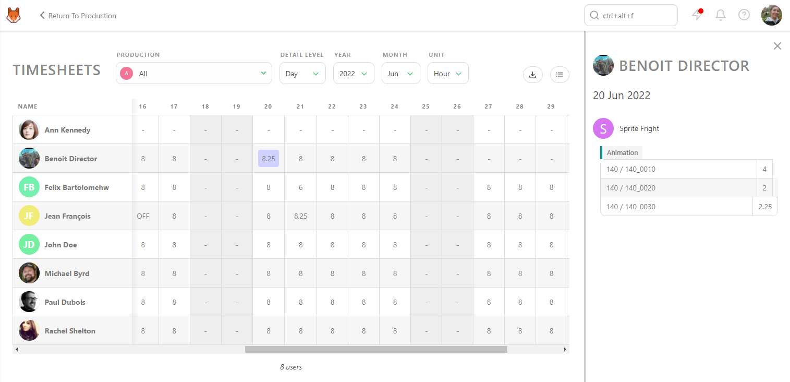

# Build your Production Report as a Production Manager

## Know Everything that is Happening in the Production

As Production, you need to know everything.

Usually, it's done by knowing everything by heart all the time. Meaning you can see that a status has 
changed because you remember the previous status and notice the change.

Otherwise, you could subscribe to all the tasks and be drowned by the notification, which will get you out of
 focus every time you stop what you are doing to read them.

The perfect solution will be to have all the production changes on one page, always up-to-date.

Welcome to the New Feed page.

Here, you can see all the status changes minute by minute.

You can filter the list per **Task Status**, **Task Type**, and per **Person**.

If you click into a line, the comment panel will open on the right and give you all the information you need.

If you click on **Show Stats**, you will see the sum-up of the number of news, the total number, and the per status number.

With the **Filters Builder** button, you can define the time frame to display the information.

For example, if you want to focus on a supervisor, for example, for a specific month, you can select its name and then pick a date on the **From** box.

## Know the Current State of the Production - Short / Feature

As Production, the important thing is to know the status of your Production anytime, anywhere.

So once again, you can learn everything by heart or look at the statistic pages.

With the **Sequence Stats** page, you have access to the pie charts of the whole production on a single page,
 sequence per sequence.
 
 The **color scheme** of the pie charts is the same as **the status**. So, with a glance, you know immediately what is
the state of your production.

The first line is **all sequences**, meaning the whole Production, and the first column **All** is all the tasks simultaneously.

If you focus on this first pie chart, you have the exact state of your Production. If you need more detail, you can look at the rest of the line for a global view of each task type state.

You have the same level of information for the asset with the **Asset Types Stats**.

You can also display data as **Counts**. This way, you'll see the exact number of assets/shots / frames with the percentage per status.

Export this page as a `.csv`text file and import it into spreadsheet software.

 ## Know the Current State of the Production - TV Show
 
You can access an extra information level on a TV show: **Episodes Stats**.

You have two ways to display data on this page. The first one is **Retakes**, the setting per default.

The **Retakes** display lets you see the number of retakes (back-and-forth) for each episode 
on each task type. Only three colors are displayed: the **validated as Green**, the **retakes as Red**, and the **in progress as Grey** tasks.
 

 If you unfold an episode, you will see the percentage of each take and the evolution of the retakes VS validation.
 
 It helps you to see the progress of each episode task per task.

 Usually, the first episodes have many retakes, but it should get better then.
 But, if late episodes still have many retakes, something must be fixed. It's time to discuss the issue with the director and the supervisor.
 
The second option on the display of data is the **Status**.
 
This status display works like the **Sequence** / **Asset Type** Stats page.

You can also display data as **Counts**. This way, you'll see the exact number of shots / Frames with the percentage per status.

Export this page as a `.csv`text file and import it into spreadsheet software.
 

## How to Know if a Task Type is Late

To know if a task a late, you need two things first. 

- Know the **Task Type** of the task
- Enter an **Estimation** in number of days, and an estimate **Start date** and **Due date** for the task.

When done, you can compare **estimation** versus **reality** on the **Task Type** page.

You can do it in two ways : 
- By filtering **Due Date Status**
- By looking at the **Gant Diagram**

Kitsu will automatically grab the date of the status of the **WIP** and **WFA**. You can now compare your
 **estimate start date** versus **when the Artist really starts**, and compare the **estimate due date** to **when the Artist ask for a validation**.
 

On the **Tasks** tab, the first filter you see is **Due Date Status**. 

Set it to **Due before today**. Kitsu will display all the tasks with a **Due date** set **Due Before Today**.

Once this filter is applied, you must sort out what is finished and what still needs to be finished.

You can use the filter **-Done** to filter all the tasks except those finished.

You can now see all the late tasks with the two filters applied, meaning they are only validated after the **Estimated Due Date**.

You can see the sum-up at the bottom of the page, which updates in real time depending on the applied filter.

 
You can export this page as a `.CSV` file and open it on spreadsheet software.

You can also use the **Late Status** filter built into the page.
 
With this filter, you can immediately see which tasks took more time than estimated **Estimation over Duration**

You can also filter which tasks are late with **Due date is late**.

We have two ways to calculate if a task is late, the first has **estimated due date** VS **Feedback**, and the second is versus **Done**. Depending on how you calculate it in your studio, you will always have the answer with Kitsu.

 On the **Task type Page**, go to the **Schedule** tab.

On the top part of the screen, you can see the **Start** and **End** date of this task type, as set on the production schedule.

The **Gantt Diagram** will be dark grey before and after these dates. Visually, you immediately
know if you are too soon or too late.

The final step is to change the **Coloring**. Per default, it's set on **Status color**, meaning all the bars will be colored as their actual status (blue = wip, green = done, etc.).

You will only see two colors with the **Late in Red**: **Grey** if the Task is still on time and **Red** if the Task is late.

You can return to the **Tasks** tab for more details. Kitsu will keep your filtered from tab to tab.

  
## How to Know if a Task Type may be late
 
Realizing that a task is late is good, but knowing if a task **may** be late is better. As **Production**, you always need to be ahead.

On the **Task Type** page, use the **Due Date Status** filter.

Depending on how much you want to know, you can focus on the **Due this week** and the **Due this month** filters.

You now have a global view of what is happening next. Feel free to use the **Status filter** for a more precise view.

For example, if you are on the **Due this week** view, you may want to see if there are still **Todo** or **Ready** tasks. 
There will likely be late if a task needs to be finished this week and hasn't started yet. 

To be sure, you must also check the amount of work assigned to the artists who haven't started yet.
Go to the **Estimation** tab with your filters still active.

On the **Estimation** tab, on the right part of the screen, you will see the sum-up of your artists.

The first line is the total number of tasks assigned to the Artist since the beginning of the Production. The second line, **Remaining** is what the Artist has left to do. 

If the artist still has plenty of tasks to do, he may miss the deadline. If he only has not started to do it, there is still a chance. But you need to keep an eye on those tasks.

## How to Know Why a Task is Late

Now that you know which tasks are late or will be late, you need to understand **why**.

There are several reasons why a task is late: 
- The Artist is overwhelmed and has too many tasks to do at the same time
- There is too much back-and-forth on this Task
- The Task needs to be more underestimated and easier to finish on time.
- The previous Task was already late

To check how many tasks an artist has, you can filter the **Task Type** page with the name of the Artist under the **Task** tab.

You can also add the **-done** filter to see what the Artist has left to do. Then add the **Due Date Status** filter to **Due previous week** or **Due this week** (depending on what you are looking for).

You can now see how many tasks your Artist has to do.

To identify the number of **Back-and-forth**, look at the **Retakes** column on the **Tasks** tab.

Each **Red Dot** is a **retake**. Click on the line to open the **Comment panel** and read the whole task history. 

It's the best way to understand what is happening. The artist misunderstood the brief, or maybe the brief changed with each version.

The next step is to check if the Task is not under-estimated. You can go back to the global page, click on the name of the shot or asset, and see the casting and all the extra information. 

Maybe there are too many characters in the scene, and maybe this is a big action scene.

Lastly, while you are on the detailed view of the asset/shot, you can check the previous Task. 
If you click on it, you will go to the dedicated **Task Type** page, and from there, you have detailed information about what was happening before.

## Estimation over Duration

It's time to focus on the big picture and have a global view of the **Bid**.

On all the pages, you can see the sum-up at the bottom of the page of estimation **Person days** VS the reality **Days Spent**.

On the global page of the shot, you can see the **sum-up** of all the estimations vs duration. But you can also use a filter. 

For example, you can focus on a specific sequence: filter your global page with the name of the sequence, and you will have the sum-up updated at the bottom.

This way, you will know the **estimation** vs. **duration** for this **sequence**.

You can also do the same kind of filter on the global asset page.

For example, you can filter on a specific **Asset Type**  as the **Character**. 

Once the global page is filtered, the sum-up at the bottom will update and give you the **estimation** vs. **duration** for this **asset type**.

## Estimation over Duration for a Task Type

Now that you know how to see the global view, it's time to focus on details.

You can click on the name of a **task type** and notice that you also have the sum-up at the bottom of the screen with **estimation** vs. **duration** for this level of detail.

You can get the global view or focus on a **specific status** or **Artist's name**. As on the global page, the sum-up will update at each filter.

## Estimation over Duration for an Asset / Shot

To go deeper into the details, you can display **Estimation** vs. **Time** (duration) for each asset and shot in Kitsu.

You can now see the sum-up of each Task for this specific asset or shot. If something looks not right, you can click on the asset's name or shot and go to the detail page.

On the detail page, on the top left of the screen, you have the sum-up of the asset/shot life. You have the details of each **Status**, **Estimation**, **duration**, **Start and due date**, and assignation.

## How to Check Quotas

Kitsu has two ways to calculate the quotas per **shot Task Type**.

The first is linked to the timesheet :
Shots are considered ended on the first feedback request. Then, quotas are weighted following the time spent on the task (when the Artist fills his timesheet).

In this example, Kitsu has weighted the daily quota linked to the timesheet.

If no timesheet is filled, then Kitsu considers that:

The task was started at the first status change to WIP.

The task was done the day the feedback request was made.

Kitsu will split the done frames among all business days between the start and the end and grab the number of frames (or seconds, or tasks) submitted per day/week/month per Artist.

You can click on a number and see its details on the right panel anytime.

## Check the Timesheet of the Team

All of the previous chapters are based on the fact that **estimation** and **duration** are filled for each task.

It means that everybody has to do their part. You and the supervisor will fill out the estimation, and your team will fill out the timesheet.

You can go to the main menu and see the Timesheet page.

On this page, you can see per day the timesheet of each team member, if they fill it every day, if they took a day off, and, more importantly, if they are doing extra time.

If you have a question about a timesheet, click on it and see the details of the Production, task type, and task.

Once everything is good at the day level, you can change the **Detail Level** from Day to Week, Month, and Year.

You can also see all the Productions you manage at once or view Production per Production.

As with all other pages in Kitsu, you can export this page as a `.CSV` file and open it on spreadsheet software.
