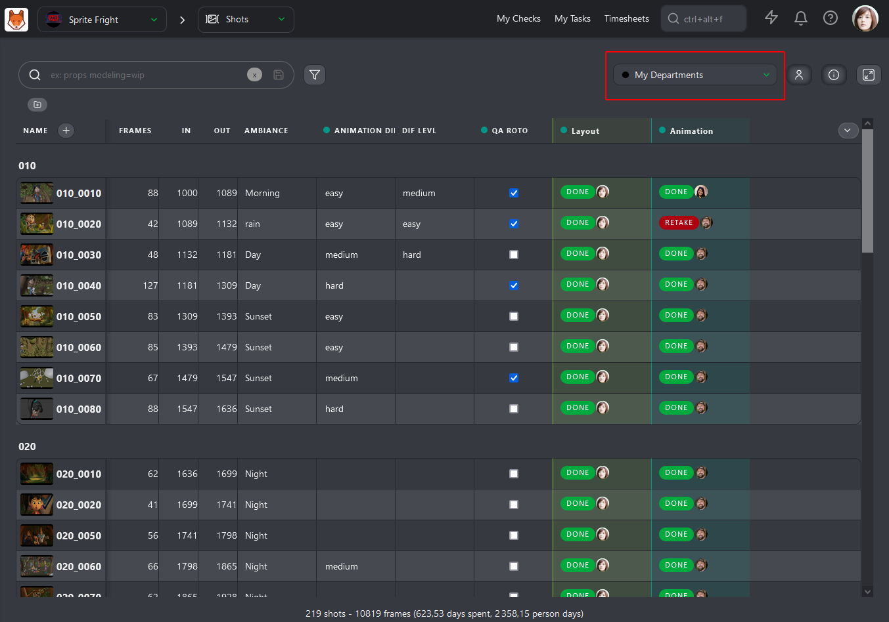
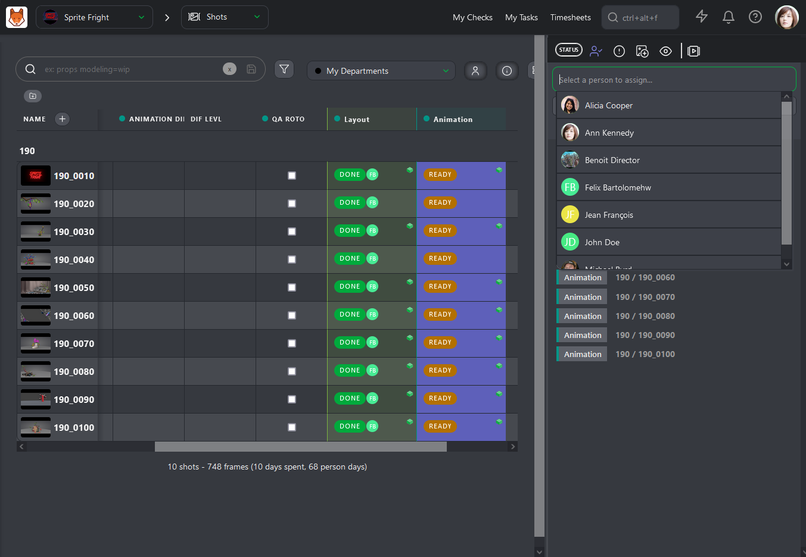
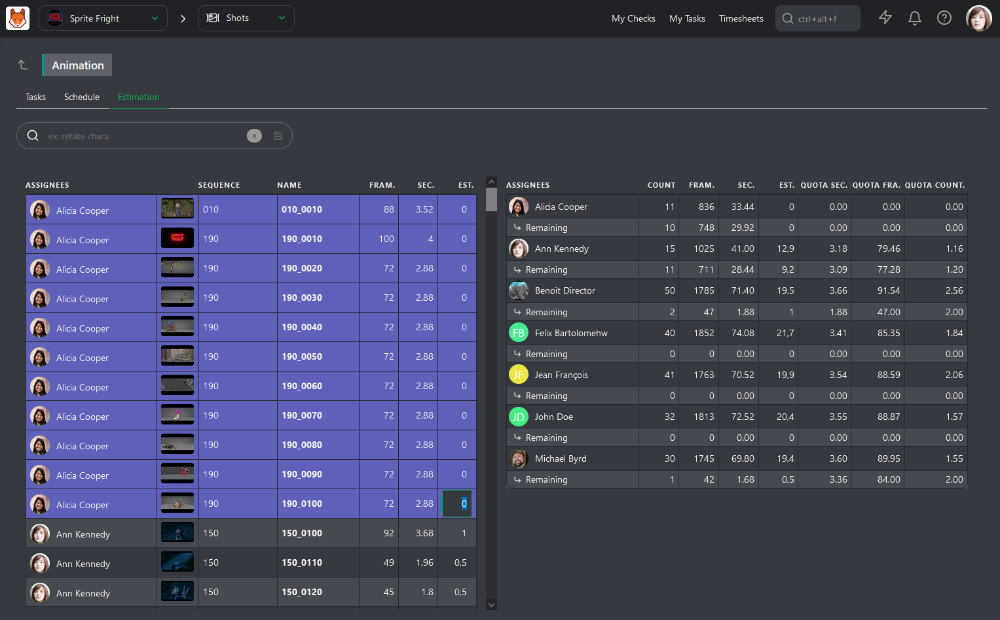
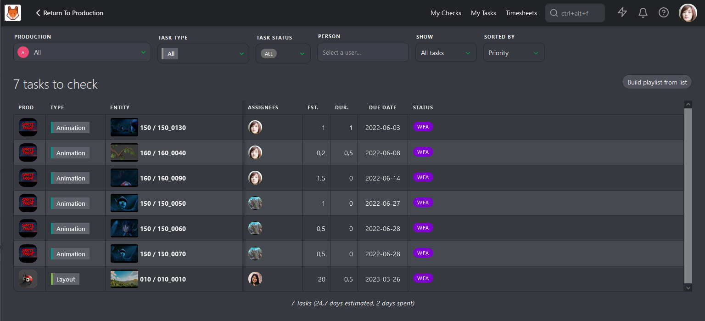
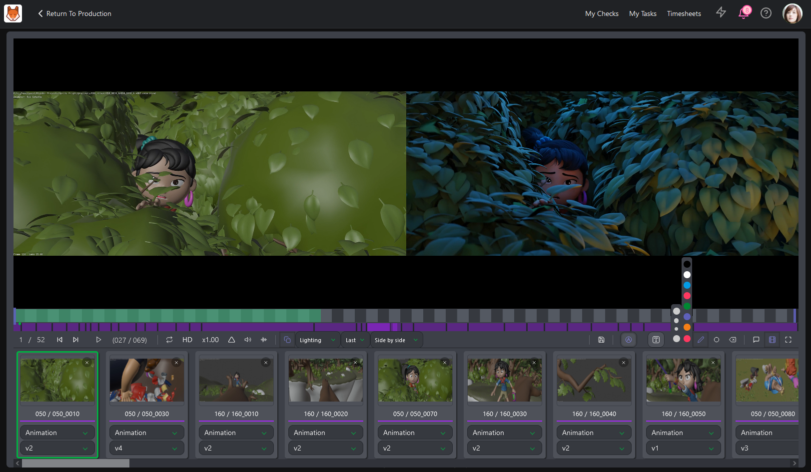
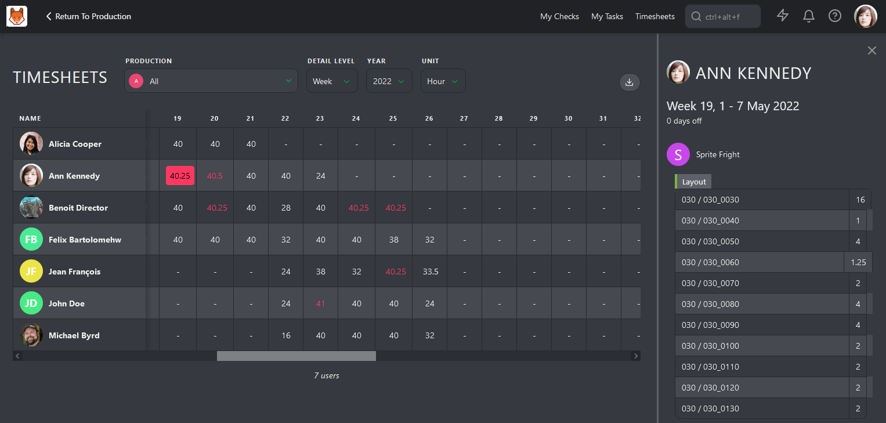

# Supervise your Department as Supervisor

## Check your Tasks

As Supervisor, most of the time, you also have tasks assigned on top of supervising your department.

So it means splitting your time between your work and supervising your team.

Let's start with how to check what you have to do.

When you login into Kitsu, you will notice the button on top of the screen **My Tasks**. 
It's direct access to your **to-do list**. Per default, it's sorted by priority, so you don't have to think twice about what to do first; it's the one on top of the list.

On the **My Tasks** page, you can filter the tasks list by **Production**, **Task Type**, **Status**, etc. 

Then you must click on the **Status** to open the comment panel. From here, you can comment and publish a new revision.

## Assign and Estimate Tasks to your Department

Now it's time to focus on your team. The first thing to do is to assign tasks.

Your view is automatically filtered on the global shot/asset page as **My Department**. You only see your **Task Type** and the **Custom Columns** linked to your department.

When you assign one or several tasks to someone, you will notice that you only have access to the people from your department. 

It's faster for you to find the right Artist for the task.

Now that you have assigned all your Artists, it's time to fill in the **Estimation** for each task.

Click on the name of a **task Type** column to open its dedicated page.

On this page, you can access three tabs: **Tasks**, **Schedule**, and **Estimation**. We will focus on the last one.

The **Estimation** page is split into two parts. On the left, you have all the tasks sorted by Artist, their number of frames, and seconds.

On the right part of the screen, you have the sum-up of your team, one line per Artist. You will have the **Count** of the total number of assigned tasks, the total number of **Frames** and **Seconds**, and the updated total number of days **Estimated**.

With all this information, Kitsu can calculate different estimated **Quotas**: **per Second**, **per Frame**, and **per Task**.

You can now fill the **Estimation** column on the left and see the result on the right.

As soon as you fill in an **Estimation** for a task, you will see the artist line updated on the right part.

You know if the distribution of the tasks is fair between your team member and what are their estimated quotas for production. 

You need to do it accordingly to their experience and the difficulty of each task.

## Check the Previews of your Department

Now that everyone in your team knows what to do, you must check their work.

Usually, when an artist has finished a task, he will call you and ask for your review.
So it means that you have to stop what your doing, lose your focus, open their preview, focus on it, make your comments, and try to get back where you're stopped.

It's a lot of wasted energy here, and you are not as productive as you could be, no thanks to all the intrusion.

And the more you are interrupted, the longer it takes to regain focus.

That's why we suggest defining a specific timeframe for your checking. The first advantage is to help your team to be better organized because the Artists will know when it's a good time to speak with you, and they can post their work and start a new task, knowing you will check it.
The second advantage is that you can focus on your work! You know when the checking is and when to do your tasks. 

If you click on the **My Checks** button on top of the screen, you will have the list of all your department's **WFA** tasks.

This list covers all the **Productions**, **Task Type**, and **Task Status** relevant to you.

As with any other page in Kitsu, you can click on a **Status**, open the **Comment Panel** on the right, and do your review task per task.

Or you can also use the **Build playlist from list** button. Kitsu will create a playlist with all the tasks on the list displayed.

This **playlist** has the same options as others; you can open the comment panel, compare version and task types, and draw and write text.

Another solution is to go to the **Task Type Page** and change the **Display as contact sheet**.

For example, You can filter per **Due Date Status** and select **Due this week**.

You can now click on the contact sheet to open the comment panel or select several tasks to create a playlist.

## Supervise the Quotas of your Department

At the beginning of the production, while you set estimation for each task, you also define estimated quotas for each of your Artists.

Once a task is validated, the remaining line on the **Estimation** tab of the **Task Type** page will update and display the remaining number of tasks and the **updated estimated quotas**.

You can keep an eye your every member of your team and see if their **estimated quotas** stay on the line with the first established.

When you need to check on their **Actual Quotas**, you need to go to the **Quotas** page. 

Kitsu has two ways to calculate the quotas. The first is based on the daily Timesheets filled by the Artists.

The calculation of the quotas will start as soon as the Artist fills out his first timesheet on this task, and it will end when he stops.

The second way is based on the status. The calculation starts with the **WIP** status and ends with the **WFA** status.

It's **First take** quotas, meaning that the back-and-forth of comments won't enter in the calculation.

This page's most important element is the first column, **Average**. Kitsu will calculate the average quotas for each Artist per **Day**, **Week**, or **Month**.

## Supervise the Timesheets of your Department

As a Supervisor, you also have to keep an eye on the hours of your team. The **Timesheet** page shows how many hours they do every day, week, and month. 

It's time to notice a pattern of extra hours, sick days, or no vacation. It's also your job to take care of your team, speak with them, and see if everything is fine if they are not burning.

