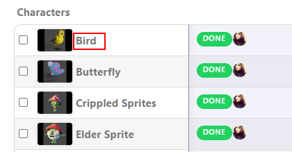
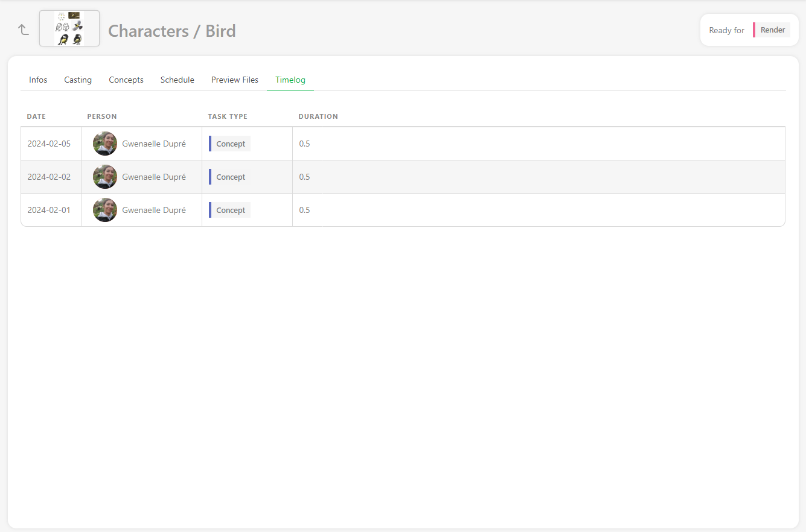
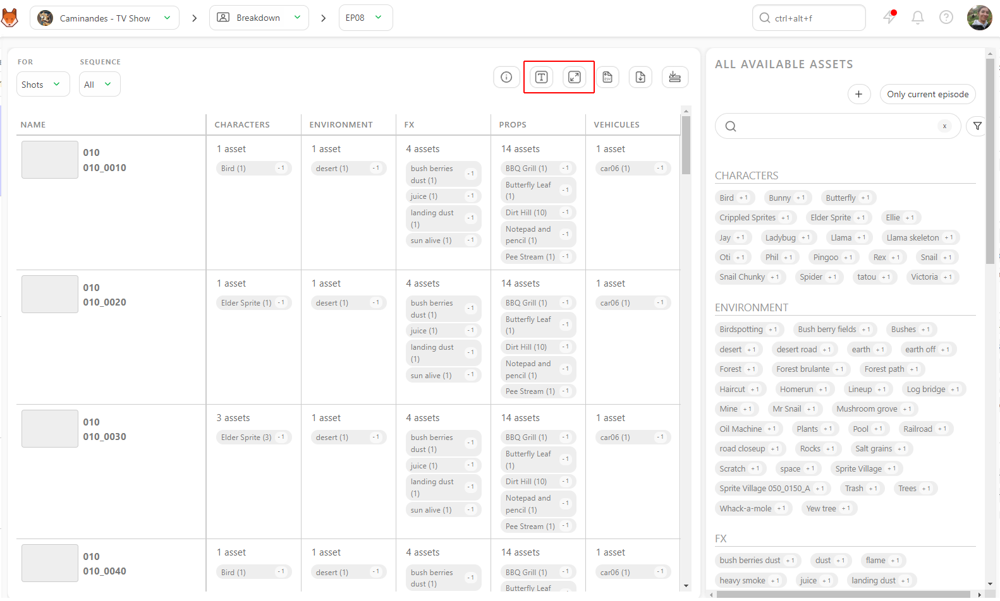
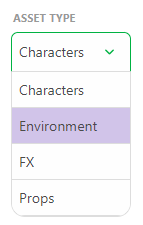

# NFTコレクションを作成する

Kitsuでワークフローを設計し、より多くの人を招待したので、今度は作品を作成する番です。 

**新しい作品を作成**ボタンをクリックします。

制作物の名前を入力し、**タイプ**として**短い**を選択し、制作スタイル（2D、3D）を選択します。

次に、FPS数、アスペクト比、解像度などの技術情報を入力します。

これらのデータはすべて、Kitsuがアップロードされたビデオプレビューを再エンコードする際に使用されます。

次に、制作物の開始日と終了日を定義する必要があります。

プロダクションのワークフローは、次のパート3から6で定義できます。

アセットタスクタイプ（3）、NFTコレクションタスクタイプ（4）、タスクステータス（5）、アセットタイプ（6）を選択する必要があります。

::: ヒント
**プロダクションワークフロー**を作成するには、グローバルライブラリからタスクタイプを選択します。

タスクタイプをいくつか見落としていたことに気づいた場合は、後で作成できます。

「スタジオワークフロー」（../first_production/README_configure_Kitsu.md#studio-workflow）セクションを参照してください。
:::

次に、7と8はオプション部分です。アセット/NFTコレクションの一覧が記載されたスプレッドシートがすでに用意されている場合。

詳細は「**CSVのインポート**」セクションを参照してください。

[アセットのインポート](../batch-action/README.md#create-assets-from-a-csv-spreadsheet-file)

[NFTコレクションのインポート](../batch-action/README.md#create-shots-from-a-csv-spreadsheet-file)

ボタンですべてを確認します。

## Kitsuグローバルページの紹介

Kitsuのグローバルアセットページへようこそ。

見てみましょう。

上部 (1) には、**グローバルナビゲーション**があり、これはすべての制作ページで常に表示されます。

**左から右へ:**

### メインメニュー

左上のボタン、Kitsu（またはお客様のスタジオロゴ）をクリックすると、メインメニューが開きます。

メインメニューでは、割り当てられたタスク、制作物、グローバルおよびチームスケジュール、ワークフローのカスタマイズページ、およびKitsu設定に直接アクセスできます。

::: 詳細 メインメニューの詳細
**ワークスペース**
- マイタスク：割り当てられたタスク 
- マイチェック：あなたの部署に応じて、ステータスが**フィードバックリクエスト**となっているすべてのタスク
- マイプロダクション：プロダクションページの選択に戻ります。

**スタジオ**
- プロダクション
- 担当者
- タイムシート
- メインスケジュール
- チームスケジュール
- すべてのタスク
- ニュースフィード
- エンティティ検索

**ADMIN**
- 部署
- タスクの種類
- アセットの種類
- カスタムアクション
- 自動化
- 3D背景
- ボット
- 設定
- ログ

::: 警告 権限の表示
ワークスペースセクションは、アーティストには表示されない「マイチェック」を除くすべての権限に対して有効になっています。

アーティスト（およびそれ以上）は、自身の**タイムシート**も表示でき、**エンティティ検索**にもアクセスできます
:::

### ナビゲーション

メインメニューアイコンの右側にナビゲーションドロップダウンメニューが表示されます。

制作を選択できます。実際の制作名と実際のページ名が常に表示されます。

ドロップダウンメニューを使用して、制作から制作へと移動できます（複数の制作がある場合）。

制作を選択すると、次のドロップダウンメニューで、その制作の異なるページを移動することができます。

::: 詳細 ナビゲーション詳細
最初のセクションは、タスクのトラッキングについてです
- 資産
- NFTコレクション
- シーケンス
- 編集（特定のタスクを作成した場合）

2番目のセクションは、制作の側面についてです
- コンセプト
- ブレークダウン
- プレイリスト
- ニュースフィード

3番目のセクションは統計情報です
- シーケンス統計
- アセットタイプ統計

4番目のセクションはチーム管理に関連しています
- スケジュール
- ノルマ
- チーム

5番目のセクションは制作の設定です
- 設定

::: ヒント
アセットページから開始しますが、制作のホームページを他のエンティティに変更することができます（設定ページを参照）。
:::

::: 警告 
エピソードなど、追加のナビゲーションレベルが必要になった場合は、プロダクションタイプを**テレビ番組**に変更する必要があります。

逆に、**アセット**や**NFTコレクション**が必要ない場合は、プロダクションタイプを**アセットのみ**または**NFTコレクションのみ**に切り替える必要があります。
:::

### グローバル検索、ニュース、通知、およびドキュメント
グローバル検索はナビゲーションドロップダウンメニューの右側にあります。 4件の最初の結果を表示するクイックアクセス検索です。 さらに多くの結果やフィルタリングオプションが必要な場合は、**エンティティ検索**ページを参照してください。

次のアイコン  は、ニュースとフィードバックページへの直接リンクです。

アニメーションGIFで新機能のすべてをご覧いただけます。また、Kitsuに追加してほしい次期機能に関するご意見もご投稿いただけます。

ベルのアイコンは、通知（割り当て、コメント、タグ）を表示します！[通知](../img/getting-started/notification_icon_on.png)。未読通知の数はベルのアイコンに表示されます。

アバターの直前のアイコンは、ドキュメントボタンです。
 あなたが今読んでいるドキュメントです！

### 個人設定
アバターをクリックすると、メニュー（設定、ドキュメントなど）を開くことができます。

## タスクスプレッドシート

### エンティティスプレッドシート

画面の2番目の部分は、すべてのエンティティ（アセット、NFTコレクション、シーケンス、編集）に共通です。これはグローバルなタスクスプレッドシートです。

ここでは、各タスクのステータス、割り当て、優先度などを確認できます。

::: ヒント
スプレッドシートの最初の行と列のヘッダーは、スクロールしても常にページの上部に表示されます。

また、他の列を常に表示しておくために「固定」することもできます。
:::

### フィルター

左側の最初の要素はフィルターボックスです。単純なフィルタリング、順序、アセットタイプなど、任意の文字列を入力することができます。

より高度なフィルタリングが必要な場合は、フィルタービルダーボタンを使用してください。

すべてのフィルターを保存し、ページとして使用することができます。

### 表示の簡素化

画面の右側には、左から右に、アサインメントの表示/非表示、追加カラムの表示/非表示、サムネイルの拡大/縮小を行うためのボタンがあります。

### インポート / エクスポート
バッチインポートサムネイル 、最後にインポート  またはエクスポート  データの

### メタデータカラム
以下に、カラムの名前があります。「名前」の隣にある(+)をクリックしてください！[メタデータカラムの追加](../img/getting-started/add_column_custom.png)をクリックすると、新しいメタデータカラムを作成できます。次に、タスクタイプのカラムの名前があります。

### ビューのカスタマイズ
画面の一番右側にあるスクロールバーの隣に、テキストカラムの非表示/表示オプションがあります

。

### ビューの要約
画面の一番下の最後の部分（4）は、表示されているページの要約です。つまり、ページをフィルタリングすると要約が更新されます。

要素（アセットまたはNFTコレクション）の数、見積もり日数の合計、およびすでに費やした日数の合計を確認できます。

## アセットの作成
### 最初の資産の作成
さて、プロダクションを作成し、Kitsuインターフェースの概要を理解したので、最初の資産を作成してみましょう。

アセットページで、**[アセットを追加]**をクリックします。

::: 警告
アセットを作成すると、タスクワークフローが適用され、**すべてのタスクがアセットと同時に作成されます**。
:::

ポップアップウィンドウが開きます。

**アセットタイプ**を選択するよう求められます（1）。
新しいアセットタイプを追加していない場合、Kitsuは「キャラクター」、「環境」、「エフェクト」、「小道具」などの例を提供します。
キャラクターから始めましょう。

::: ヒント
アセットタイプのリストとタスクパイプラインはカスタマイズすることもできます。
[ワークフローのカスタマイズ](../customization-pipeline/README.md#modify-an-existing-asset-types) )
:::

次に**名前**を入力し (2)、アーティストが何をすべきか、またアセットを素早く識別できるように説明を入力します。

複数のアセットを作成する場合は、**[Confirm and stay]**をクリックします。

アセットの種類を変更して、アセットを追加し続けることができます。

::: ヒント
「確認して戻る」をクリックするたびに、新しく作成されたアセットが背景に表示されます。
:::

最後のアセットを追加したら、
「確認」をクリックします。アセットが作成され、ウィンドウが閉じます。

ヒント
「確認してそのままにする」をクリックし、追加するアセットがないことに気づいたら、「閉じる」をクリックすると、ウィンドウがキャンセルされます。
ヒント

アセットワークフローで選択されたタスクも同時に作成されます。

さらに**アセット**を追加する必要がある場合は、**+ Create assets**（アセットの作成）ボタンをクリックします。

::: 詳細 CSVスプレッドシートファイルからアセットを作成
アセットのリストがすでにスプレッドシートファイルに用意されている場合もあります。
Kitsuでは、インポートする方法が2つあります。1つ目は、`.csv`ファイルをインポートし、データを直接Kitsuにコピー＆ペーストする方法です。

まず、スプレッドシートを`.csv`ファイルとして保存します。

次に、Kitsuのアセットページに戻り、**インポート**アイコンをクリックします。

ポップアップウィンドウの**「CSVからデータをインポート」**が開きます。**「参照」**をクリックして、`.csv`ファイルを選択します。

結果を確認するには、**[プレビュー]**ボタンをクリックします。

データのプレビューで、列の名前を確認し、調整することができます。

注：**[エピソード]**列は、**[テレビ番組]**制作の場合のみ必須です。

すべてが適切であることを確認したら、**[確認]**ボタンをクリックしてデータをKitsuにインポートします。

これで、すべての資産がKitsuにインポートされ、設定に従ってタスクが作成されました。

::::

:::: 詳細 スプレッドシートファイルのコピー/ペーストによる資産の作成

スプレッドシートを開き、データを選択してコピーします。

次に、Kitsuのアセットページに戻り、**インポート**アイコンをクリックします
。

ポップアップウィンドウ**CSVからのインポート**が開きますので、**CSVデータの貼り付け**タブをクリックします。

以前に選択したデータを貼り付け、**[プレビュー]**ボタンで結果を確認できます。

データのプレビューで列の名前を確認し、調整することができます。

注意：**エピソード**の列は、**テレビ番組**の制作の場合のみ必須です。

すべて問題なければ、**確認**ボタンをクリックしてデータをKitsuにインポートします。

これで、すべてのアセットがKitsuにインポートされ、設定に従ってタスクが作成されました。

:::

### アセットの詳細を確認する

アセットの詳細を確認するには、その名前をクリックします。

新しいページが開き、右側にタスク、アサイン、ステータスニュースフィードの一覧が表示されます。

各タスクのステータスをクリックすると、コメントパネルが開き、コメントの履歴や異なるバージョンを確認できます。

また、**キャスティング**にもアクセスできます。

このアセットに関連付けられた**コンセプト**にもアクセスできます。

**スケジュール**は、タスクタイプページのデータを事前に記入していれば利用できます。データがすでに記入されている場合は、ここで直接修正することができます。 

さまざまなタスクタイプでアップロードされた**プレビューファイル**、

そして、このアセットのタスクでタイムシートが記入された場合の**タイムログ**。

## アセットを作成した後にタスクを追加する

アセットを作成した後にタスクが欠けていることに気づいた場合でも、追加することができます。

まず、欠けているタスクタイプがタスクタイプタブの設定ページに追加されていることを確認してください。

次に、アセットページに戻り、**+ タスクを追加**をクリックします

### アセットを更新する
アセットはいつでも更新でき、名前やアセットタイプを変更したり、説明文を修正したり、グローバルページに追加したカスタム情報を追加したりすることができます。

アセットを編集するには、アセットページに移動し、編集したいアセットの上にカーソルを移動させて、**編集**ボタンをクリックします
！[編集ボタン](../img/getting-started/edit_button.png) (1)
行の右側にある

アセットのメインページの説明を拡張するには、最初の語句 (2) をクリックすると、説明の全文を含むポップアップが開きます。

アセットを削除するには、FAQ : [アセットの削除方法](../faq-deletion/README.md##how-to-delete-an-asset)を参照してください。

::: 詳細 CSV インポートによるアセットの更新
CSV インポートを使用すると、データを素早く更新することができます。

アセットの**タイプ**、**アサイン**、タスクの**ステータス**を更新したり、**コメント**を追加したりすることができます。

**既存のデータを更新する**オプションをオンにする必要があります。すると、更新される行が
青くハイライトされます。

:::

::: 詳細 スプレッドシートファイルのコピー＆ペーストによるアセットの更新

スプレッドシートを開き、データを選択してコピーします。

次に、Kitsuのアセットページに戻り、**インポート**アイコンをクリックします
！[インポートアイコン](../img/getting-started/import.png)。

ポップアップウィンドウ「**CSVからデータをインポート**」が開きます。「**CSVデータを貼り付け**」タブをクリックします。

！[インポートデータコピーペーストタブ](../img/getting-started/import_pastcsvdata_asset.png)

以前に選択したデータを貼り付け、**[プレビュー]** ボタンで結果を確認できます。

データをプレビューして、列の名前を確認し、調整することができます。

注：**[エピソード]** 列は、**[テレビ番組]** 制作の場合のみ必須です。

オプション「**既存データの更新**」をオンにする必要があります。すると、更新される行が
青くハイライトされます。

これで、すべてのアセットがKitsuにインポートされ、設定に従ってタスクが作成されました。

:::

## コンセプトの作成
### コンセプトのアップロード

**コンセプト**を作成するには、ナビゲーションメニューから**コンセプト**ページに移動します。

コンセプトをアップロードするには、「**コンセプトへの新しい参照を追加**」ボタンをクリックします。

同時に1つまたは複数のコンセプトをアップロードできます。

プレビューをアップロードすると、コンセプトページは次のようになります。

コンセプトとやりとりするには2つの方法があります。画像をクリックして拡大表示します。
もう1つは、ステータス部分をクリックして右側の**コメントパネル**を開く方法です。

コメントパネルでは、コンセプトを既存のアセットにリンクするか、削除するかの2つのオプションがあります。
また、アセットにコメントを追加したり、ステータスを変更することもできます。

**コンセプト**ごとに1つのバージョンを持つことが基本です。 検証されていない場合は、同じコンセプトの複数のバージョンを作成しないよう、新しいコンセプトをアップロードする必要があります。

1つのコンセプトは1つのタスクです。

### コンセプトとアセットのリンク

コンセプトをアップロードすると、アセットにリンクすることができます。

アセットのステータス部分にリンクが表示されます。

コンセプトのステータス部分をクリックすると、右側にコメントパネルが開きます。

コメントパネルの上部には、コンセプトをアセットにリンクするか、コンセプトを削除するかの2つのオプションがあります。

アセットをリンクするには、[リンク] ボタン  をクリックします。

Kitsu は、アップロードしたコンセプトにリンク可能なすべての **アセット** を表示します。

Kitsu は、リンクされたアセットをコメントパネルの上部にリスト表示します。現時点では、リンクはありません。

アセットをリンクするには、それをクリックします。リンクされたアセットの名前は、コンセプトのプレビューの下に画面の上部に表示されます。

コンセプトがアセットにリンクされると、アセットの詳細ページで確認できます。

アセットページに戻り、コンセプトを確認したいアセット名をクリックします。

デフォルトでは、キャスティングの詳細が画面の2番目の部分に表示されます。
ドロップダウンメニューを使用してコンセプトを選択します。

コンセプトセクションに入ると、このアセット用に作成されたすべてのコンセプトが表示されます。ステータスごとにフィルタリングできます。

## NFTコレクションの作成
### 最初のNFTコレクションの作成

制作した**NFTコレクション**を作成する時が来ました。

::: 警告
NFTコレクションは、Kitsu内のシーケンスにリンクされています。
シーケンスを作成し、その中にNFTコレクションを追加する必要があります。
:::

NFTコレクション**ページに移動する必要があります。
ドロップダウンメニューを使用して、**NFTコレクション**をクリックします。

**NFTコレクションの追加**ボタンをクリックして、NFTコレクションの作成を開始します。

::: 警告
NFTコレクションを作成すると、設計したタスクワークフローが適用され、すべてのタスクがNFTコレクションと同時に作成されます。
:::

NFTコレクションの作成用に新しいポップアップが開きます。
これでシーケンスとNFTコレクションを作成できます。

最初のシーケンス、例えば「sq01」を入力し、
次に**追加**します。

これで、シーケンスが作成されたことが確認できます。このシーケンスにNFTコレクションを追加するには、シーケンスを選択してNFTコレクションを作成する必要があります。

例えば、NFTコレクションの列に「sh0010」と入力し、再度**追加**します。
NFTコレクションのパディングを定義することもできます。

::: ヒント
NFTコレクションを10個ごとにSH0010、SH0020、SH0030などと名付けたい場合は、**NFTコレクションのパディング**を10に設定します
:::

新しいNFTコレクションが、シーケンス順にリスト化され、リンクされているのが確認できます。
これで、最初のシーケンスの最初のNFTコレクションが作成されました。

それでは、NFTコレクションを1つ以上追加してみましょう！ご覧の通り、ボックスにはすでに名前のコードが含まれていますが、
コードが含まれていますが、インクリメントされているので、**追加**をクリックして
さらにNFTコレクションを作成する必要があります。

さらにシーケンスを追加するには、左側部分に移動し、新しいシーケンスの名前を入力し、**追加**をクリックします。
2番目のシーケンスが選択され、NFTコレクションを追加できるようになります。

::: ヒント
NFTコレクションがシーケンス上で誤った場所に配置されている場合は、NFTコレクションを編集する必要があります
！[編集ボタン](../img/getting-started/edit_button.png)をクリックし、
シーケンスを変更します。
！[NFTコレクションの編集 シーケンスの変更](../img/getting-started/edit_shot.png)

！[シーケンスの変更](../img/getting-started/change_seq.png)
:::

NFTコレクションを削除するには、FAQを参照してください。 : [NFTコレクションの削除方法](../faq-deletion/README.md#how-to-delete-a-shot)

シーケンスを削除するには、FAQを参照してください。 : [シーケンスの削除方法](../faq-deletion/README.md#how-to-delete-a-sequence)

### NFTコレクションの詳細を確認する

NFTコレクションの詳細を確認したい場合は、その名前をクリックします。

新しいページが開き、右側にタスク、アサインメント、ステータスニュースフィードの一覧が表示されます。
タブの名前をクリックすることで、それぞれを移動できます。

各タスクのステータスをクリックすると、コメントパネルが開き、コメントの履歴や異なるバージョンを確認できます。

また、**キャスティング**にもアクセスできます。

**スケジュール**は、事前にタスクタイプページのデータを入力している場合に利用できます。データがすでに記入されている場合は、ここで直接修正することができます。 

さまざまなタスクタイプでアップロードされた**プレビューファイル**、

そして、このアセットのタスクでタイムシートが記入された場合の**タイムログ**。

## NFTコレクションを作成した後にタスクを追加する
NFTコレクションを作成した後にタスクが不足していることに気づいた場合でも、追加することができます。

まず、不足しているタスクタイプがタスクタイプタブの設定ページに追加されていることを確認します。

次に、NFTコレクションページに移動し、「+タスクを追加」をクリックします。

### NFTコレクションを更新する

いつでもNFTコレクションを更新し、名前や順序を変更したり、説明文やグローバルページに追加したカスタム情報を修正することができます。

NFTコレクションを編集するには、NFTコレクションページに移動し、変更したいNFTコレクションにカーソルを合わせて、行の右側にある**編集**ボタンをクリックします
右側の行にある[編集]ボタン (1) をクリックします。

アセットの編集] (../img/getting-started/asset_edit01.png)

NFTコレクションのメインページの説明を拡張するには、最初の文字 (2) をクリックすると、説明の全文を含むポップアップが開きます。

::: 詳細 NFTコレクション情報のCSVインポートによる更新
CSVインポート**を使用して、**NBフレーム**、**フレームIN**、**フレームアウト**、または任意のカスタム**メタデータ列**としてデータを更新することができます。

タスクの**割り当て**と**ステータス**を更新し、**コメント**を追加することができます。

スプレッドシートを開き、データを選択してコピーします。

次に、KitsuのNFTコレクションページに戻り、**インポート**アイコンをクリックします
。

ポップアップウィンドウ**インポートデータからCSV**が開きます。**CSVデータを貼り付け**タブをクリックします。

以前に選択したデータをペーストし、**[プレビュー]**ボタンで結果を確認できます。

オプション：既存のデータを更新** をオンにする必要があります。
更新されたNFTコレクションは青くなります

注：**エピソード**の列は、**TV Show**制作の場合のみ必須です。

すべて問題なければ、**Confirm**ボタンをクリックしてデータをKitsuにインポートします。

これで、NFTコレクションがすべてKitsuにインポートされ、設定に従ってタスクが作成されました。

:::

## カスタムメタデータカラムの作成

一般的なスプレッドシートページにさらに情報を追加するには、カスタム**メタデータカラム**を作成する必要があります。

難易度レベル、**天候**、**タグ**など、ページに追加する追加情報があるかもしれません。 すべてのテキスト（または数値）情報をカスタムメタデータ列に保存することができます。

名前列の近くにある**+**をクリックします。

タイプ**オプションでは、情報をどのように保存するかを選択できます。
- 自由入力の**テキスト**、
- **数値**、
- **チェックボックス**、
- **値のリスト**、
- **タグのリスト**、
- **チェックリスト**。

::: 警告 
テキスト、数値、およびチェックボックスでは、各エンティティに異なる情報を追加できます。最初に計画する必要はありません。

リスト値、タグリスト、およびチェックリストでは、各エンティティに同じ選択肢が与えられます。さらに、これは現在入力する必要があります。

利用可能な値**の下にリスト要素を入力し、**値を追加**をクリックして確認します。
:::

メタデータカラム**を1つまたは複数の**部門**にリンクすることもできます。

ヒント
メタデータ列を部門にリンクします。アーティスト/スーパーバイザーは、自分のToDoページと部門フィルタリングビューでこれを見ることができます。

メタデータ列を1つまたは複数の部門にリンクすることができます。リストから部門をクリックし、**追加**をクリックして有効にします。

ここでは、VFX列が2つの部門にリンクされています。

:::

::: 詳細 メタデータ列の編集
アセットのグローバルページまたはNFTコレクションのグローバルページで、メタデータ列の右側にある矢印をクリックし、**[編集]**をクリックします。

:::

この情報は、グローバルスプレッドシートページで直接入力できます。
ケースは編集可能です。

::: ヒント
左側の複数のエンティティを選択してからメタデータ列を修正すると、メタデータ列を一括で修正できます。
:::

::: 詳細 手動で編集
編集ボタンを使用して情報を変更することもできます！[編集ボタン](../img/getting-started/edit_button.png)。

編集ポップアップに新しい行が表示されます。リストから情報を選択することもできますし、
あるいは、テキストや数値を直接入力したり、チェックボックスにチェックを入れたり、チェックリストを使用したりすることもできます。

編集が完了したら、**確認**ボタンを押すことを忘れないでください。

:::

メタデータ列の編集または削除が必要な場合は、スプレッドシートの一般ページに移動します。
メタデータ列の名前の近くにある矢印をクリックします 。

::: ヒント
この新しい列を使用して、グローバルページを**ソート**することができます。列名の右側にある矢印をクリックして、このメニューを開きます。次に、「**ソート**」をクリックします。

また、メタデータ列を左側に**固定**することもできます。
:::

## ブレークダウンリストの作成

ブレークダウンを記入すると、NFTコレクションの作成に役立ちます。
ブレークダウンには、NFTコレクションを作成するために追加する必要があるアセットの詳細がすべて記載されています。
これにより、必要なものをすべて漏れなく記載できるでしょう。

ドロップダウンメニューで **BREAKDOWN** を選択します。

ブレイクダウンページの左側には、エピソード/シーケンス/NFTコレクションメニュー（1）があります。作成したものの中から選択できます。これらは画面の右側に表示され、
作成したすべての資産は、この制作（メインパックおよびエピソード）（3）で利用できます。さらに、
中央セクションでは、NFTコレクションの選択肢（2）があります。

そこで、キャストしたいNFTコレクションを選択する必要があります。

サムネイルがまだない場合はテキストとしてアセットを表示したり、
サムネイルのサイズを拡大することもできます。

また、ブレークダウン中にリストにアセットを追加する必要があることに気づくかもしれません。

ブレークダウンページから直接新しいアセットを作成できます。「利用可能なすべてのアセット」の右にある「+」をクリックします。

複数のNFTコレクションを一度に選択することもできます。最初のNFTコレクションをクリックし、**シフト**キーを押したまま、選択する最後のNFTコレクションをクリックします。

次に、割り当てたいアセットをクリックします。
キャラクター、背景など、右側（3）から選択します。
複数のNFTコレクションを選択した場合、選択したアセットは多数のNFTコレクションに適用されます。

アセットが入力されたNFTコレクションをコピーし、このアセット選択を別のNFTコレクションに貼り付けます。

アセットの上にカーソルを移動させると、**+1**または**+10**と表示されます。これは
このアセットを追加した回数であり、必要なだけクリックできます。

シーケンスやNFTコレクションを指定せずに、すべてのアセットをテレビ番組のエピソードにリンクすることもできます。

この方法では、絵コンテ/アニマティックの段階の前に、すべてのアセットを1つまたは複数のエピソードにリンクすることができます。

画面中央にアセットが表示されているのが確認できます（2）。
アセット名の隣には、追加された回数が表示されています。この
例では、キャラクターアセットのラマを2回追加しています。

誤ってアセットを2回追加してしまった場合は、画面中央部分に戻り、このNFTコレクションのアセットを選択します（2）。そこから、**-1**をクリックします。
このNFTコレクションを終えたら、他のNFTコレクションを続行します。
選択した内容は自動的に保存されます。

ストーリーボードの作成中に新しいアセットが作成された場合は、アセットページに戻り
（ドロップダウンメニューを使用）、必要なアセットを作成します。以前に作成したタスクは、これらの新しいアセットに即座に適用されます。
ただし、割り当てを行う必要があり、その後
ブレークダウンを続行できます。

これで、**Breakdown**ページは以下のようになります。

アセットを組み立てて個々のパーツを追跡する必要がある場合は、アセットのブレークダウンリストを作成することもできます。

画面左上にある**FOR**の下のドロップダウンメニューで**asset**を選択します。

2つ目のドロップダウンメニューにアクセスして、アセットの種類を選択できます。 **キャラクター**、**環境**、**小道具**、**FX**、...

アセットのブレークダウンページは、NFTコレクションと同じ方法で完了できます。まず、左側で1つまたは複数のアセットを選択し、次に右側の要素を追加します。

::: 詳細 CSVファイルからブレークダウンリストを作成する

すでにスプレッドシートファイルで内訳リストが準備できているかもしれません。Kitsuでは、それをインポートする方法が2つあります。1つ目は、.csvファイルを直接インポートする方法、2つ目は、データを直接Kitsuにコピー＆ペーストする方法です。

まず、Kitsuの推奨に従って、スプレッドシートを `.csv` ファイルとして保存します。

インポート] ボタンをクリックします！[インポート] ボタン (../img/getting-started/import.png)

「CSVからデータをインポート」というポップアップウィンドウが開きます。「参照」をクリックして、`.csv`ファイルを選択します。

結果を確認するには、「プレビュー」ボタンをクリックします。

データのプレビューで、列の名前を確認し、調整することができます。

注意：**[エピソード]**の列は、**[テレビ番組]**制作の場合のみ必須です。

すべてが適切であることを確認したら、**[確認]**ボタンをクリックしてデータをKitsuにインポートします。

これで、ブレークダウンがKitsuにインポートされました。

:::

::: 詳細 スプレッドシートファイルをコピー＆ペーストしてブレークダウンリストを作成

スプレッドシートを開き、データを選択してコピーします。

次に、Kitsuのブレークダウンページに戻り、**インポート**アイコンをクリックします 
。

ポップアップウィンドウ「**CSVからデータをインポート**」が開きますので、「**CSVデータを貼り付け**」タブをクリックします。

以前に選択したデータを貼り付け、**[プレビュー]** ボタンで結果を確認できます。

データのプレビューで列の名前を確認し、調整できます。

注：**[エピソード]** 列は、**[テレビ番組]** 制作の場合のみ必須です。

すべてが正しく入力されたら、**Confirm**（確認）ボタンをクリックしてデータをKitsuにインポートします。

これで、すべてのアセットがKitsuにインポートされました。

:::

## アセットの状態の紹介：準備完了

ほとんどの場合、NFTコレクションのタスクでアセットを使用する際に、そのアセットのタスクが承認されるのを待つ必要はありません。

たとえば、アセットが **コンセプト** 段階で承認された場合、**ストーリーボード** 段階で使用することができます。
次に、**モデリング** 段階で承認された場合、**レイアウト** 段階で使用することができます。

アセットの状態 **Ready For** がまさに実行しているのは、アセットのタスクの状態を知らせ、NFTコレクションのタスクでの使用可能性を比較することです。

内訳を記入したので、どのアセットがすべてのNFTコレクションで使用されているかがわかります。

まず、タスクの状態に対するアセットの状態を定義する必要があります。セルをクリックして**準備完了**を変更できます。NFTコレクションのタスクを含むドロップダウンメニューが表示されます。

::: ヒント
**自動化**機能を使用して、作業を自動化することができます。

**準備完了**のトリガーで自動化を設定できます。 
:::

いくつかのアセットの状態を**準備完了**に変更したので、NFTコレクションページで結果を確認できます。

いくつかの白いボックスが**緑色**になっていることに気づくでしょう。このNFTコレクションに含まれるすべてのアセットが、この特定のタスクの準備ができていることを示しています。

白いボックスが表示されている場合、Kitsuは、このタスクに準備ができているアセットの数を示します。

::: ヒント
ボックスが表示されていない場合、このNFTコレクションにアセットがキャストされていません。
:::

次に、NFTコレクションの名前をクリックして詳細ページに移動します。
すると、このNFTコレクションにキャストされたすべてのアセットとそのステータスが表示されます。

特定のタスクに対してNFTコレクションを開始できるかどうかを判断する最も簡単な方法です。
