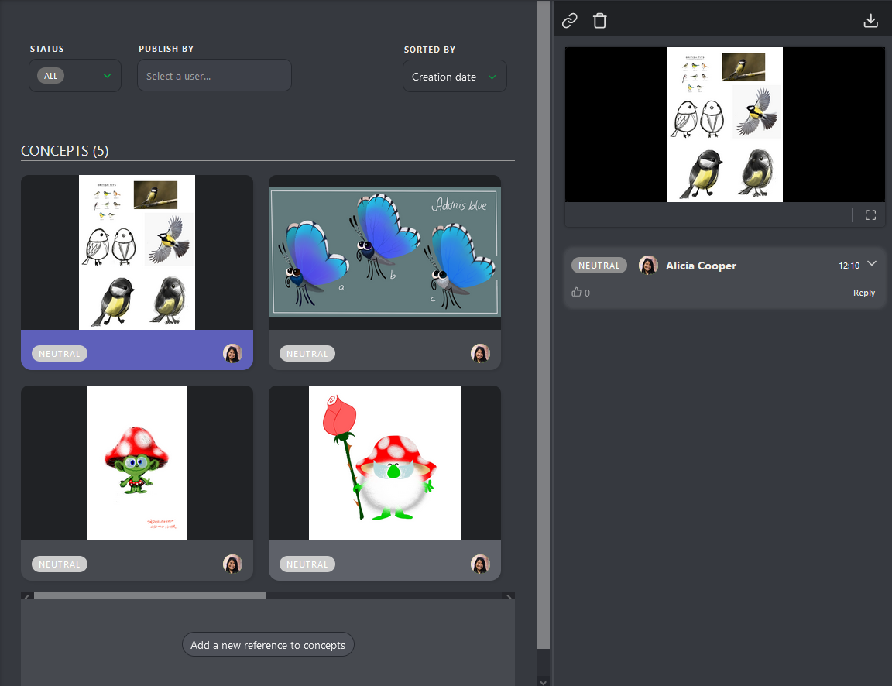
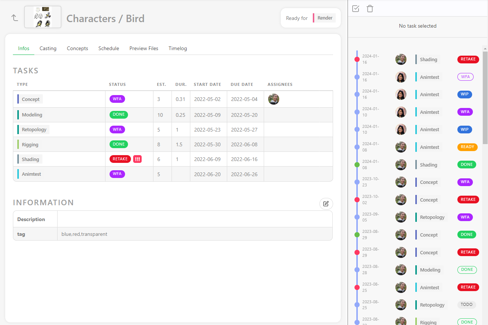
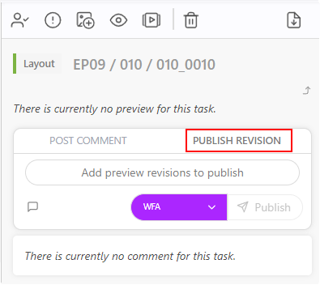
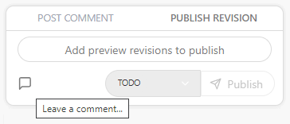

# 公開

## コンセプトの公開

**コンセプト**を公開するには、プロジェクトナビゲーションメニューから**コンセプト**ページに移動します。

コンセプトをアップロードするには、「**コンセプトへの新しい参照を追加**」ボタンをクリックします。1つまたは複数のコンセプトを同時にアップロードできます。

アップロードが完了すると、プレビューが生成され、コンセプトページから表示できるようになります。

サムネイルをクリックすると、コンセプトの拡大プレビューが表示されます。ステータスをクリックすると、右側に**コメントパネル**が開きます。

コメントパネルが開いている場合、次の2つのオプションがあります。

1) コンセプトを既存のアセットにリンクしたり、既存のリンクを削除したりすることができます。 
2) コンセプトにコメントを追加したり、ステータスを変更したりすることができます。

**コンセプト**は1バージョンのみにしておくのが望ましいです。コンセプトが承認されず、さらに変更が必要な場合は、そのコンセプトをバージョンアップした方が良いでしょう。

## コンセプトとアセットのリンク

コンセプトをアップロードすると、アセットにリンクすることができます。

リンクされたアセットの名前は、コンセプトのサムネイルの下、ステータスの上に表示されます。アセットがリンクされていない場合は、このエリアは空白になります。

コンセプトのステータスをクリックすると、右側にコメントパネルが開きます。

ここから、コンセプトがリンクされているものを調整したり、削除したりすることができます。以下の例では、コンセプトは現在アセットにリンクされていません。

アセットをリンクするには、[リンク] ボタンをクリックします。

すると、アップロードしたコンセプトにリンク可能なすべての**アセット**が表示されます。

リンクしたいアセットをリストから選択します。すると、リンクされたアセット名が画面の上部に表示され、コンセプトのサムネイルの下にも表示されます。

コンセプトがアセットにリンクされると、アセットの詳細ページから参照できるようになります。アセットページに戻り、コンセプトにリンクしたアセットをクリックします。

デフォルトでは、画面の2番目の部分にキャスティングの詳細が表示されます。ドロップダウンメニューを使用して、コンセプトを選択します。

コンセプトセクションに入ると、このアセット用に作成されたすべてのコンセプトが表示されます。ステータス別にフィルタリングすることもできます。

## プレビューをバージョンとして公開
プレビュー、画像、または動画を公開するには、タスクのコメントパネルにアクセスし、**[公開リビジョン]**タブを選択します。

WFA**ステータスなど、**[フィードバックリクエスト]**オプション付きのステータスを使用している場合、Kitsuは自動的に**[公開リビジョン]**タブに切り替わります。

任意のコメントに1つまたは複数のプレビューを追加することができます。 これらは、画像（`.png`、`.jpg`、`.jpeg`、`.gif`）、ビデオ（`.mp4`、`.mov`、`.wmv`）、または`.glb`ファイルです。 さらに、ブラウザからすべてのプレビューを確認したり、すべてを混ぜ合わせたりすることができます。

また、`.glb`ファイルをワイヤーフレームとして確認したり、`.HDR`ファイルを追加して照明を確認することもできます。詳細は**カスタマイズ**セクションを参照してください。

[パイプラインのカスタマイズ](../configure-kitsu/README.md#3d-backgrounds).

pdf、.zip、.rar、.ma、.mbなどの他のファイルはブラウザで表示できないため、確認するにはダウンロードする必要があります。

次に、**[プレビューリビジョンを追加して公開]**ボタンをクリックします。エクスプローラーが開き、ファイルまたは複数のファイルを選択できるようになります。

また、ダウンロードせずに、クリップボードからこのアップロードダイアログに**スクリーンショットをコピー＆ペースト**することもできます。ファイルを選択すると、**「公開するファイルを追加」**ボタンの近くにファイル名が表示されます。

また、アップロードしたいファイルをコメントセクションにドラッグ＆ドロップすると、自動的にアップロードプロセスが開始されます。

プレビューの上に**コメントを追加**することができます。**コメントを残す**ボタンをクリックして、コメントセクションを開きます。

次に、ステータスを選択し、**[投稿]** ボタンでプレビューを公開します。

サムネイルとして公開を使用する方法の詳細については、[サムネイルに関するこのセクションを参照してください](../thumbnails/README.md)。

## プレビューをバージョンにまとめる

複数の画像を同時に追加することも、画像をアップロードした後に別の画像を追加することもできます。

**プレビューの追加**ポップアップでは、ファイルの選択を求められます。アップロードした画像をナビゲートできます。

番号をクリックしてドラッグ＆ドロップすることで、プレビューの順序を変更できます。

プレビューを削除するには、コメントパネルを拡大し、バージョンの番号をクリックしてから、をクリックします。

