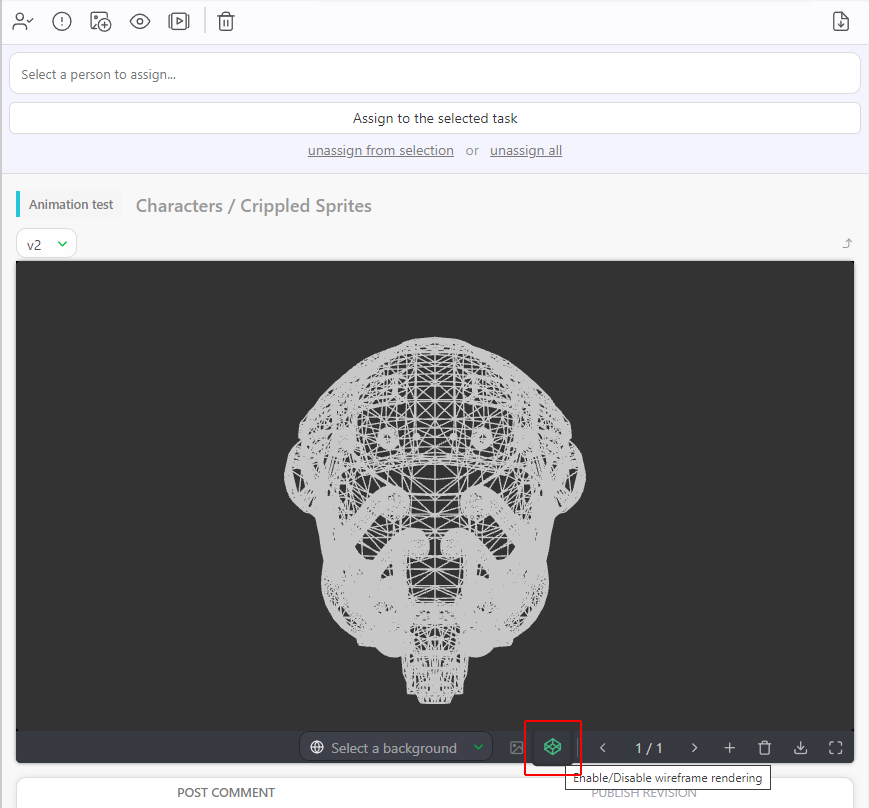
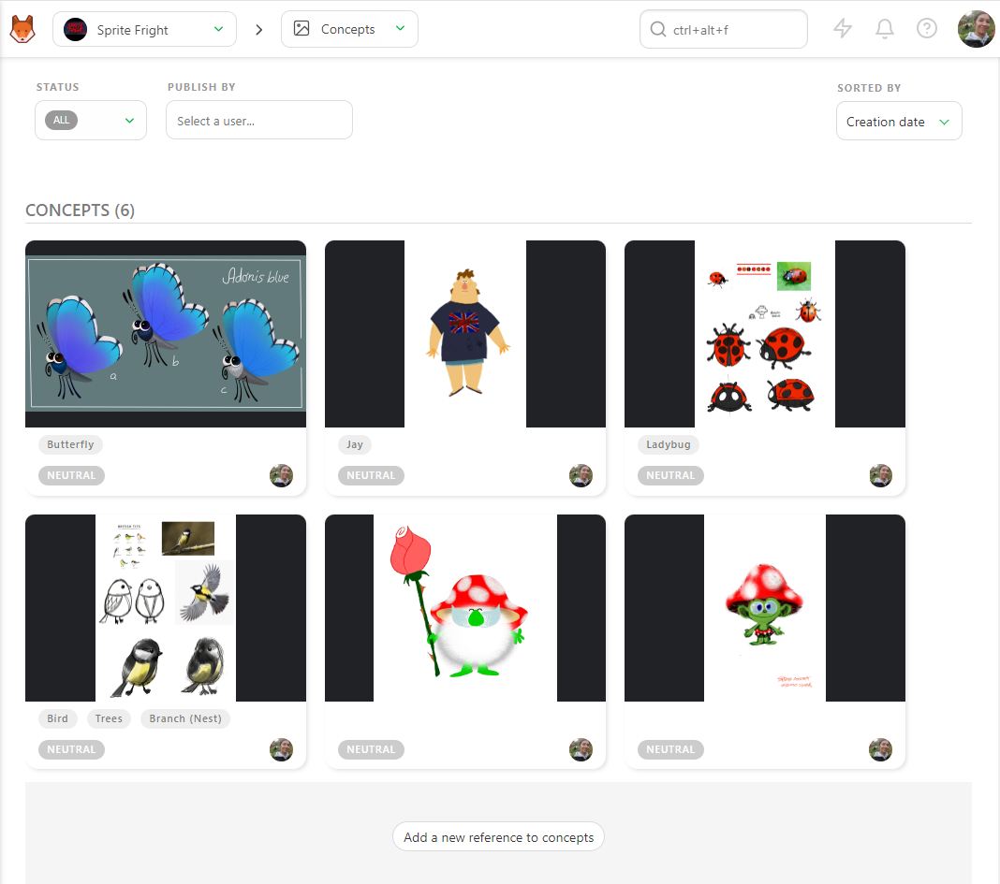
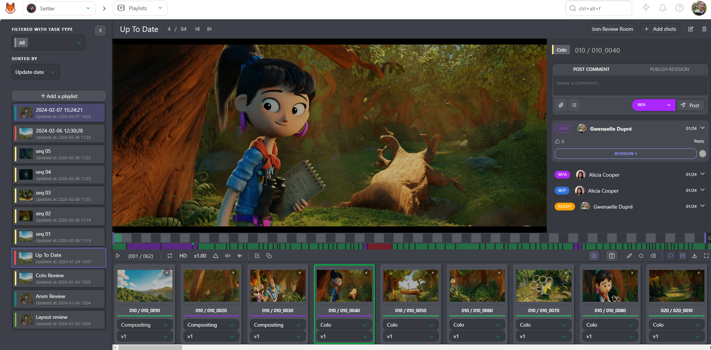

# レビュー

## レビュータスク

アーティストが自分の作品を誰かに**レビュー**してもらいたい場合、タスクのステータスを  に変更します。

ステータスをクリックすると右側のパネルが開き、レビューを開始できます。

右パネルからバージョンを閲覧し、パネルの端をつかんで拡大したり、このアイコンをクリックしてフルスクリーン表示にすることもできます 。

同様に、3Dファイル（`.glb`ファイル）をワイヤーフレームとして確認したり、`.HDR`ファイルを追加して照明を確認することもできます。

カーソルをドラッグ＆ドロップして3Dファイルを移動したり、スクロールホイールでズームイン・ズームアウトしたりできます。

詳細は**カスタマイズ**のセクションを参照してください。
[パイプラインのカスタマイズ](../configure-kitsu/README.md#3d-backgrounds)

使用する色を選択し、**鉛筆**ツールでプレビュー上に直接描画することができます 。

### 描画注釈

フレームに**テキスト**で注釈を付けることもできます。

**注釈**を一時的に非表示にしたい場合は、**「万年筆」**ボタンをクリックします。

### フレームへのタグ付け
コメント内で特定のフレームを参照したい場合は、`@`を入力するとサブメニューが開き、チームリストが表示されます。その後、**「フレーム」**の入力を開始します。

これにより、現在のフレームのタイムスタンプがコメントに追加され、タイムスタンプをクリックすると、そのフレームにジャンプします。

### 注釈のエクスポート
**スクリーンショットを添付ファイルとして添付**することで、各フレームの描画をエクスポートすることもできます。

添付ファイルを追加**]ボタンをクリックします。

添付オプションで、**注釈のスナップショットを添付する**こともできます。これにより、注釈を付けたフレームをコメントの添付ファイルとして追加することができます。これは、フィードバックの中で特定の注釈を強調したい場合に便利です。

ボタンをクリックすると、Kitsuが注釈付きのすべてのフレームを取得し、結果を表示します。 **確認**をクリックすると、それらを公開できます。

### 注釈の削除
線を削除したい場合は、鉛筆アイコンを再度クリックします。カーソルが多方向クロス  に変わり、線を削除したい場所まで移動して選択します。

方向を示す十字のアイコンで線を選択し、削除アイコン  を押します。

### 画像の比較
**フルスクリーン**モードにすると、**比較**ボタン  をクリックして、2つのタスクタイプまたはバージョンを並べて比較することができます。

ここから、アーティストに変更を依頼する場合は、ステータスを  に変更できます。

あるいは、アーティストに作業を承認したことを通知するために、  に変更することもできます。

## コンセプトのレビュー

アーティストがコンセプトをアップロードすると、スーパーバイザーまたはディレクターがそれをレビューすることができます。

コンセプトをレビューするには、画面上部のナビゲーションメニューを使用してコンセプトページを選択します。

アップロードされたすべてのコンセプト、そのステータス、割り当て、リンクされたアセットを確認できます。

コンセプトを確認するには、ステータスをクリックしてコメントパネルを開きます。コメントパネルを拡大したり、フルスクリーン表示にしたりすることができます。

次に、コメントを入力し、ステータスとして**承認済み**または**却下済み**を選択し、**投稿**ボタンで確定します。

**ステータス**フィルターを使用してページをフィルタリングし、**ニュートラル**ステータスのすべてのコンセプトを表示することができます。また、アーティスト別にフィルタリングしたり、ソート順を変更することもできます。

## プレイリスト

### プレイリストの作成

プレイリストは、レビューと承認のために編集されたバージョン/プレビューの一覧です。ドロップダウンメニューに**プレイリスト**ページがあります。

**プレイリスト**ページは2つの部分に分かれています。

(1) あなたのプレイリストの一覧です。ここで新しいプレイリストを**作成**したり、既存のプレイリストを読み込むことができます。
- (2) 最後に作成されたプレイリストと最後に変更されたプレイリスト。

 ボタンを使用して、**プレイリスト**を作成します。プレイリスト名はデフォルトでは現在の日付と時刻になりますが、変更することができます。 プレイリストを**スタジオ**または**クライアント**と共有するかどうか、また、**ショット**または**アセット**のプレイリストにするかを選択できます。 プレイリストに**タスクタイプ**のタグを追加することもできます。

### プレイリストへの追加

プレイリストが作成されたら、検索/フィルタバーを使用して、プレイリストに追加するショットを選択します。

プロジェクトの大部分を一度に追加したい場合は、**エピソード全体**/**シーケンス全体**を追加するオプションも表示されます。

**Daily pending**（日次保留中）を選択すると、その日の**WFA**タスクがすべて追加されます。

グローバルショット/アセットページと同じ**フィルタ**を使用できます。例えば、検索バーに**animation=wfa**と入力すると、**アニメーション**段階にあるすべての**WFA**（「ワーク・フォー・アニメーション」の略）タスクを選択できます。**Add selection**（選択を追加）ボタンで選択を検証します。Kitsuは、**アニメーション**段階にある**WFA**ステータスのショットを選択し、**最新のアップロードバージョン**を自動的に読み込みます。

ショットは画面の上部に表示されます。 変更はすべて自動的に保存されます。

## レビューコントロール

プレイリストを作成すると、いくつかのオプションが利用可能になります。

* 再生または一時停止
* プレイリスト内の要素間を移動
* 選択した要素の全体数に対する位置を確認
* オーディオのミュートまたはミュート解除
* 再生速度の変更：2倍速（x2）、通常速（x1）、半分の速さ（x0.50）、4分の1の速さ（x0.25
* 1つの要素を連続ループ
* オーディオ波形の表示
* 再生中の注釈の表示
* プレイリスト全体のタイムコードと比較した、各エレメントのタイムコード（TC）を表示
* フレーム数を表示
* プレビュー上でフレーム単位のナビゲーション（キーボードの左矢印キーと右矢印キーも使用可能
* 比較ツールへのアクセス

* アノテーションの取り消しとやり直しオプション
* テキストと描画オプション（選択した項目の削除を含む

* プレイリスト内の全要素のタスクタイプを変更
* コメントセクションを表示
* プレイリスト内の要素を非表示
* LD（低解像度）とHD（高解像度）を切り替え
* 個々の要素を含む**Zip**ファイル、**.csv**テキストファイル、または**Build .mp4**としてプレイリストをダウンロードし、ムービー全体を作成（ショットのみ）
* フルスクリーンモード

プレイリスト内の各ショット/アセットについて、確認したい**タスク**と**バージョン**を選択できます。

また、ショットの2つのタスクを並べて再生することもできます。

[比較] ボタンをクリックします  し、2番目のタスクタイプを選択します。

プレビューから直接ショットにコメントを追加できます。

[コメント] ボタンをクリックします。

右パネルにアクセスできるようになりました。このパネルには、コメントの履歴とステータスが表示されます。

ビデオ上に描画したコメント（タイムラインの下の赤い点）を見ることができます。

[描画]ボタン を使用して、動画上に描画したり文字を入力したりすることができます（[レビューの実行](../getting-started-production/README.md#perform-a-review)と同様）。

## レビュールーム

レビュールームは、効率的で同期されたデイリーズレビューセッションを行うために設計された共同作業スペースです。これにより、すべての参加者が同時に同じコンテンツを閲覧することができ、リアルタイムのフィードバックやディスカッションが容易になります。

レビュールームについてさらに詳しく知りたい場合は、[このセクションを参照してください](../playlist-client/README.md#review-room)。
