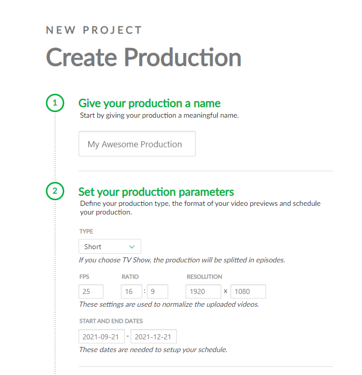
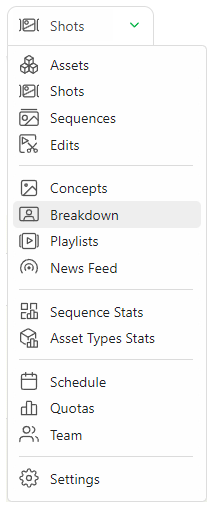

# アセットのみの制作を作成

Kitsuでワークフローを設計し、より多くのユーザーを招待したので、今度は制作を作成します。 

**新しい制作を作成**ボタンをクリックします。

制作物の名前を入力し、**タイプ**として**アセットのみ**を選択し、制作物のスタイル（2D、3D）を選択します。

次に、FPS数、アスペクト比、解像度などの技術情報を入力します。

これらのデータはすべて、Kitsuがアップロードされたビデオプレビューを再エンコードする際に使用されます。

次に、制作物の開始日と終了日を定義する必要があります。

プロダクションのワークフローは、次のパート3から6で定義できます。

アセットのタスクタイプ（3）、タスクのステータス（4）、アセットタイプ（5）を選択する必要があります。

::: ヒント
**制作ワークフロー**を作成するには、グローバルライブラリからタスクタイプを選択します。

タスクタイプをいくつか見落としていたことに気づいた場合は、後でそれらを作成することができます。

[スタジオワークフロー](../first_production/README_configure_Kitsu.md#studio-workflow) のセクションを参照してください。
:::

次に、6はオプション部分です。アセットの入ったスプレッドシートがすでに用意されている場合。

詳細は**インポートCSV**のセクションを参照してください。

[アセットのインポート](../batch-action/README.md#create-assets-from-a-csv-spreadsheet-file)

[Import shot](../batch-action/README.md#create-shots-from-a-csv-spreadsheet-file)

 ボタンですべてを検証します。

## Kitsuグローバルページの紹介

Kitsuのグローバルアセットページへようこそ。

見てみましょう。

上部 (1) には、**グローバルナビゲーション**があり、これはすべての制作ページで常に表示されます。

**左から右へ:**

### メインメニュー

左上のボタン、Kitsu（またはお客様のスタジオロゴ）をクリックすると、メインメニューが開きます。

メインメニューでは、割り当てられたタスク、制作物、グローバルおよびチームスケジュール、ワークフローのカスタマイズページ、およびKitsu設定に直接アクセスできます。

::: 詳細 メインメニューの詳細
**ワークスペース**
- マイタスク：割り当てられたタスク 
- マイチェック：あなたの部署に応じて、ステータスが**フィードバックリクエスト**となっているすべてのタスク
- マイプロダクション：プロダクションページの選択に戻ります。

**スタジオ**
- プロダクション
- 担当者
- タイムシート
- メインスケジュール
- チームスケジュール
- すべてのタスク
- ニュースフィード
- エンティティ検索

**ADMIN**
- 部署
- タスクの種類
- アセットの種類
- カスタムアクション
- 自動化
- 3D背景
- ボット
- 設定
- ログ

::: 警告 権限の表示
ワークスペースセクションは、アーティストには表示されない「マイチェック」を除くすべての権限に対して有効になっています。

アーティスト（およびそれ以上）は、自身の**タイムシート**も表示でき、**エンティティ検索**にもアクセスできます
:::

### ナビゲーション

メインメニューアイコンの右側にナビゲーションのドロップダウンメニューが表示されます。

制作を選択できます。実際の制作名と実際のページ名が常に表示されます。

ドロップダウンメニューを使用して、制作から制作へと移動できます（複数の制作がある場合）。

制作を選択すると、次のドロップダウンメニューで、その制作の異なるページを移動することができます。

::: 詳細 ナビゲーションの詳細
最初のセクションは、タスクのトラッキングについてです
- アセット
- 編集（特定のタスクを作成した場合）

2番目のセクションは、制作の側面についてです
- コンセプト
- ブレークダウン
- プレイリスト
- ニュースフィード

3番目のセクションは統計情報です。
 - アセットタイプ統計

4番目のセクションはチーム管理に関連しています。
 - スケジュール
- クォータ
- チーム

5番目のセクションは制作の設定です。
 - 設定

::: ヒント
アセットページから開始しますが、制作ホームページを他のエンティティに変更することができます（設定ページを参照）。
:::

::: 警告 
エピソードなど、追加のナビゲーションレベルが必要だと気づいた場合は、制作タイプを**テレビ番組**に変更する必要があります。

逆に、ショットが必要だと気づいた場合は、制作タイプを**アセットのみ**から**ショート**に変更する必要もあります。
:::

### グローバル検索、ニュース、通知、およびドキュメント
グローバル検索はナビゲーションドロップダウンメニューの右側にあります。 4件の最初の検索結果を表示するクイックアクセス検索です。 さらに多くの結果やフィルタリングオプションが必要な場合は、**エンティティ検索**ページを参照してください。

次のアイコン  は、ニュースとフィードバックページへの直接リンクです。

アニメーションGIFで新機能のすべてをご覧いただけます。また、Kitsuに追加してほしい次期機能に関するご意見もご投稿いただけます。

ベルのアイコンは、通知（割り当て、コメント、タグ）を表示します！[通知](../img/getting-started/notification_icon_on.png)。未読の通知の数は、ベルのアイコンに表示されます。

アバターの直前のアイコンは、ドキュメントボタンです。
 あなたが今読んでいるドキュメントです！

### 個人設定
アバターをクリックすると、メニュー（設定、ドキュメントなど）を開くことができます。

## タスクリスト

### エンティティスプレッドシート

画面の2番目の部分は、すべてのエンティティ（アセット、ショット、シーケンス、編集）に共通です。これはグローバルなタスクリストです。

ここでは、各タスクのステータス、割り当て、優先度などを確認できます。

::: ヒント
スプレッドシートの最初の行と列のヘッダーは、ページを下にスクロールしても常にページの先頭に表示されます。

また、他の列を常に表示しておくために「固定」することもできます。
:::

### フィルター

左側の最初の要素はフィルターボックスです。単純なフィルタリング、順序、アセットタイプなど、任意の文字列を入力することができます。

より高度なフィルタリングが必要な場合は、フィルタービルダーボタンを使用してください。

すべてのフィルターを保存し、ページとして使用することができます。

### 表示の簡素化

画面の右側には、左から右に、アサインメントの表示/非表示、追加カラムの表示/非表示、サムネイルの拡大/縮小を行うためのボタンがあります。

### インポート / エクスポート
バッチインポートサムネイル 、最後にインポート  またはエクスポート  データの

### メタデータカラム
以下に、カラムの名前があります。**名前**の隣にある(+)をクリックすると、 が表示され、新しいメタデータカラムを作成できます。次に、タスクタイプのカラムの名前があります。

### ビューのカスタマイズ
画面の一番右側、スクロールバーの隣に、テキストカラムの表示/非表示を切り替えるオプションがあります

。

### ビューのまとめ
最後の部分（4）は、画面の下部にある、表示されたページのまとめです。つまり、ページをフィルタリングすると、まとめも更新されます。

表示されているページのサマリーが表示されます。 要素（アセットまたはショット）の数、見積もり日数、およびすでに費やした日数の合計を確認できます。

## アセットの作成
### 最初のアセットの作成
制作物を制作し、Kitsuインターフェースの概要を理解したので、最初のアセットを作成してみましょう。

アセットページで、**[アセットを追加]**をクリックします。

::: 警告
アセットを作成すると、タスクワークフローが適用され、**すべてのタスクがアセットと同時に作成されます**。
:::

ポップアップウィンドウが開きます。

**アセットタイプ**を選択するよう求められます（1）。
新しいアセットタイプを追加していない場合、Kitsuは「キャラクター」、「環境」、「エフェクト」、「小道具」などの例を提供します。
まずはキャラクターから始めましょう。

::: ヒント
アセットタイプリストとタスクパイプラインをカスタマイズすることもできます。
[ワークフローのカスタマイズ](../customization-pipeline/README.md#modify-an-existing-asset-types) )
:::

**名前** (2) を付け、アーティストが何をすべきか、またアセットを素早く識別できるようにするための説明を入力します。

複数のアセットを作成する場合は、**「確認して戻る」**をクリックします。

アセットの種類を変更して、アセットを追加し続けることができます。

::: ヒント
「確認して戻る」をクリックするたびに、新しく作成したアセットが背景に表示されます。
:::

最後のアセットを追加したら、
「確認」をクリックします。アセットが作成され、ウィンドウが閉じます。 

::: ヒント
「確認して戻る」をクリックしたものの、追加するアセットがもうないことに気づいた場合は、「閉じる」をクリックすると、ウィンドウがキャンセルされます。
:::

また、アセットワークフローで選択されたタスクも同時に作成されます。

さらに**アセット**を追加する必要がある場合は、**+ アセットの作成**ボタンをクリックします。

::: 詳細 CSVスプレッドシートファイルからのアセットの作成
アセットのリストがすでにスプレッドシートファイルに用意されているかもしれません。
Kitsuでは、それらをインポートする方法が2つあります。1つ目は、`.csv`ファイルをインポートし、データを直接Kitsuにコピー＆ペーストする方法です。

まず、スプレッドシートを`.csv`ファイルとして保存します。

次に、Kitsuのアセットページに戻り、**インポート**アイコンをクリックします。

ポップアップウィンドウの**「CSVからデータをインポート」**が開きます。**「参照」**をクリックして、`.csv`ファイルを選択します。

結果を確認するには、**「プレビュー」**ボタンをクリックします。

データのプレビューで列の名前を確認し、調整することができます。

注：**「エピソード」**列は、**「テレビ番組」**制作の場合のみ必須です。

すべてが適切であることを確認したら、**「確認」**ボタンをクリックしてデータをKitsuにインポートします。

これで、すべての資産がKitsuにインポートされ、設定に従ってタスクが作成されました。

::::

:::: 詳細 スプレッドシートファイルのコピー/ペーストによる資産の作成

スプレッドシートを開き、データを選択してコピーします。

次に、Kitsuのアセットページに戻り、**インポート**アイコンをクリックします
。

ポップアップウィンドウ**CSVからのインポート**が開きますので、**CSVデータの貼り付け**タブをクリックします。

以前に選択したデータを貼り付け、**[プレビュー]**ボタンで結果を確認できます。

データのプレビューで列の名前を確認し、調整することができます。

注意：**エピソード**の列は、**テレビ番組**の制作の場合のみ必須です。

すべて問題なければ、**確認**ボタンをクリックしてデータをKitsuにインポートします。

これで、すべてのアセットがKitsuにインポートされ、設定に従ってタスクが作成されました。

:::

### アセットの詳細を確認する

アセットの詳細を確認するには、その名前をクリックします。

新しいページが開き、右側にタスク、アサイン、ステータスニュースフィードの一覧が表示されます。

各タスクのステータスをクリックすると、コメントパネルが開き、コメントの履歴や異なるバージョンを確認できます。

また、**キャスティング**にもアクセスできます。

このアセットに関連付けられた**コンセプト**にもアクセスできます。

**スケジュール**は、タスクタイプのページのデータを事前に記入している場合に表示されます。データがすでに記入されている場合は、ここで直接修正することができます。 

さまざまなタスクタイプでアップロードされた**プレビューファイル**、

そして、このアセットのタスクでタイムシートが記入された場合の**タイムログ**。

## アセットを作成した後にタスクを追加する

アセットを作成した後に、タスクが欠けていることに気づいた場合でも、追加することができます。

まず、欠けているタスクタイプが、タスクタイプタブの設定ページに追加されていることを確認してください。

次に、アセットページに戻り、**+ タスクを追加**をクリックします

### アセットを更新する
いつでもアセットを更新し、名前やアセットタイプを変更したり、説明文やグローバルページに追加したカスタム情報を修正することができます。

アセットを編集するには、アセットページに移動し、編集したいアセットの上にカーソルを合わせて、**[編集]**ボタンをクリックします
！[編集ボタン](../img/getting-started/edit_button.png) (1)
行の右側にある

アセットのメインページの説明を拡張するには、最初の語句 (2) をクリックすると、説明の全文を含むポップアップが開きます。

アセットを削除するには、FAQ : [アセットの削除方法](../faq-deletion/README.md##how-to-delete-an-asset)を参照してください。

::: 詳細 CSV インポートによるアセットの更新
CSV インポートを使用すると、データを素早く更新することができます。

アセットの**タイプ**、**アサインメント**、タスクの**ステータス**を更新したり、**コメント**を追加したりすることができます。

**既存のデータを更新する**オプションをオンにする必要があります。すると、更新される行が
青くハイライトされます。

::::

:::: 詳細 スプレッドシートファイルのコピー＆ペーストによるアセットの更新

スプレッドシートを開き、データを選択してコピーします。

次に、Kitsuのアセットページに戻り、**インポート**アイコンをクリックします
。

ポップアップウィンドウ**CSVからのインポート**が開きますので、**CSVデータの貼り付け**タブをクリックします。

以前に選択したデータを貼り付け、**[プレビュー]**ボタンで結果を確認できます。

データをプレビューして、列の名前を確認し、調整することができます。

注意：**エピソード**の列は、**テレビ番組**制作の場合のみ必須です。

既存のデータを更新**オプションをオンにする必要があります。すると、更新される行が
青くハイライトされます。

これで、すべてのアセットがKitsuにインポートされ、設定に従ってタスクが作成されました。

:::

## コンセプトの作成
### コンセプトのアップロード

**コンセプト**を作成するには、ナビゲーションメニューから**コンセプト**ページに移動します。

コンセプトをアップロードするには、「**コンセプトへの新しい参照を追加**」ボタンをクリックします。

一度に1つまたは複数のコンセプトをアップロードできます。

プレビューをアップロードすると、コンセプトページは次のようになります。

コンセプトとやりとりするには2つの方法があります。画像をクリックすると拡大表示されます。
もう1つは、ステータス部分をクリックして右側の**コメントパネル**を開く方法です。

コメントパネルでは、2つのオプションがあります。コンセプトを既存のアセットにリンクするか、削除するかです。
また、アセットにコメントを追加したり、ステータスを変更することもできます。

**コンセプト**ごとに1つのバージョンを持つことが基本です。承認されていない場合は、同じコンセプトの複数のバージョンを作成しないよう、新しいコンセプトをアップロードする必要があります。

1つのコンセプトは1つのタスクです。

### コンセプトとアセットのリンク

コンセプトをアップロードすると、アセットにリンクすることができます。

アセットのステータス部分にリンクが表示されます。

コンセプトのステータス部分をクリックすると、右側にコメントパネルが開きます。

コメントパネルの上部には、コンセプトをアセットにリンクするオプションと、コンセプトを削除するオプションがあります。

アセットをリンクするには、[リンク] ボタン  をクリックします。

Kitsu は、アップロードしたコンセプトにリンク可能なすべての **アセット** を表示します。

Kitsu は、コメントパネルの上部にリンクされたアセットをリスト表示します。現時点では、リンクはありません。

アセットをリンクするには、それをクリックする必要があります。リンクされたアセットの名前は、画面の上部およびコンセプトのプレビューの下部に表示されます。

コンセプトがアセットにリンクされると、アセットの詳細ページで確認できます。

アセットページに戻り、コンセプトを確認したいアセット名をクリックします。

デフォルトでは、キャスティングの詳細が画面の2番目の部分に表示されます。
ドロップダウンメニューを使用してコンセプトを選択します。

コンセプトセクションに入ると、このアセット用に作成されたすべてのコンセプトが表示されます。ステータスごとにフィルタリングすることができます。

## カスタムメタデータカラムの作成

一般的なスプレッドシートページにさらに情報を追加するには、カスタムの**メタデータカラム**を作成する必要があります。

難易度レベル、天候、タグなど、ページに追加する追加情報があるかもしれません。テキスト（または数値）情報をすべてカスタムメタデータ列に保存できます。

名前列の近くにある**+**をクリックします。

タイプ**オプションでは、情報をどのように保存するかを選択できます。
- 自由入力の**テキスト**、
- **数値**、
- **チェックボックス**、
- **値のリスト**、
- **タグのリスト**、
- **チェックリスト**。

::: 警告 
テキスト、数値、およびチェックボックスでは、各エンティティに異なる情報を追加できます。最初に計画する必要はありません。

リスト値、タグリスト、およびチェックリストでは、各エンティティに同じ選択肢が与えられます。さらに、これは現在入力する必要があります。

**利用可能な値**の下にリスト要素を入力し、**値を追加**をクリックして確認します。
:::

メタデータカラムを1つまたは複数の**部署**にリンクすることもできます。

::: ヒント
メタデータカラムを部署にリンクします。アーティスト/スーパーバイザーは、自分のToDoページおよび部門フィルタリングビューでこれを見ることができます。

メタデータ列を1つまたは複数の部門にリンクすることができます。リストから部門をクリックし、**追加**をクリックして有効にします。

ここでは、VFX列が2つの部門にリンクされています。

:::

::: 詳細 メタカラムの編集
アセットまたはショットのグローバルページで、メタカラムの右側にある矢印をクリックし、**[編集]**をクリックします。

:::

この情報は、グローバルスプレッドシートページで直接入力できます。
ケースは編集可能です。

::: ヒント
左側の複数のエンティティを選択し、メタデータ列を一括で変更することができます。
:::

::: 詳細 手動で編集
編集ボタン  を使用して情報を変更することもできます。

編集ポップアップに新しい行が表示されます。リストから情報を選択することもできますが、
代わりに、テキストや数値を直接入力したり、チェックボックスにチェックを入れたり、チェックリストを使用したりすることもできます。

編集が完了したら、必ず「確認」ボタンをクリックしてください。

:::

メタデータ列を編集または削除する場合は、スプレッドシートの一般ページに移動します。
メタデータ列の名前の近くにある矢印をクリックします！[メタデータ列の詳細](../img/getting-started/arrow.png)。

::: ヒント
この新しい列を使用して、グローバルページを**ソート**することができます。列名の右にある矢印をクリックして、このメニューを開きます。次に、**ソート**をクリックします。

メタデータ列を左側に**固定**することもできます。
:::

## 編集の作成

Kitsuでは、**編集**レベルでタスクを追跡することができます。

特に、
複数の検証ステップで複数の編集を追跡する必要がある場合に便利です。例えば、映画全体、複数の予告編、ファースト・エディット、ファイン・エディット、ミックスなどを追跡することができます。

::: 警告
デフォルトでは、**Edit** ページは、**制作ライブラリ**（設定ページ）にそれ用のタスクタイプが作成されるまで表示されません
:::

このページを使用するには、まず **グローバルライブラリ**に **Edit** 属性を持つ専用のタスクタイプを作成する必要があります。

新しい **タスクタイプ**を作成するには、「**パイプラインのカスタマイズ**」セクションを参照してください。

[Pipeline customization](../customization-pipeline/README.md)

グローバルライブラリで**タスクタイプ**を作成したら、**プロダクションライブラリ**に追加します。
すると、ナビゲーションのドロップダウンメニューに**Edit**が表示されます。

この新しいページは、アセットおよびショットのグローバルページと同様に動作します。**+ 新規編集** ボタンで編集を追加できます。

タスクの割り当て、レビュー、ステータスの変更などを行うことができます。

メタデータ列を追加したり、説明を記入したりすることができます。

::: ヒント
配信内容によっては、**編集** ごとに解像度を変更することもできます。
:::

::: 警告
詳細ページは他のエンティティとは異なります。

**Edit** が特定のロングビデオに焦点を当てているため、詳細ページはコメントの詳細ページにより似たものとなっています。
:::

このページでは、アセットやショットのエンティティと同様に、Editエンティティの**名前の変更**や**削除**が可能です。

## ブレークダウンリストの作成

ブレークダウンを記入すると、アセットの組み立てに役立ちます。
ブレークダウンには、メインのアセットを作成するために追加する必要のあるアセットの詳細がすべて記載されています。

ドロップダウンメニューで **BREAKDOWN** を選択します。

ブレークダウンページの左側にはアセットメニュー（1）があります。作成したものの中から選択できます。これらは画面の右側部分で、
作成したすべてのアセットがこの制作で利用可能です（3）。さらに、
中央セクションでは、アセットの選択（2）を行います。

したがって、キャストしたいアセットを選択する必要があります。

サムネイルがまだない場合はアセットをテキストで表示したり、
サムネイルのサイズを拡大することもできます。

また、ブレイクダウン中にアセットをリストに追加する必要があることに気づくかもしれません。

ブレークダウンページから直接新しいアセットを作成することができます。「利用可能なすべてのアセット」の右にある「+」をクリックします。

また、複数のアセットを一度に選択することもできます。最初の「アセット」をクリックし、「シフト」キーを押したまま、選択する最後の「アセット」をクリックします。

次に、割り当てたいアセットをクリックします。
キャラクター、背景、... 右側部分 (3) から。
複数のアセットを選択した場合、選択したアセットが多数のアセットに適用されます。

アセットで満たされたアセットをコピーし、このアセット選択を別のアセットに貼り付けます。

アセットの上にカーソルを移動させると、**+1** または **+10** と表示されます。これは
このアセットを追加した回数であり、必要なだけクリックできます。

画面中央（2）にアセットが表示されているのが確認できます。
アセット名の隣には、追加された回数が表示されています。この
例では、キャラクターアセット「ラマ」を2回追加しています。

誤ってアセットを2回追加してしまった場合は、画面中央部分に戻って、このショットのアセットを選択する必要があります（2）。そこから、**-1**をクリックします。
このショットの作業が完了したら、他のショットの作業に進みます。
選択した内容は自動的に保存されます。

作業中に新しいアセットが作成された場合は、アセットページに戻り
ページ（ドロップダウンメニューを使用）に戻り、必要なアセットを作成します。 以前に作成されたタスクは、これらの新しいアセットに即座に適用されます。
 ただし、割り当てを実行する必要があります。その後、
ブレークダウンを続行できます。

これで、**ブレークダウン**ページは次のようになります。

::: 詳細 CSVファイルから内訳リストを作成する

すでにスプレッドシートファイルで内訳リストが準備できているかもしれません。 Kitsuでは、それをインポートする方法が2つあります。1つ目は、.csvファイルを直接インポートする方法、2つ目は、データを直接Kitsuにコピー＆ペーストする方法です。

まず、Kitsuの推奨に従って、スプレッドシートを `.csv` ファイルとして保存します。

インポート] ボタンをクリックしてください！[インポート] ボタン (../img/getting-started/import.png)

ポップアップウィンドウ [CSV からのインポート] が開きます。 [参照] をクリックして `.csv` ファイルを選択してください。

結果を確認するには、[プレビュー] ボタンをクリックしてください。

データのプレビューで列名を確認し、必要に応じて調整します。

注：**[エピソード]**列は、**[テレビ番組]**制作の場合のみ必須です。

すべてが適切であることを確認したら、**[確認]**ボタンをクリックしてデータをKitsuにインポートします。

これで、ブレークダウンがKitsuにインポートされました。

:::

::: 詳細 スプレッドシートファイルをコピー/ペーストしてブレークダウンリストを作成

スプレッドシートを開き、データを選択してコピーします。

次に、Kitsuのブレークダウンページに戻り、**インポート**アイコンをクリックします 
。

ポップアップウィンドウ「**CSVからデータをインポート**」が開きますので、「**CSVデータを貼り付け**」タブをクリックします。

以前に選択したデータを貼り付け、**[プレビュー]** ボタンで結果を確認できます。

データのプレビューで列の名前を確認し、調整できます。

注：**[エピソード]** 列は、**[テレビ番組]** 制作の場合のみ必須です。

すべてが正しく入力されたら、**Confirm**ボタンをクリックしてデータをKitsuにインポートします。

これで、すべてのアセットがKitsuにインポートされました。

:::
