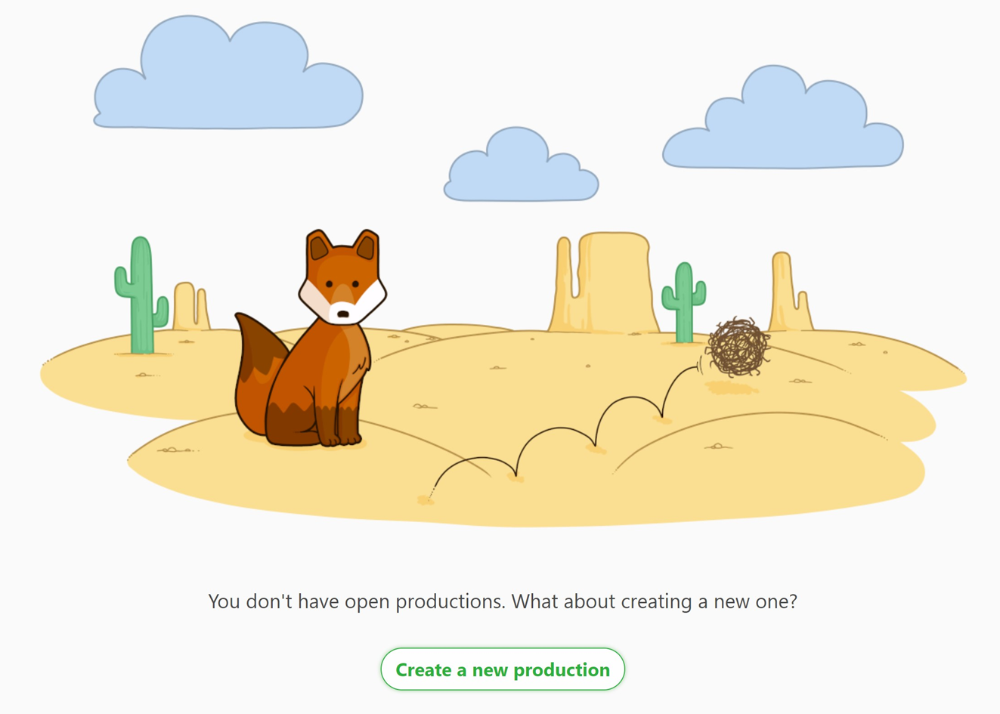
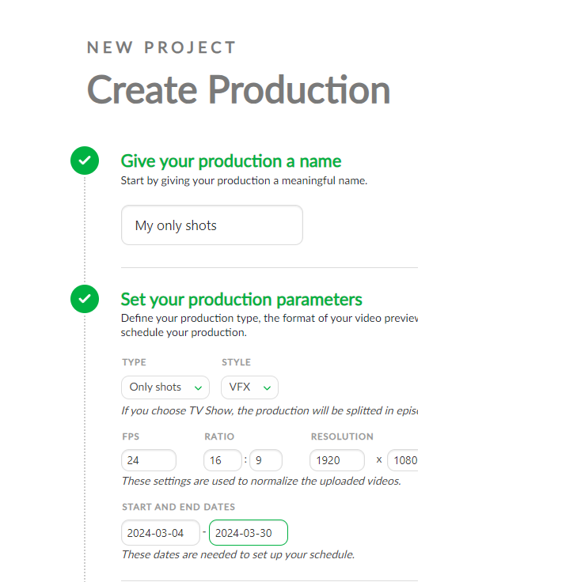
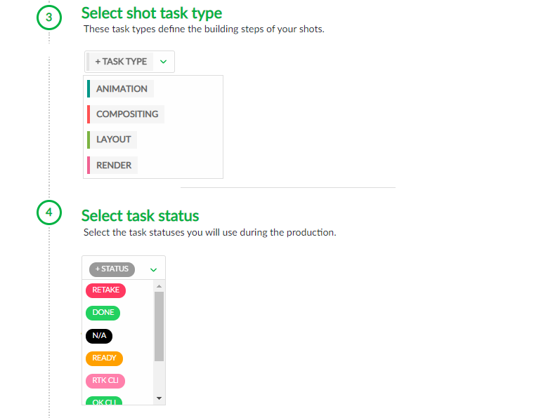
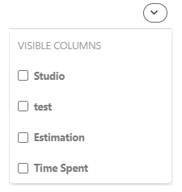
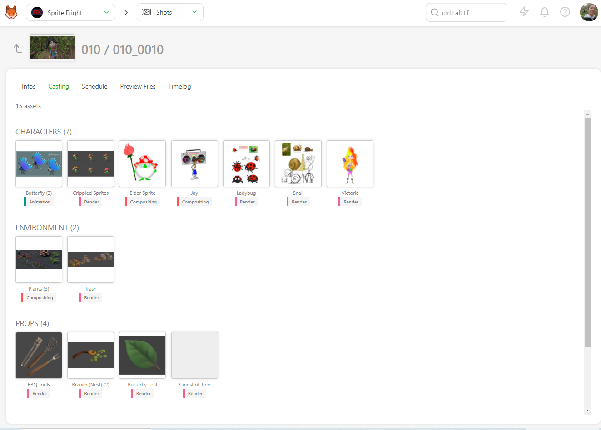
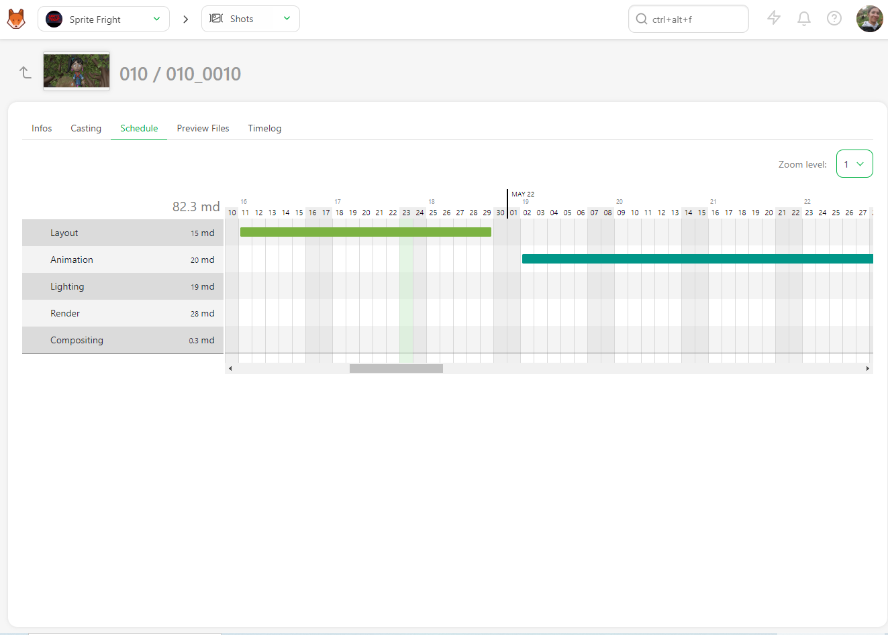
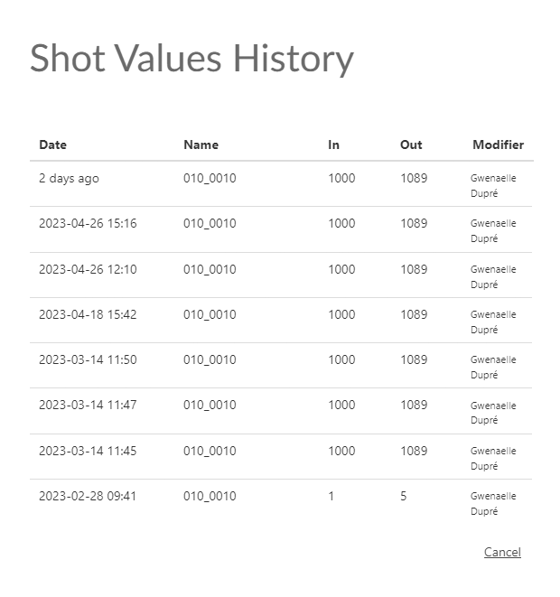
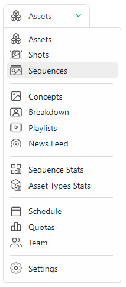
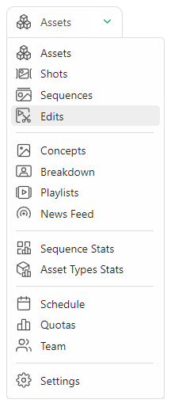

# ショットのみの制作を作成

Kitsuでワークフローを設計し、さらに多くのユーザーを招待したので、今度は制作を作成する番です。

[新しい制作を作成]ボタンをクリックします。

制作の名前を入力し、[タイプ]として[ショットのみ]を選択し、制作に最適なスタイルを選択します。

次に、FPS数、比率、解像度などの技術情報を入力する必要があります。

これらのデータは、アップロードされたビデオプレビューがキットゥで再エンコードされる際に使用されます。

次に、制作物の開始日と終了日を定義する必要があります。

ショットのワークフロー（タスクタイプ）（3）と検証プロセス（タスクステータス）（4）を選択する必要があります。 

::: ヒント
**制作ワークフロー**を作成するには、グローバルライブラリからタスクタイプを選択します。

タスクタイプをいくつか見落としていたことに気づいた場合は、後で作成できます。

[スタジオワークフロー](../first_production/README_configure_Kitsu.md#studio-workflow)セクションを参照してください。
:::

次に、5はオプションパーツです。ショットの入ったスプレッドシートをすでに持っている場合は、

詳細は**インポートCSV**のセクションをご覧ください。

[ショットのインポート](../batch-action/README.md#create-shots-from-a-csv-spreadsheet-file)

ボタンで全てを検証します。

## Kitsuグローバルページの紹介

Kitsuのグローバルアセットページへようこそ。

見てみましょう。

上部 (1) には、**グローバルナビゲーション**があり、これはすべての制作ページで常に表示されます。

**左から右へ:**

### メインメニュー

左上のボタン、Kitsu（またはお客様のスタジオロゴ）をクリックすると、**メインメニュー**が開きます。

メインメニューでは、割り当てられたタスク、制作物、グローバルおよびチームスケジュール、ワークフローのカスタマイズページ、およびKitsuの設定に直接アクセスできます。

::: 詳細 メインメニューの詳細
**ワークスペース**
- マイタスク：割り当てられたタスク 
- マイチェック：所属部署に応じて、ステータスが**フィードバックリクエスト**となっているすべてのタスク
- マイプロダクション：プロダクションページの選択に戻ります。

**スタジオ**
- プロダクション
- 担当者
- タイムシート
- メインスケジュール
- チームスケジュール
- すべてのタスク
- ニュースフィード
- エンティティ検索

**ADMIN**
- 部署
- タスクの種類
- アセットの種類
- カスタムアクション
- 自動化
- 3D背景
- ボット
- 設定
- ログ

::: 警告 権限の表示
ワークスペースセクションは、アーティストには表示されない「マイチェック」を除くすべての権限に対して有効になっています。

アーティスト（およびそれ以上）は、自身の**タイムシート**も表示でき、**エンティティ検索**にもアクセスできます
:::

### ナビゲーション

メインメニューアイコンの右側にナビゲーションドロップダウンメニューが表示されます。

Production] を選択できます。実際の Production の名前とページは常に表示されます。

ドロップダウンメニューを使用して、複数の Production がある場合は、Production から Production へ移動できます。

制作を選択すると、次のドロップダウンメニューで、その制作の異なるページを移動することができます。

::: 詳細 ナビゲーション詳細
最初のセクションは、タスクのトラッキングについてです
- ショット
- シーケンス
- 編集（特定のタスクを作成した場合）

2番目のセクションは、制作の側面についてです
- コンセプト
- プレイリスト
- ニュースフィード

3番目のセクションは、統計についてです
- シーケンス統計

4番目のセクションはチーム管理に関連しています
- スケジュール
- クォータ
- チーム

5番目のセクションは制作の設定に関するものです
- 設定

::: ヒント
アセットページから開始しますが、制作ホームページを他のエンティティに変更することができます（設定ページを参照）。
:::

::: 警告 
エピソードなど、追加のナビゲーションレベルが必要だと気づいた場合は、プロダクションタイプを「テレビ番組」に変更する必要があります。

逆に、オンリーショットではなくアセットが必要だと気づいた場合は、プロダクションタイプを「オンリーショット」から「ショート」に変更する必要があります。
:::

### グローバル検索、ニュース、通知、およびドキュメント
グローバル検索はナビゲーションドロップダウンメニューの右側にあります。 4つの最初の結果を表示するクイックアクセス検索です。 さらに多くの結果やフィルタリングオプションが必要な場合は、**エンティティ検索**ページを参照してください。

次のアイコン  は、ニュースとフィードバックページへの直接リンクです。

アニメーションGIFで新機能のすべてをご覧いただけます。また、Kitsuに追加してほしい次期機能に関するご意見もご投稿いただけます。

ベルのアイコンは、通知（割り当て、コメント、タグ）を表示します！[通知](../img/getting-started/notification_icon_on.png)。未読の通知の数は、ベルのアイコンに表示されます。

アバターの直前のアイコンは、ドキュメントボタンです。
 あなたが今読んでいるドキュメントです！

### 個人設定
アバターをクリックすると、メニュー（設定、ドキュメントなど）を開くことができます。

## タスクリスト

### エンティティスプレッドシート

画面の2番目の部分は、すべてのエンティティ（アセット、ショット、シーケンス、編集）に共通です。これはグローバルなタスクリストです。

ここでは、各タスクのステータス、割り当て、優先度などを確認できます。

::: ヒント
スプレッドシートの最初の行と列のヘッダーは、スクロールしても常にページの上部に表示されます。

また、他の列を常に表示しておくために「固定」することもできます。
:::

### フィルター

左側の最初の要素はフィルターボックスです。単純なフィルタリング、順序、アセットタイプなど、任意の文字列を入力することができます。

より高度なフィルタリングが必要な場合は、フィルタービルダーボタンを使用してください。

すべてのフィルターを保存し、ページとして使用することができます。

### 表示の簡素化

画面の右側には、左から右に、アサインメントの表示/非表示、追加カラムの表示/非表示、サムネイルの拡大/縮小を行うためのボタンがあります。

### インポート / エクスポート
バッチインポートサムネイル 、最後にインポート  またはエクスポート  データの

### メタデータカラム
以下に、カラムの名前があります。**名前**の隣にある(+)をクリックすると、 が表示され、新しいメタデータカラムを作成できます。次に、タスクタイプのカラムの名前があります。

### ビューのカスタマイズ
画面の一番右側、スクロールバーの隣に、テキストカラムの表示/非表示を切り替えるオプションがあります

。

### ビューの要約
最後の部分（4）は、画面の下部にある、表示ページの要約です。つまり、ページをフィルタリングすると、要約も更新されます。

要素（アセットまたはショット）の数、見積もり日数の合計、およびすでに費やした日数の合計を確認できます。

## ショットの作成
### 最初のショットの作成

制作物の**ショット**を作成する時が来ました。

::: 警告
ショットは、Kitsuのシーケンスにリンクされています。
つまり、まずシーケンスを作成し、次にこのシーケンスにショットを追加する必要があります。
:::

**ショット**ページに移動する必要があります。
ドロップダウンメニューを使用して、**ショット**をクリックします。

ショット作成を開始するには、**ショットを追加**ボタンをクリックします。

::: 警告
ショットを作成すると、設計したタスクワークフローが適用され、すべてのタスクがショットと同時に作成されます。
:::

ショットの作成用に新しいポップアップが開きます。
これでシーケンスとショットを作成できます。

最初のシーケンス、例えば「sq01」を入力し、
**追加**します。

これでシーケンスが作成されたことが確認できます。このシーケンスにショットを追加するには、シーケンスを選択してショットを作成する必要があります。

例えば、ショットの列に「sh0010」と入力し、再度**追加**します。
ショットのパディングを定義することもできます。

::: ヒント
ショット10個を「SH0010」、「SH0020」、「SH0030」などと名付けたい場合は、「ショットのパディング」を10に設定します
:::

新しいショットがシーケンスごとにリスト化され、リンクされているのがお分かりいただけるでしょう。
これで最初のシーケンスの最初のショットを作成できました。

それでは、1つ以上のショットを追加してみましょう！ご覧の通り、ボックスにはすでに名前の
コードが含まれていますが、増分されています。そのため、**追加**をクリックして
ショットを追加します。

さらにシーケンスを追加するには、左側部分に移動し、新しいシーケンスの名前を入力し、**追加**をクリックします。
2番目のシーケンスが選択され、ショットを追加できるようになります。

::: ヒント
ショットがシーケンス上で誤って配置された場合は、ショットを編集する必要があります
！[編集ボタン](../img/getting-started/edit_button.png)をクリックし、
シーケンスを変更します。
！[ショットの編集 シーケンスの変更](../img/getting-started/edit_shot.png)

！[シーケンスの変更](../img/getting-started/change_seq.png)
:::

ショットを削除するには、FAQを参照してください。 : [ショットの削除方法](../faq-deletion/README.md#how-to-delete-a-shot)

シーケンスを削除するには、FAQを参照してください。 : [シーケンスの削除方法](../faq-deletion/README.md#how-to-delete-a-sequence)

## EDLファイルからショットを作成
すでに**EDL**ファイルにショットリストが用意されているかもしれません。
Kitsuでは、**EDL**ファイルを直接インポートして、シーケンス、ショット、フレーム数、フレームイン、フレームアウトなどを作成することができます。

**グローバルショットページ**には、**[インポートEDL]**ボタンがあります。

ポップアップで、編集時に使用するビデオファイルの命名規則を選択できます。

これは、編集上のビデオクリップがproject_sequence_shot.extensionという名前で命名されていることを意味します。

LGC制作のEDLの例を以下に示します。

動画ファイルの名前はLGC_100-000.movとなっており、LGCが制作名、100がシーケンス名、000がショット名であることを意味しています。

命名規則を設定したら、EDLファイルをインポートできます。

次に、**[Upload EDL]**をクリックします。

その後、Kitsuがショットを作成します。

:::

::: 詳細 CSVスプレッドシートファイルからショットを作成
ショットのリストがすでにスプレッドシートファイルに用意されているかもしれません。
Kitsuでは、インポートする方法が2つあります。1つ目は、`.csv`ファイルを直接インポートする方法、2つ目は、データを直接Kitsuにコピー＆ペーストする方法です。

まず、スプレッドシートを`.csv`ファイルとして保存します。

次に、Kitsuのショットページに戻り、**インポート**アイコンをクリックします。

「CSVからデータをインポート」というポップアップウィンドウが開きます。「参照」をクリックして、`.csv`ファイルを選択します。

結果を確認するには、「プレビュー」ボタンをクリックします。

データのプレビューで、列の名前を確認し、調整することができます。

注意：**エピソード**の列は、**テレビ番組**制作の場合のみ必須です。

すべてが適切であることを確認したら、**確認**ボタンをクリックしてデータをKitsuにインポートします。

これで、すべてのショットがKitsuにインポートされ、**設定**に従ってタスクが作成されます。

::::

:::: 詳細 スプレッドシートファイルのコピー＆ペーストによるショットの作成
スプレッドシートを開き、データを選択してコピーします。

次に、キットゥのショットページに戻り、**インポート**アイコンをクリックします
！[インポートアイコン](../img/getting-started/import.png)。

ポップアップウィンドウ「**CSVからデータをインポート**」が開きます。「**CSVデータを貼り付け**」タブをクリックします。

！[インポートデータコピーペーストタブ](../img/getting-started/import_pastcsvdata_shot.png)

以前に選択したデータを貼り付け、**[プレビュー]**ボタンで結果を確認できます。

データをプレビューして、列の名前を確認し、調整することができます。

注：**[エピソード]**列は、**[テレビ番組]**制作の場合のみ必須です。

すべてが正しく入力されていることを確認したら、**Confirm**ボタンをクリックしてデータをKitsuにインポートします。

これで、すべてのショットがKitsuにインポートされ、**設定**に従ってタスクが作成されます。

:::

### ショットの詳細を確認する

ショットの詳細を確認したい場合は、ショット名をクリックします。

新しいページが開き、右側にタスク、アサイン、ステータス・ニュースフィードのリストが表示されます。
タブ名をクリックすることで、各ページを移動できます。

各タスクのステータスをクリックすると、コメントパネルが開き、コメントの履歴や異なるバージョンを確認できます。

また、**キャスティング**にもアクセスできます。

**スケジュール**は、タスクタイプページのデータを事前に記入している場合に利用できます。データがすでに記入されている場合は、ここで直接修正することができます。 

各種タスクタイプでアップロードされた**プレビューファイル**、

そして、このアセットのタスクでタイムシートが記入された場合の**タイムログ**。

## ショットを作成した後にタスクを追加する
ショットを作成した後にタスクが不足していることに気づいた場合でも、追加することができます。

まず、不足しているタスクタイプがタスクタイプタブの設定ページに追加されていることを確認します。

次にショットページに戻り、+タスクを追加をクリックします。

### ショットを更新する

ショットはいつでも更新でき、名前や順序を変更したり、説明を修正したり、グローバルページに追加したカスタム情報を追加したりすることができます。

ショットを編集するには、ショットページに移動し、変更したいショットの上にカーソルを移動させて、行の右側にある**編集**ボタン
 (1)をクリックします。

メインショットページの説明を拡張するには、最初の文字 (2) をクリックすると、説明の全文を含むポップアップが開きます。

::: 詳細 ショット情報のCSVインポートによる更新
CSVインポート**を使用して、**NBフレーム**、**フレームIN**、**フレームOUT**、または任意のカスタム**メタデータ列**としてデータを更新することができます。

アサインメント**、タスクの**ステータス**を更新し、**コメント**を追加することができます。

スプレッドシートを開き、データを選択してコピーします。

次に、Kitsuのショットページに戻り、**インポート**アイコンをクリックします
。

ポップアップウィンドウ**「CSVからデータをインポート」**が開きますので、**「CSVデータを貼り付け」**タブをクリックします。

以前に選択したデータをペーストし、**[プレビュー]**ボタンで結果を確認できます。

**[オプション]: 既存のデータを更新**をオンにする必要があります。
更新されたショットは青くなります

注：**エピソード**の列は、**テレビ番組**制作の場合のみ必須です。

すべてが正しく入力されていることを確認したら、**確認**ボタンをクリックしてデータをKitsuにインポートします。

これで、すべてのショットがKitsuにインポートされ、**設定**に従ってタスクが作成されます。

::::

## ショットにフレーム数とフレーム範囲を追加する

この段階では、アニマティックが完了しているはずです。つまり、
各ショットの長さ（**フレーム数**、**フレーム範囲イン**、**フレーム範囲アウト**）が分かっているはずです。
この情報をスプレッドシートに追加できます。この方法により、
すべてのフレームが計算され、抜けや過剰計算がないことを確認できます。

::: 警告
ショットとシーケンスを手動で作成した場合、
「フレーム」列は非表示になります。「フレーム」列を表示するには、少なくとも1つのショットを編集してフレーム数を入力する必要があります。
ショットをCSV/スプレッドシートで作成し、フレーム数をインポートした場合は、列が表示されます。
:::

ショットを編集してフレーム範囲の情報を入力する必要があります。
編集ボタンをクリックしてください！[編集ボタン](../img/getting-started/edit_button.png)を
ショット行の右側で

クリックしてください！[ショット編集 シーケンス変更](../img/getting-started/edit_shot.png)

新しいウィンドウで、ショットの**開始**と**終了**を入力できます。その後、**確認**ボタンをクリックして保存します。

これで、ショットページの一般的なスプレッドシートにフレーム範囲が表示されます。

**フレーム**、**イン**、**アウト**の列のロックを解除したので、
グローバルショットページから直接データを入力することができます。

入力したいケースをクリックしてデータを追加します。

::: ヒント
**フレームイン**と**フレームアウト**を入力すると、Kitsが自動的に**フレーム数**を計算します。
:::

**CSVインポート**を使用して、フレーム範囲をすばやく更新することもできます。
[CSVインポートでショット情報を更新](../batch-action/README.md#update-shots-information-with-csv-import)

ショット値の履歴にもアクセスできます。

## カスタムメタデータカラムの作成

一般的なスプレッドシートページにさらに情報を追加するには、カスタム**メタデータカラム**を作成する必要があります。

ページに追加する追加情報として、**難易度レベル**、**天候**、**タグ**などがあります。 カスタムメタデータカラムには、すべてのテキスト（または数値）情報を保存できます。

名前カラムの近くにある**+**をクリックします。

タイプ**オプションでは、情報をどのように保存するかを選択できます。
- 自由入力の**テキスト**、
- **数値**、
- **チェックボックス**、
- **選択肢リスト**、
- **タグリスト**、
- **チェックリスト**。

::: 警告 
**テキスト**、**数値**、および**チェックボックス**では、各エンティティに対して異なる情報を追加することができます。 最初に計画する必要はありません。

**値のリスト**、**タグのリスト**、および**チェックリスト**では、各エンティティに対して同じ選択肢が提供されます。さらに、これは現在入力する必要があります。

利用可能な値の下にリスト要素を入力し、**値を追加**をクリックして確認します。
:::

メタデータカラムを1つまたは複数の**部署**にリンクすることもできます。

ヒント
メタデータ列を部門にリンクします。 アーティスト/スーパーバイザーは、自分のToDoページおよび部門フィルタリングされたビューでこれを見ることができます。

メタデータ列を1つまたは複数の部門にリンクすることができます。 リストから部門をクリックし、**追加**をクリックして有効にします。

ここでは、VFX列が2つの部門にリンクされています。

:::

::: 詳細 メタデータ列の編集
アセットまたはショットのグローバルページで、メタデータ列の右端にある矢印をクリックし、**[編集]**をクリックします。

:::

この情報は、グローバルスプレッドシートページで直接入力できます。
ケースは編集可能です。

::: ヒント
左側の複数のエンティティを選択し、メタデータカラムを修正すると、メタデータカラムを一括で修正できます。
:::

::: 詳細 手動で編集
編集ボタンを使用して情報を変更することもできます！[編集ボタン](../img/getting-started/edit_button.png)。

編集ポップアップに新しい行が表示されます。リストから情報を選択することもできますし、
あるいは、テキストや数値を直接入力したり、チェックボックスにチェックを入れたり、チェックリストを使用したりすることもできます。

編集が完了したら、**確認**ボタンを押すことを忘れないでください。

:::

メタデータ列の編集または削除が必要な場合は、スプレッドシートの一般ページに移動します。
メタデータ列の名前の近くにある矢印をクリックします 。

::: ヒント
この新しい列を使用してグローバルページを**ソート**することができます。列名の右側にある矢印をクリックして、このメニューを開きます。次に、「**ソート**」をクリックします。

また、メタデータ列を左側に**固定**することもできます。
:::

## シーケンスを作成

Kitsuでは、**シーケンス**レベルでタスクを追跡することもできます。
これは、
ストーリーやカラーボード、カラーグレーディングなど、追跡するマクロタスクがある場合に特に便利です。

ナビゲーションメニューを使用して、**シーケンス**ページに移動します。

::: 警告
この新しいページは、アセットおよびショットのグローバルページと同様に動作します。

このページを使用するには、まず**グローバルライブラリ**に**シーケンス**属性を持つ専用のタスクタイプを作成する必要があります。

新しい **タスクタイプ** を作成するには、**新しいタスクタイプの作成** セクションを参照してください。

[新しいタスクタイプの作成](../configure-kitsu/README.md#タスクの種類)

グローバルライブラリで**タスクタイプ**を作成したら、それを**
プロダクションライブラリ**（設定ページ）に追加します。
:::

タスクタイプが設定ページで準備できたら、シーケンス（アセットやショットと同じ）を作成する必要があります。

この新しいページは、アセットやショットのグローバルページと同様に動作します。**+ 新規シーケンス** ボタンで編集を追加できます。

タスクの割り当て、レビュー、ステータスの変更などを行うことができます。

メタデータ列を追加したり、説明を記入したりすることができます。

::: ヒント
ここから直接シーケンスを作成することもできます（+新規シーケンスボタン）し、グローバルショットページからショットにリンクされたシーケンスを作成することもできます。
:::

このページでは、アセットやショットと同様に、シーケンスのエンティティを**名前変更**したり、**削除**したりすることができます。

シーケンス名をクリックすると、そのシーケンスの詳細ページが表示されます。

詳細ページでは、シーケンスのキャストにアクセスできます。
シーケンス全体で使用されているすべてのアセットを確認できます。

また、シーケンスのスケジュール、プレビューファイル、アクティビティ、タイムログにアクセスすることもできます。

## 作成と編集

Kitsuでは、**編集**レベルでタスクを追跡できます。

特に、
複数の編集を複数の検証ステップで追跡する必要がある場合に便利です。例えば、映画全体、複数の予告編、ファースト・エディット、ファイン・エディット、ミックスなどを追跡できます。

::: 警告
デフォルトでは、**Edit**ページは、**production library**（設定ページ）にタスクタイプが設定されるまで表示されません
:::

このページを使用するには、まず**グローバルライブラリ**に**Edit**属性を持つ専用のタスクタイプを作成する必要があります。

新しい **タスクタイプ** を作成するには、**新しいタスクタイプの作成** セクションを参照してください。

[新しいタスクタイプの作成](../configure-kitsu/README.md#タスクの種類)

グローバルライブラリで**タスクタイプ**を作成したら、**プロダクションライブラリ**に追加します。
すると、ナビゲーションドロップダウンメニューに**編集**が表示されます。

この新しいページは、アセットおよびショットのグローバルページと同様に動作します。**+ 新規編集** ボタンで編集を追加できます。

タスクの割り当て、レビュー、ステータスの変更などを行うことができます。

メタデータ列を追加したり、説明を記入したりすることができます。

::: ヒント
配信内容によっては、**[編集]** ごとに解像度を変更することもできます。
:::

::: 警告
詳細ページは、他のエンティティとは異なります。

**Edit** が特定のロングビデオに焦点を当てているため、詳細ページはコメントの詳細ページにより似たものとなっています。
:::

このページでは、アセットおよびショットエンティティの**Edit** を**Rename**（名前の変更）および**Delete**（削除）することができます。

