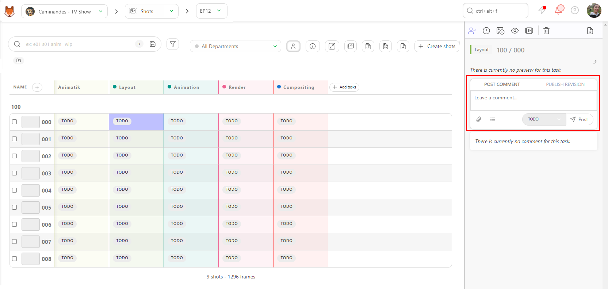
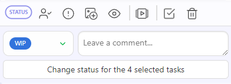
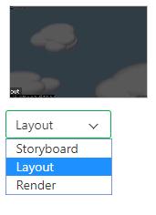

# ステータス、公開、レビュー

## コンセプトの公開

**コンセプト**を公開するには、ナビゲーションメニューから**コンセプト**ページに移動します。

コンセプトをアップロードするには、**コンセプトへの新しい参照を追加**ボタンをクリックします。

1つまたは複数のコンセプトを同時にアップロードできます。

プレビューをアップロードすると、コンセプトページは次のようになります。

コンセプトとやりとりするには2つの方法があります。画像をクリックして拡大表示します。
もう1つは、ステータス部分をクリックして右側の**コメントパネル**を開く方法です。

コメントパネルでは、コンセプトを既存のアセットにリンクするか、コンセプトを削除するかの2つのオプションがあります。
また、アセットのステータスを変更してコメントを追加することもできます。

**コンセプト**ごとに1つのバージョンを持つことが基本です。承認されていない場合は、同じコンセプトの複数のバージョンを作成しないよう、新しいコンセプトをアップロードする必要があります。

1つのコンセプトは1つのタスクです。

## コンセプトとアセットのリンク

コンセプトをアップロードすると、アセットにリンクすることができます。

アセットのステータス部分にリンクが表示されます。

コンセプトのステータス部分をクリックすると、右側にコメントパネルが開きます。

コメントパネルの上部には、2つのオプションがあります。コンセプトをアセットにリンクするか、コンセプトを削除します。

アセットをリンクするには、[リンク] ボタン  をクリックします。

Kitsu は、アップロードしたコンセプトにリンク可能なすべての **アセット** を表示します。

コメントパネルの上部には、リンクされたアセットがリスト表示されます。現時点では、**リンクなし** です。

アセットをリンクするには、それをクリックする必要があります。画面の上部とコンセプトのプレビューの下にリンクされたアセットの名前が表示されます。

コンセプトがアセットにリンクされると、アセットの詳細ページでコンセプトを確認できるようになります。

アセットページに戻り、コンセプトを確認したいアセット名をクリックします。

デフォルトでは、キャスティングの詳細が画面の2番目の部分に表示されます。
ドロップダウンメニューを使用してコンセプトを選択します。

コンセプトセクションに入ると、このアセット用に作成されたすべてのコンセプトが表示されます。ステータス別にフィルタリングすることもできます。

## ステータスの変更とコメントの追加

タスクのステータスを変更したりコメントを追加するには、
タスクのステータスをクリックする必要があります。

右側にパネルが表示され、ここでコメントの追加、ステータスの変更、ファイルの添付を行うことができます。

コメントパネル**は2つのタブに分かれています。
- コメントを投稿
- リビジョンを公開

**ステータス**を変更するには、**コメントを投稿**タブに留まります。

コメントには **Markdown** 言語を使用します。特定の構文が必要な場合は、markdown guide ウェブサイトをご覧ください： https://www.markdownguide.org/basic-syntax/

**コメントを残す** セクションでは、コメントを投稿する際にチーム内の誰かを **タグ付け** することができます。 `@` を入力すると、チームのリストを含むサブメニューが開きます。

また、「@」と部署名を入力することで、部署全体に**タグ付け**することもできます。

コメントに**チェックリスト**を追加することができます。

「**チェックリストを追加**」ボタンをクリックすると、チェックリストの最初の項目が表示されます。

コメントを入力し、**Enter**キーを押してチェックリストに別の行を追加するか、**チェックリストの追加**ボタンを再度クリックします。

コメントの他に、画像としてファイルを添付することもできます。 **添付ファイルを追加** ボタンをクリックします。

**ハードドライブからファイルを選択**するか、**スクリーンショット**をここに貼り付けます。

**ファイルを添付**をクリックして添付ファイルを検証します。

次に、ドロップダウンメニューから必要な**ステータス**を選択します。 

次に、**投稿**ボタンをクリックして世界に投稿します。

## プレビューをバージョンとして公開する

プレビュー、画像、動画を公開するには、タスクのコメントパネルで**「リビジョンを公開」**タブを選択します。

WFA**ステータスのように、**「フィードバックリクエスト」**オプション付きのステータスを使用すると、Kitsuは自動的に**「リビジョンを公開」**タブに切り替わります。

任意のコメントに1つまたは複数のプレビューを追加できます。 画像（`.png`、`.jpg`、`.jpeg`、`.gif`）、ビデオ（`.mp4`、`.mov`、`.wmv`）、
または`.glb`ファイルを追加できます。 ブラウザからすべてのプレビューを確認したり、すべてを混ぜ合わせたりできます。

.glb` ファイルについては、ワイヤーフレームとして確認することもできます。また、`.HDR` ファイルを追加して照明を確認することもできます。

しかし、`.pdf`、`.zip`、`.rar`、`.ma`、`.mb`などのファイルは
ダウンロードして確認する必要があります。

次に、**[プレビューリビジョンを追加して公開]**ボタンをクリックします。エクスプローラーが開き、ファイルまたは複数のファイルを選択できるようになります。

この画面に**スクリーンショットをコピー＆ペースト**することもできます。

添付ファイルのプレビューが表示されます。

ファイルを選択すると、**添付プレビュー**ボタンの近くにファイル名が表示されます。

コメントセクションにファイルを**ドラッグ＆ドロップ**することもできます。

プレビューの上に**コメント**を追加することができます。

コメントを残す**ボタンをクリックして、コメントセクションを開きます。

投稿**ボタンをクリックして、ステータスを選択し、プレビューを公開します。

## サムネイルの追加

プレビューをサムネイルとして定義するには、プレビューがリビジョンとしてアップロードされている必要があります。

プレビュー、画像、または動画を公開するには、タスクのコメントパネルで**[リビジョンを公開]**タブを選択します。

プレビューをアセットまたはショットタスクの**サムネイルとして使用**できます。
これにより、メインページでアセット/ショットを認識しやすくなります。
リストページで希望するステータスをクリックし、右パネルで**プレビュー**ボタンをクリックします（1）。

ボタンをクリックすると、最初のフレームまたは任意のフレームを選択できます。フレームを選択すると、サムネイルが表示され、ボタンがグレーに変わります。

## レビューの実行

アーティストが**レビュー**を必要とする場合、タスクの状態も変更します 。

ステータスをクリックすると右パネルが開き、レビューを開始できます。

右パネルからバージョンを閲覧したり、パネルのサイドをつかんで拡大したり、フルスクリーンにすることもできます 。

3Dファイル（`.glb`ファイル）については、ワイヤーフレームとしてレビューすることもできます。また、`.HDR`ファイルを追加して照明を確認することもできます。

3Dファイルは、カーソルでドラッグして移動したり、スクロールでズームイン/ズームアウトしたりすることができます。

**鉛筆**ツールを使用してプレビュー上に直接描画し、色を選択することができます！[鉛筆](../img/getting-started/draw.png)。

また、フレーム上に**テキスト**を追加することもできます。

コメントなしでプレビューを表示したい場合は、**注釈を隠す**ために、**万年筆**ボタンをクリックします。

どのバージョンでも）フレームにタグを付けるには、`@`を入力すると、チームリストを含むサブメニューが開き、**フレーム**の入力を開始できます。

また、**スクリーンショットを添付**して各フレームの描画をエクスポートすることもできます。

添付を追加**]ボタンをクリックします。

添付オプションで**注釈のスナップショットを添付**することもできます。

ボタンをクリックすると、Kitsuが注釈付きのすべてのフレームを取得し、結果を表示します。 **確認**をクリックすると、それらを公開できます。

線を削除したい場合は、**鉛筆**アイコンをもう一度クリックすると、カーソルが多方向クロスに変わります！[鉛筆](../img/getting-started/direction_arrow.png) その後、線を移動して選択することができます。

方向を示す十字のアイコンでラインを選択し、削除アイコンを押します。 

フルスクリーン**に切り替えると、**比較**ボタンをクリックすると、2つのタスクタイプまたはバージョンを並べて比較することができます
。

そこから、ステータスを変更することもできます！[再提出](../img/getting-started/retake_icon.png)をクリックすると、アーティストに変更を依頼できます。

または、に変更して、アーティストに作業が承認されたことを通知することもできます。

## コンセプトの確認

アーティストがコンセプトをアップロードしたら、スーパーバイザーまたはディレクターが確認することができます。

コンセプトを確認するには、画面上部のナビゲーションメニューを使用してコンセプトページを選択します。

アップロードされたすべてのコンセプト、ステータス、割り当て、リンクされたアセットを確認できます。

コンセプトを確認するには、ステータスの部分をクリックしてコメントパネルを開きます。コメントパネルを拡大したり、フルスクリーン表示にしたりすることができます。

次に、コメントを入力し、ステータスとして**承認済み**または**却下済み**を選択し、**投稿**ボタンで確定します。

**ステータス**フィルターでページをフィルタリングして、**ニュートラル**ステータスのコンセプトをすべて表示することができます。

また、アーティストごとにフィルタリングしたり、並び順を変更することもできます。

## 複数のプレビューを1つのバージョンとして追加

複数の画像を同時に追加したり、画像を1つアップロードした後に別の画像を追加することができます。

**プレビューの追加**ポップアップでは、ファイルの選択を求められます。

アップロードした画像を閲覧できます。

番号をクリックしてドラッグ＆ドロップすると、プレビューの順序を変更できます。

プレビューを削除するには、コメントパネルをドラッグしてバージョン番号をクリックして拡大する必要があります。

そして、をクリックします。

## バッチごとのステータス変更

あるいは、**バッチ**ごとに変更することもできます。

**Ctrl** または **Shift** キーを押すことで、複数のショットまたはアセットを選択することができます。

次に、アクションメニューの**ステータス変更**セクションに進みます。

選択したタスクの新しいステータスを選択します (1)。 選択したすべてのタスクにコメントを追加することもできます (2)
新しいステータスを **Confirm** ボタンで確定します。

ショットは名前ではなく、メタデータ列の情報によってソートされます。

メタデータ列の名前や情報を編集したり、削除したりしたい場合は、メニューから選択することもできます。

また、**CSVインポート**を使用して、カスタムメタデータ列を素早く埋めることもできます。
まず、**メタデータ列**をKitsuに作成し、スプレッドシートに追加し、データを**CSVインポート**にコピー＆ペーストします。

[CSVインポートでショット情報を更新](../batch-action/README.md#update-shots-information-with-csv-import)

# プレイリスト

## プレイリストを作成する

ドロップダウンメニューに**プレイリスト**ページがあります。

**プレイリスト**ページは2つの部分に分かれています。

(1) プレイリストを作成したり、既存のプレイリストを読み込むことができるプレイリストリスト。
(2) 最後に作成したプレイリストと最後に変更したプレイリスト

まず、**プレイリスト**を作成します
。デフォルトの名前は
デフォルト名は日付と時間です。すぐに変更できます。プレイリストを
スタジオまたはクライアントと共有するか、また、ショットまたはアセットのプレイリストにするかを選択できます。
プレイリストにタスクタイプのタグを追加することもできます。

プレイリストを作成したら、検索/フィルタバーを使用して、プレイリストに追加するショットを選択できます。

また、**ムービー全体を追加**することもでき、ムービー内のすべてのショットが追加されます。

**デイリー保留中**を選択すると、その日の**WFA**タスクがすべて追加されます。

特定のシーケンスのみに焦点を当てたい場合は、**シーケンス全体を追加**することもできます。

グローバルショット/アセットページと同じ**フィルタ**を使用できます。例えば、
アニメーションステージのWFAショートをすべて選択できます。
検索バーに**animation=wfa**と入力します。**Add selection**ボタンで選択を確定します。
Kitsuは**Animation**ステージで**WFA**ステータスを持つショットを選択しますが、Kitsuは自動的に**最新のアップロードバージョン**を読み込みます。

ショットは画面の上部に表示されます。 変更はすべて
自動的に保存されます。

## レビューと検証

プレイリストを作成すると、いくつかのオプションが利用可能になります。

* 再生または一時停止
* 要素から要素への移動
* 選択した要素の位置を全要素数と比較して表示
* サウンドのミュートまたはミュート解除
* 速度の変更、2倍速（x2）、通常速度（x1）、半分の速度（x0.50）、4分の1の速度（x0.25
* 1つの要素のループ再生
* サウンド波形の表示
* 再生中の注釈の表示
* プレイリスト全体の時間コードに対する要素の時間コード
* フレーム数
* プレビュー上でフレーム単位の移動。キーボード上の矢印でも移動できます。
* 比較ツール

* 描画コメントの取り消しとやり直しオプション
* テキストと描画オプション、選択した項目の削除

* プレイリストの全要素のタスクタイプを変更
* コメントセクションを表示
* プレイリストの要素を隠す
* LD（低解像度）からHD（高解像度）に切り替え
* プレイリストを、分割された全要素を含む**Zip**ファイル、**.csv**テキストファイル、または**Build .mp4**としてダウンロードし、ムービー全体を作成（ショットのみ）
* フルスクリーン

プレイリスト化されたショット/アセットごとに、表示する**タスク**と
**バージョン**を選択できます。

ショットの2つのタスクを並べて再生することもできます。

[比較] ボタンをクリックします  し、2番目のタスクの種類を選択します。

プレイリストの主な目的は、ショットとアセットのレビューをお手伝いすることです。

プレビューから直接ショットにコメントを追加することができます。

コメントボタンをクリックします。

これで右パネルにアクセスでき、コメントとステータスの全履歴を確認できます。

ビデオ上の描画コメント（タイムラインの下の赤い点）を見ることができます。

ビデオ上に描画したり、文字を入力したりすることができます（
[レビューを行う](../getting-started-production/README.md#perform-a-review)と同じ方法で、**描画**ボタンを使用します！[描画ボタン](../img/getting-started/draw.png)

## レビュールーム

プレイリストの上部に、**「レビュールームに参加」**ボタンがあります。 レビュールームは、すべての参加者を同期します。

レビュールーム内の全員が、再生と一時停止、ショットとフレームの選択をリアルタイムで確認できます。

また、レビュールーム内の全員が、同期された描画注釈も確認できます。

## プレビューのバッチアップロード（サムネイルとして

グローバルページにある「サムネイルの追加」ボタン  を使用して、サムネイルを大量にインポートすることができます。

新しいポップアップが開き、サムネイルをリンクするタスクの種類を選択するよう求められます。

**サムネイルの一括インポートでは、画像ファイルと動画ファイルを受け入れます**。

動画ファイルの場合は、最初のフレームのみがサムネイルとして使用されます。

サムネイルには、sequence_shotという名前を付ける必要があります。
