# ビデオゲームの制作

Kitsuでワークフローを設計し、より多くの人を招待したので、今度は制作を開始します。 

[**新しい制作を作成**]ボタンをクリックします。

制作名を入力し、**タイプ**として**短い**を選択し、制作スタイル（2D、3D）を選択します。

次に、FPS数、比率、解像度などの技術情報を入力する必要があります。

これらのデータは、Kitsuがアップロードされたビデオプレビューを再エンコードする際に使用されます。

次に、制作物の開始日と終了日を定義する必要があります。

次のパート 3 から 6 で、制作ワークフローを定義できます。

アセットタスクタイプ (3)、マッピングタスクタイプ (4)、タスクステータス (5)、アセットタイプ (6) を選択する必要があります。

::: ヒント
制作ワークフロー**を作成するには、グローバルライブラリからタスクタイプを選択します。

タスクタイプをいくつか見落としていたことに気づいた場合は、後で作成することができます。

[スタジオワークフロー](../first_production/README_configure_Kitsu.md#studio-workflow) のセクションを参照してください。
:::

次に、7と8はオプション部分です。アセット/マップのスプレッドシートをすでに持っている場合は、

**インポートCSV**のセクションを参照してください。

[アセットのインポート](../batch-action/README.md#create-assets-from-a-csv-spreadsheet-file)

[マップのインポート](../batch-action/README.md#create-shots-from-a-csv-spreadsheet-file)

 ボタンですべてを検証します。

## Kitsuグローバルページの紹介

Kitsuのグローバルアセットページへようこそ。

見てみましょう。

上部 (1) には、**グローバルナビゲーション**があり、これはすべての制作ページで常に表示されます。

**左から右へ:**

### メインメニュー

左上のボタン、Kitsu（またはお客様のスタジオロゴ）をクリックすると、メインメニューが開きます。

メインメニューでは、割り当てられたタスク、制作物、グローバルおよびチームスケジュール、ワークフローのカスタマイズページ、およびKitsu設定に直接アクセスできます。

::: 詳細 メインメニューの詳細
**ワークスペース**
- マイタスク：割り当てられたタスク 
- マイチェック：あなたの部署に応じて、ステータスが**フィードバックリクエスト**となっているすべてのタスク
- マイプロダクション：プロダクションページの選択に戻ります。

**スタジオ**
- プロダクション
- 担当者
- タイムシート
- メインスケジュール
- チームスケジュール
- すべてのタスク
- ニュースフィード
- エンティティ検索

**ADMIN**
- 部署
- タスクの種類
- アセットの種類
- カスタムアクション
- 自動化
- 3D背景
- ボット
- 設定
- ログ

::: 警告 権限の表示
ワークスペースセクションは、アーティストには表示されない「マイチェック」を除くすべての権限に対して有効になっています。

アーティスト（およびそれ以上）は、自身の**タイムシート**も表示でき、**エンティティ検索**にもアクセスできます
:::

### ナビゲーション

メインメニューアイコンの右側にナビゲーションドロップダウンメニューが表示されます。

制作を選択できます。実際の制作名と実際のページ名が常に表示されます。

ドロップダウンメニューを使用して、制作から制作へと移動できます（複数の制作がある場合）。

制作を選択すると、次のドロップダウンメニューで、その制作の異なるページを移動することができます。

::: 詳細 ナビゲーション詳細
最初のセクションは、タスクのトラッキングについてです
- アセット
- マップ
- レベル
- 編集（特定のタスクを作成した場合）

2番目のセクションは、制作の側面についてです
- コンセプト
- ブレークダウン
- プレイリスト
- ニュースフィード

3番目のセクションは統計情報に関するものです。
レベル統計、
アセットタイプ統計

4番目のセクションはチーム管理に関するものです。
スケジュール、
ノルマ、
チーム

5番目のセクションは制作の設定に関するものです。
設定

::: ヒント
アセットページから開始しますが、制作のホームページを他のエンティティに変更することができます（設定ページを参照）。
:::

::: 警告 
チャプターとして追加のナビゲーションレベルが必要だと気づいた場合は、制作タイプを**TV Show**に変更する必要があります。

逆に、**assets**や**maps**が必要ないことに気づいた場合は、制作タイプを**Only Assets**または**Only Maps**に切り替える必要があります。
:::

### グローバル検索、ニュース、通知、およびドキュメント
グローバル検索はナビゲーションドロップダウンメニューの右側にあります。 4つの最初の結果を表示するクイックアクセス検索です。 さらに多くの結果やフィルタリングオプションが必要な場合は、**エンティティ検索**ページを参照してください。

次のアイコン  は、ニュースとフィードバックページへの直接リンクです。

アニメーションGIFで新機能のすべてをご覧いただけます。また、Kitsuに追加してほしい次期機能に関するご意見もご投稿いただけます。

ベルのアイコンは、通知（割り当て、コメント、タグ）を表示します！[通知](../img/getting-started/notification_icon_on.png)。未読の通知の数は、ベルのアイコンに表示されます。

アバターの直前のアイコンは、ドキュメントボタンです。
 あなたが今読んでいるドキュメントです！

### 個人設定
アバターをクリックすると、メニュー（設定、ドキュメントなど）を開くことができます。

## タスクスプレッドシート

### エンティティスプレッドシート

画面の2番目の部分は、すべてのエンティティ（アセット、マップ、レベル、編集）に共通です。これはグローバルなタスクスプレッドシートです。

ここでは、各タスクのステータス、割り当て、優先度などを確認できます。

::: ヒント
スプレッドシートの最初の行と列のヘッダーは、スクロールしても常にページの一番上に表示されます。

また、他の列を常に表示しておくために「固定」することもできます。
:::

### フィルター

左側の最初の要素はフィルターボックスです。簡単なフィルタリングを行うには、レベルやアセットタイプなど、任意の文字列を入力します。

より高度なフィルタリングが必要な場合は、フィルタービルダーボタンを使用してください。

すべてのフィルターを保存し、ページとして使用することができます。

### 表示の簡素化

画面の右側には、左から右に、アサインメントの表示/非表示、追加カラムの表示/非表示、サムネイルの拡大/縮小を行うためのボタンがあります。

### インポート / エクスポート
バッチインポートサムネイル 、最後にインポート  またはエクスポート  データの

### メタデータカラム
以下に、カラムの名前があります。**名前**の隣にある(+)をクリックすると、 が表示され、新しいメタデータカラムを作成できます。次に、タスクタイプのカラムの名前があります。

### ビューのカスタマイズ
画面の一番右側、スクロールバーの隣に、テキストカラムの表示/非表示を切り替えるオプションがあります

。

### ビューの要約
最後の部分（4）は、画面の下部にある、表示されたページの要約です。つまり、ページをフィルタリングすると、要約も更新されます。

表示されているページのサマリーが表示されます。 表示されているページでフィルタリングを行うと、サマリーも更新されます。 表示されているアセット（またはマップ）の数、見積もり日数の合計、およびすでに費やした日数の合計を確認できます。

## アセットの作成
### 最初のアセットの作成
ここまでで、本番環境を作成し、Kitsuインターフェースの概要を把握しました。 それでは、最初の1つ目のアセットを作成してみましょう。

アセットページで、**[アセットを追加]**をクリックします。

::: 警告
アセットを作成すると、タスクワークフローが適用され、**すべてのタスクがアセットと同時に作成されます**。
:::

ポップアップウィンドウが開きます。

**アセットタイプ**の選択を求められます（1）。
新しいアセットタイプを追加していない場合、Kitsuは「キャラクター」、「環境」、「エフェクト」、「小道具」などの例を提供します。
まずはキャラクターから始めましょう。

::: ヒント
アセットタイプリストとタスクパイプラインをカスタマイズすることもできます。
[ワークフローのカスタマイズ](../customization-pipeline/README.md#modify-an-existing-asset-types) )
:::

**名前** (2) を付け、アーティストが何をすべきか、またアセットを素早く識別できるようにするための説明を入力します。

複数のアセットを作成する場合は、**「確認して戻る」**をクリックします。

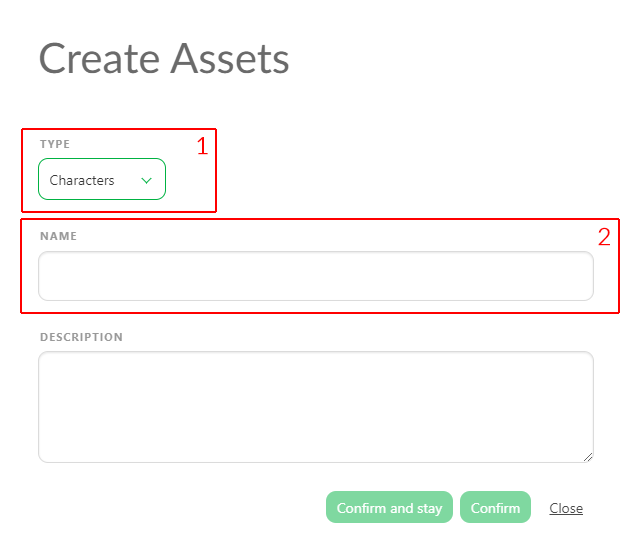

アセットの種類を変更して、アセットを追加し続けることができます。

::: ヒント
「確認して戻る」をクリックするたびに、新しく作成したアセットが背景に表示されます。
:::

最後のアセットを追加したら、
「確認」をクリックします。これによりアセットが作成され、ウィンドウが閉じます。 

::: ヒント
「確認して戻る」をクリックし、追加するアセットがもうないことに気づき、「閉じる」をクリックすると、ウィンドウがキャンセルされます。
:::

また、アセットワークフローで選択されたタスクも同時に作成されます。

さらに**アセット**を追加する必要がある場合は、**+ アセットの作成**ボタンをクリックします。

::: 詳細 CSVスプレッドシートファイルからのアセットの作成
アセットのリストがすでにスプレッドシートファイルに用意されているかもしれません。
Kitsuでは、それらをインポートする方法が2つあります。1つ目は、`.csv`ファイルをインポートし、データを直接Kitsuにコピー＆ペーストする方法です。

まず、スプレッドシートを`.csv`ファイルとして保存します。

次に、Kitsuのアセットページに戻り、**インポート**アイコンをクリックします。

ポップアップウィンドウ「**CSVからデータをインポート**」が開きます。**参照**をクリックして、`.csv`ファイルを選択します。

結果を確認するには、**プレビュー**ボタンをクリックします。

データのプレビューで列の名前を確認し、調整することができます。

注：**「チャプター」**列は、**「テレビ番組」**制作の場合のみ必須です。

すべてが適切であることを確認したら、**「確認」**ボタンをクリックしてデータをKitsuにインポートします。

これで、すべての資産がKitsuにインポートされ、設定に従ってタスクが作成されました。

::::

:::: 詳細 スプレッドシートファイルのコピー/ペーストによる資産の作成

スプレッドシートを開き、データを選択してコピーします。

次に、Kitsuのアセットページに戻り、**インポート**アイコンをクリックします
。

ポップアップウィンドウ**CSVからのインポート**が開きますので、**CSVデータの貼り付け**タブをクリックします。

以前に選択したデータを貼り付け、**[プレビュー]**ボタンで結果を確認できます。

データのプレビューで列の名前を確認し、調整することができます。

注：**chapter**（チャプター）の列は、**TV Show**（テレビ番組）制作の場合のみ必須です。

すべて問題なければ、**Confirm**（確認）ボタンをクリックしてデータをKitsuにインポートします。

これで、すべてのアセットがKitsuにインポートされ、設定に従ってタスクが作成されました。

:::

### アセットの詳細を確認する

アセットの詳細を確認するには、その名前をクリックします。

新しいページが開き、右側にタスク、アサイン、ステータスニュースフィードの一覧が表示されます。

各タスクのステータスをクリックすると、コメントパネルが開き、コメントの履歴や異なるバージョンを確認できます。

また、**キャスティング**にもアクセスできます。

このアセットに関連付けられた**コンセプト**にもアクセスできます。

**スケジュール**は、タスクタイプページのデータを事前に記入していれば利用できます。データがすでに記入されている場合は、ここで直接修正することができます。 

さまざまなタスクタイプでアップロードされた**プレビューファイル**、

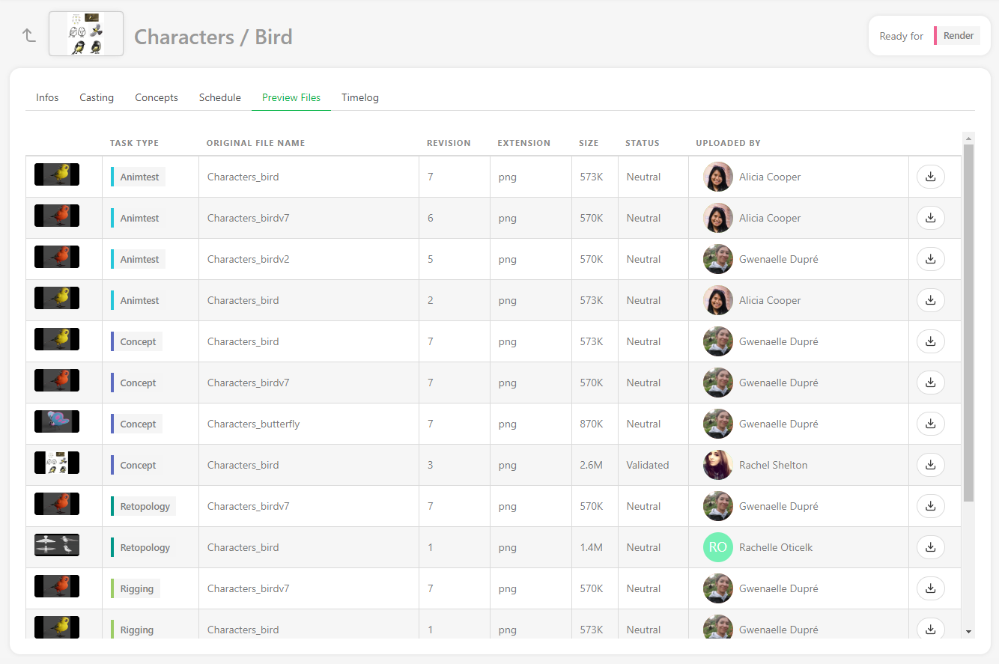

そして、このアセットのタスクでタイムシートが記入された場合の**タイムログ**。

## アセットを作成した後にタスクを追加する

アセットを作成した後にタスクが欠けていることに気づいた場合でも、追加することができます。

まず、欠けているタスクタイプがタスクタイプタブの設定ページに追加されていることを確認してください。

次に、アセットページに戻り、**+ タスクを追加**をクリックします

### アセットを更新する
アセットはいつでも更新でき、名前やアセットタイプを変更したり、説明文を修正したり、グローバルページに追加したカスタム情報を追加したりすることができます。

アセットを編集するには、アセットページに移動し、編集したいアセットの上にカーソルを移動させて、**編集**ボタンをクリックします
！[編集ボタン](../img/getting-started/edit_button.png) (1)
行の右側にある

アセットのメインページの説明を拡張するには、最初の語句 (2) をクリックすると、説明の全文を含むポップアップが開きます。

アセットを削除するには、FAQ : [アセットの削除方法](../faq-deletion/README.md##how-to-delete-an-asset)を参照してください。

::: 詳細 CSV インポートによるアセットの更新
CSV インポートを使用すると、データをすばやく更新することができます。

アセットの**タイプ**、**割り当て**、タスクの**ステータス**を更新したり、**コメント**を追加したりすることができます。

**既存のデータを更新する**オプションをオンにする必要があります。すると、更新される行が
青くハイライトされます。

:::

::: 詳細 スプレッドシートのコピー＆ペーストによるアセットの更新。 ファイル

スプレッドシートを開き、データを選択してコピーします。

次に、Kitsuのアセットページに戻り、**インポート**アイコンをクリックします 
。

ポップアップウィンドウ「**CSVからデータをインポート**」が開きますので、「**CSVデータを貼り付け**」タブをクリックします。

以前に選択したデータを貼り付け、**[プレビュー]** ボタンで結果を確認できます。

データをプレビューして、カラム名を確認し、調整することができます。

注：**[チャプター]** カラムは、**[テレビ番組]** 制作の場合のみ必須です。

オプション「**既存データの更新**」をオンにする必要があります。すると、更新される行が
青くハイライトされます。

これで、すべてのアセットがKitsuにインポートされ、設定に従ってタスクが作成されました。

:::

## コンセプトの作成
### コンセプトのアップロード

**コンセプト**を作成するには、ナビゲーションメニューから**コンセプト**ページに移動します。

コンセプトをアップロードするには、「**コンセプトへの新しい参照を追加**」ボタンをクリックします。

一度に1つまたは複数のコンセプトをアップロードできます。

プレビューをアップロードすると、コンセプトページは次のようになります。

コンセプトとやりとりするには2つの方法があります。画像をクリックすると拡大表示されます。
もう1つはステータス部分をクリックして右側の**コメントパネル**を開く方法です。

コメントパネルでは、コンセプトを既存のアセットにリンクするか、削除するかの2つのオプションがあります。
また、アセットにコメントを追加したり、ステータスを変更することもできます。

**コンセプト**ごとに1つのバージョンを持つことが基本です。承認されていない場合は、同じコンセプトの複数のバージョンを作成しないよう、新しいコンセプトをアップロードする必要があります。

1つのコンセプトは1つのタスクです。

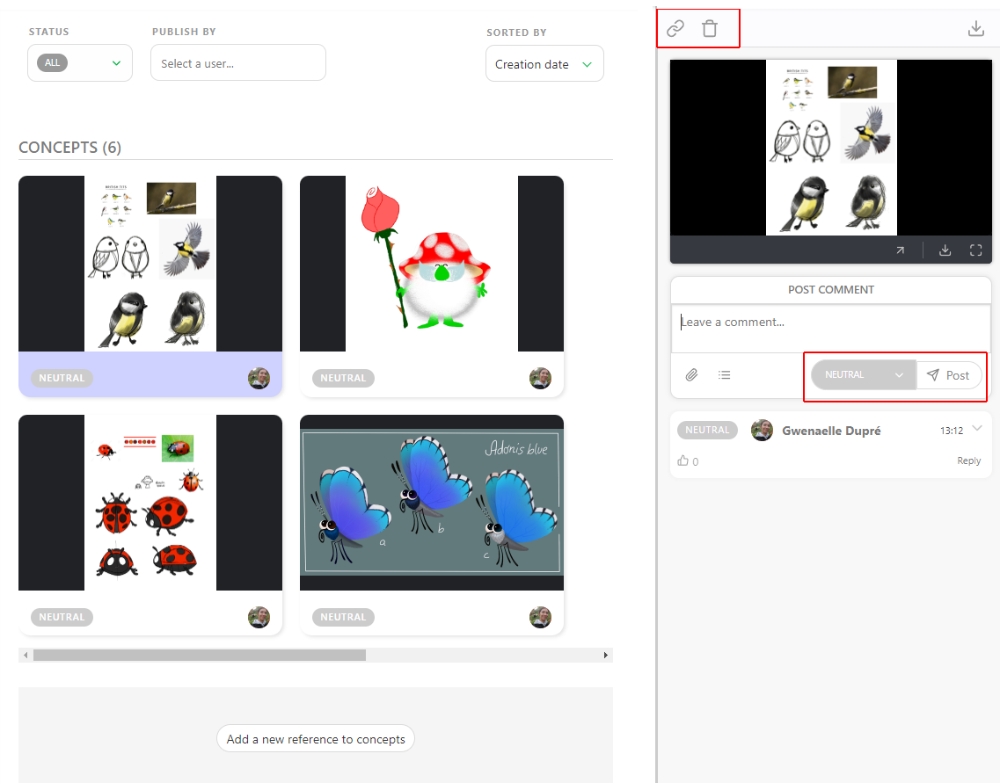

### コンセプトとアセットのリンク

コンセプトをアップロードすると、アセットにリンクすることができます。

アセットのステータス部分にリンクが表示されます。

コンセプトのステータス部分をクリックすると、右側にコメントパネルが開きます。

コメントパネルの上部には、コンセプトをアセットにリンクするか、コンセプトを削除するかの2つのオプションがあります。

アセットをリンクするには、[リンク] ボタン  をクリックします。

Kitsu は、アップロードしたコンセプトにリンク可能なすべての **アセット** を表示します。

Kitsu は、コメントパネルの上部にリンクされたアセットをリスト表示します。現時点では、リンクはありません。

アセットをリンクするには、それをクリックする必要があります。リンクされたアセットの名前は画面の上部に表示され、コンセプトのプレビューの下にも表示されます。

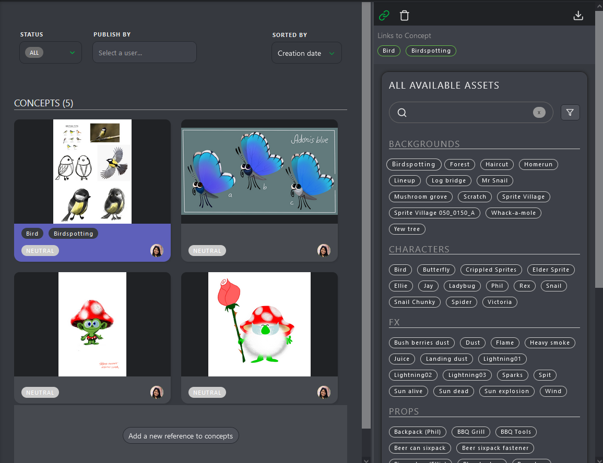

コンセプトがアセットにリンクされると、アセットの詳細ページで確認できます。

アセットページに戻り、コンセプトを確認したいアセット名をクリックします。

デフォルトでは、キャスティングの詳細が画面の2番目の部分に表示されます。
ドロップダウンメニューを使用してコンセプトを選択します。

コンセプトセクションに入ると、このアセット用に作成されたすべてのコンセプトが表示されます。ステータスごとにフィルタリングすることができます。

## マップの作成
### 最初のマップの作成

いよいよ、**マップ**を作成する時が来ました。

::: 警告
マップは、Kitsu内のレベルにリンクされています。
つまり、まずレベルを作成し、次にこのレベルにマップを追加する必要があります。
:::

**マップ**ページに移動する必要があります。
ドロップダウンメニューを使用して、**mapS**をクリックします。

**Add maps**ボタンをクリックして、マップの作成を開始します。

::: 警告
マップを作成すると、設計したタスクワークフローが適用され、すべてのタスクがマップと同時に作成されます。
:::

マップの作成用に新しいポップアップが開きます。
これでレベルとマップを作成できます。

最初のレベル、例えば「sq01」を入力し、
次に**追加**します。

これで、レベルが作成されたことが確認できます。このレベルに追加するマップを選択し、作成します。

例えば、マップの列に「sh0010」と入力し、再度**追加**します。
マップのパディングを定義することもできます。

::: ヒント
マップに SH0010、SH0020、SH0030 などのように 10 進法で名前を付けたい場合は、**マップのパディング**を 10 に設定します
:::

新しいマップがリスト化され、レベル別にリンクされているのが確認できます。
最初のレベルの最初のマップを作成しました。

それでは、1つ以上のマップを追加してみましょう！ご覧の通り、ボックスにはすでにあなたの名前コードが
含まれていますが、インクリメントされています。そのため、**追加**をクリックして、
さらにマップを作成する必要があります。

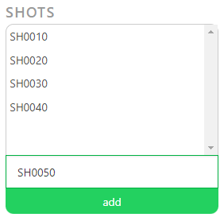

さらにレベルを追加するには、左側部分に移動し、新しいレベルの名前を入力して、**追加**をクリックします。
2番目のレベルが選択され、マップを追加できるようになります。

::: ヒント
マップがレベルに正しく配置されていない場合は、マップを編集する必要があります
！[編集ボタン](../img/getting-started/edit_button.png)をクリックし、
レベルを変更します。
！[マップの編集 レベルの変更](../img/getting-started/edit_shot.png)

！[レベルの変更](../img/getting-started/change_seq.png)
:::

マップを削除するには、FAQを参照してください。 : [マップの削除方法](../faq-deletion/README.md#how-to-delete-a-shot)

レベルを削除するには、FAQを参照してください。 : [レベルの削除方法](../faq-deletion/README.md#how-to-delete-a-sequence)

## EDLファイルからマップを作成
すでに**EDL**ファイルにマップリストが用意されているかもしれません。
Kitsuでは、**EDL**ファイルを直接インポートして、レベル、マップ、複数のフレーム、フレームイン、フレームアウトを作成することができます。

グローバルマップページ**では、**インポートEDL**ボタンが表示されます。

ポップアップで、編集時に使用するビデオファイルの命名規則を選択できます。

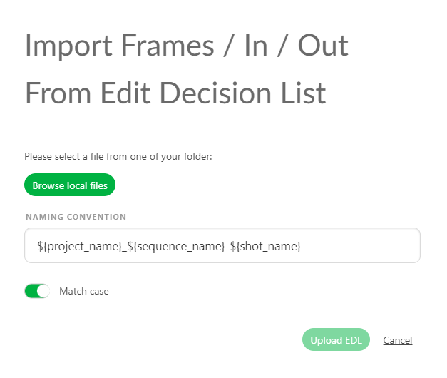

これは、プロジェクト_レベル_マップ.拡張子という名前で編集中のビデオクリップが命名されていることを意味します。

LGC制作のEDLの例を以下に示します。

動画ファイルの名前はLGC_100-000.movです。これは、LGCが制作名、100がレベル名、000がマップ名であることを意味します。

命名規則を設定したら、EDLファイルをインポートできます。

次に、**[Upload EDL]**をクリックします。

その後、Kitsuがマップを作成します。

:::

::: 詳細 CSVスプレッドシートファイルからマップを作成
マップの一覧がすでにスプレッドシートファイルに用意されているかもしれません。
Kitsuでは、インポートする方法が2つあります。1つ目は、`.csv`ファイルを直接インポートする方法、2つ目は、データを直接Kitsuにコピー＆ペーストする方法です。

まず、スプレッドシートを`.csv`ファイルとして保存します。

次に、Kitsuのマップページに戻り、**インポート**アイコンをクリックします。

「CSVからデータをインポート」というポップアップウィンドウが開きます。「参照」をクリックして、`.csv`ファイルを選択します。

結果を確認するには、「プレビュー」ボタンをクリックします。

データのプレビューで、列の名前を確認し、調整することができます。

注：**「チャプター」**の列は、**「テレビ番組」**の制作の場合のみ必須です。

すべてが適切であることを確認したら、**「確認」**ボタンをクリックしてデータをKitsuにインポートします。

これで、すべてのマップがKitsuにインポートされ、**「設定」**に従ってタスクが作成されます。

::::

:::: 詳細 スプレッドシートファイルのコピー/ペーストによるマップの作成
スプレッドシートを開き、データを選択してコピーします。

次に、Kitsuのマップページに戻り、**インポート**アイコンをクリックします
！[インポートアイコン](../img/getting-started/import.png)。

ポップアップウィンドウ**インポートデータからCSV**が開きます。**CSVデータを貼り付け**タブをクリックします。

！[インポートデータコピーペーストタブ](../img/getting-started/import_pastcsvdata_shot.png)

以前に選択したデータを貼り付け、**[プレビュー]** ボタンで結果を確認できます。

データのプレビューで列の名前を確認し、調整できます。

注：**[チャプター]**列は、**[テレビ番組]**制作の場合のみ必須です。

すべてが正しく入力されていることを確認したら、**「Confirm」**ボタンをクリックしてデータをKitsuにインポートします。

これで、すべてのマップがKitsuにインポートされ、**「Settings」**の設定に従ってタスクが作成されます。

::::

### マップの詳細を確認する

マップの詳細を確認したい場合は、マップ名をクリックします。

新しいページが開き、右側にタスク、割り当て、ステータスニュースフィードの一覧が表示されます。
タブ名をクリックすることで、各タブを切り替えることができます。

各タスクのステータスをクリックすると、コメントパネルが開き、コメントの履歴や異なるバージョンを確認できます。

また、**キャスティング**にもアクセスできます。

**スケジュール**は、タスクタイプページのデータを事前に記入している場合に利用できます。データがすでに記入されている場合は、ここで直接修正することができます。 

各種タスクタイプでアップロードされた**プレビューファイル**、

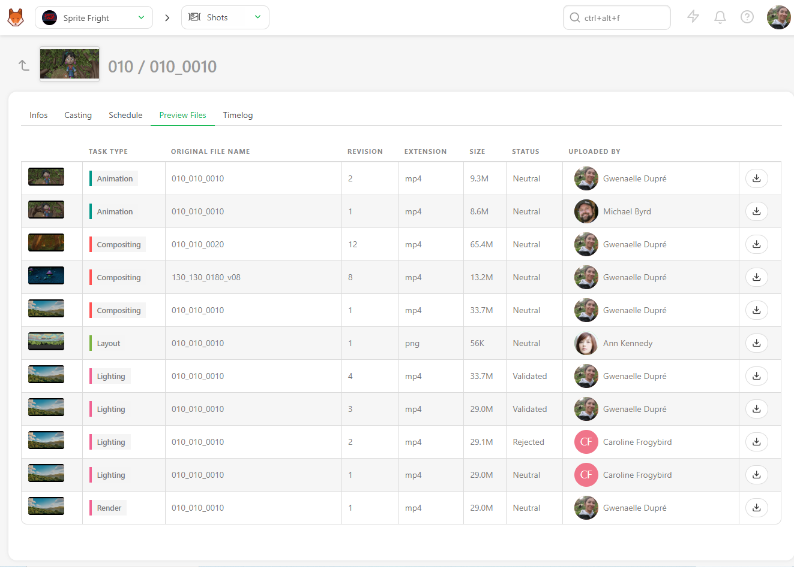

そして、このアセットのタスクでタイムシートが記入された場合の**タイムログ**。

## マップ作成後にタスクを追加する
マップを作成した後でタスクが不足していることに気づいた場合でも、追加することができます。

まず、不足しているタスクタイプがタスクタイプタブの設定ページに追加されていることを確認します。

次にマップページに戻り、+タスクを追加をクリックします。

### マップを更新する

マップはいつでも更新でき、名前やレベルを変更したり、説明を修正したり、グローバルページに追加したカスタム情報を追加したりすることができます。

マップを編集するには、マップページに移動し、変更したいマップの上にカーソルを移動させてから、**編集**ボタンをクリックします
！[編集ボタン](../img/getting-started/edit_button.png) (1) 行の右側にある。

メインのマップページの説明を拡張するには、最初の語句 (2) をクリックすると、説明の全文を含むポップアップが開きます。

::: 詳細 マップの更新 CSV インポート
CSV インポート**を使用して、**NB フレーム**、**フレーム IN**、**フレーム OUT**、または任意のカスタム **メタデータ コラム** としてデータを更新することができます。

アサインメント**、およびタスクの **ステータス** を更新し、**コメント** を追加することができます。

スプレッドシートを開き、データを選択してコピーします。

次に、Kitsuのマップページに戻り、**インポート**アイコンをクリックします
。

ポップアップウィンドウ**インポートデータからCSV**が開きます。**CSVデータを貼り付け**タブをクリックします。

以前に選択したデータを貼り付け、**プレビュー**ボタンで結果を確認できます。

オプション：既存のデータを更新** をオンにする必要があります。
更新されたマップは青くなります。

注：**チャプター**の列は、**TV番組**の制作の場合のみ必須です。

すべてが正しく入力されたら、**Confirm**ボタンをクリックしてデータをKitsuにインポートします。

これで、すべてのマップがKitsuにインポートされ、**設定**に従ってタスクが作成されます。

:::

## マップにフレーム数とフレーム範囲を追加する

この段階では、アニマティックが完了しているはずです。つまり、
各マップのフレーム長（**フレーム数**、**フレーム範囲イン**、**フレーム範囲アウト**）が分かっているはずです。
この情報をスプレッドシートに追加できます。この方法により、
すべてのフレームが計算され、抜けや過剰計算がないことを確認できます。

::: 警告
マップとレベルを手動で作成した場合、
**フレーム**列は非表示になります。**フレーム**列を表示するには、少なくとも1つのマップを編集してフレーム数を入力する必要があります。
マップを手動で作成せずに、CSV/スプレッドシートでフレーム数をインポートした場合は、列が表示されます。
:::

マップを編集してフレーム範囲の情報を入力する必要があります。
編集ボタンをクリックしてください！[編集ボタン](../img/getting-started/edit_button.png)
マップ行の右側にある

！[編集マップ レベル変更](../img/getting-started/edit_shot.png)

新しいウィンドウで、マップの**イン**と**アウト**を入力できます。次に、**確認**ボタンをクリックして保存します。

これで、フレーム範囲がマップページの一般的なスプレッドシートに表示されます。

**Frames**、**In**、および**Out**列のロックを解除したので、
グローバルマップページから直接入力することができます。

入力したいケースをクリックしてデータを追加します。

::: ヒント
フレームイン**と**フレームアウト**を入力すると、Kitsuは自動的に**フレーム数**を計算します。
:::

**CSVインポート**を使用してフレーム範囲を素早く更新することもできます。
[CSVインポートでマップ情報を更新](../batch-action/README.md#update-shots-information-with-csv-import)

マップ値の履歴にもアクセスできます。

## カスタムメタデータカラムの作成

一般的なスプレッドシートページにさらに情報を追加するには、カスタム**メタデータカラム**を作成する必要があります。

難易度**、**天気**、**タグ**など、ページに追加する追加情報があるかもしれません。すべてのテキスト（または数値）情報をカスタムメタデータ列に保存できます。

名前列の近くにある**+**をクリックします。

タイプ**オプションでは、情報をどのように保存するかを選択できます。
- 自由入力の**テキスト**、
- **数値**、
- **チェックボックス**、
- **値のリスト**、
- **タグのリスト**、
- **チェックリスト**。

::: 警告 
テキスト**、**数値**、および**チェックボックス**では、エンティティごとに異なる情報を追加できます。事前に計画しておく必要はありません。

リスト**、**タグ**、および**チェックリスト**では、エンティティごとに同じ選択肢が提供されます。さらに、これは現在入力する必要があります。

利用可能な値**の下にリスト要素を入力し、**値を追加**をクリックして確認します。
:::

メタデータカラム**を1つまたは複数の**部門**にリンクすることもできます。

::: ヒント
メタデータカラムを部門にリンクします。アーティスト/スーパーバイザーは、自分のToDoページと部門フィルタリングビューでこれを見ることができます。

メタデータカラムを1つまたは複数の部門にリンクすることができます。リストから部門をクリックし、**追加**をクリックして有効にします。

ここでは、VFXカラムが2つの部門にリンクされています。

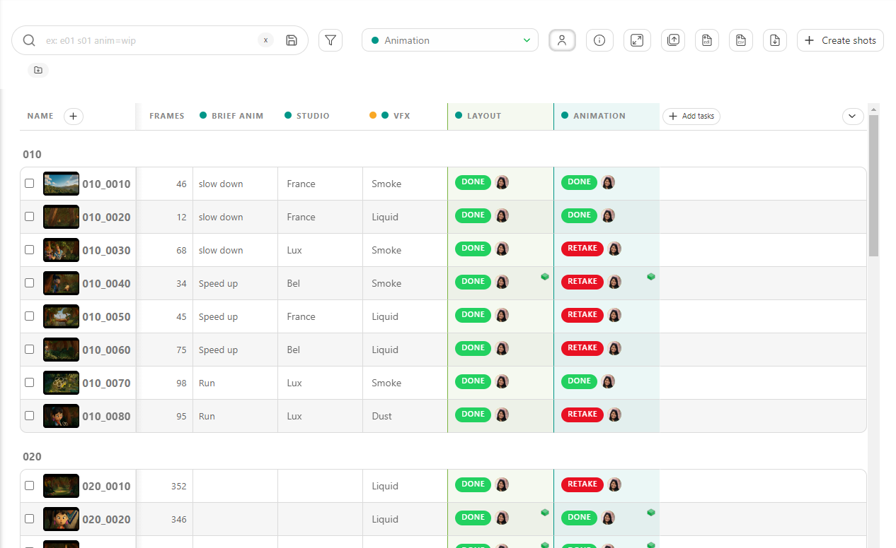

:::

::: 詳細 メタカラムの編集
アセットのグローバルページまたはマップで、メタカラムの右側にある矢印をクリックし、**[編集]**をクリックします。

:::

この情報は、グローバルスプレッドシートページで直接入力できます。
ケースは編集可能です。

::: ヒント
左側の複数のエンティティを選択し、メタデータ列を一括で変更することができます。
:::

::: 詳細 手動で編集
編集ボタン  を使用して情報を変更することもできます。

編集ポップアップに新しい行が表示されます。リストから情報を選択することもできますが、
代わりに、テキストや数値を直接入力したり、チェックボックスにチェックを入れたり、チェックリストを使用したりすることもできます。

編集が完了したら、必ず「確認」ボタンをクリックしてください。

:::

メタデータ列を編集または削除する場合は、スプレッドシートの一般ページに移動します。
メタデータ列の名前の近くにある矢印をクリックします！[メタデータ列の詳細](../img/getting-started/arrow.png)。

::: ヒント
この新しい列を使用して、グローバルページを**ソート**することができます。列名の右にある矢印をクリックして、このメニューを開きます。次に、**ソート**をクリックします。

メタデータ列を左側に**固定**することもできます。
:::

## レベルを作成

Kitsuでは、**レベル**レベルでタスクを追跡することもできます。
これは、
ストーリーやカラーボード、カラーグレーディングなど、マクロタスクを追跡する際に特に便利です。

ナビゲーションメニューを使用して、**レベル**ページに移動します。

::: 警告
この新しいページは、アセットおよびマップのグローバルページと同様に動作します。

このページを使用するには、まず**グローバルライブラリ**に**レベル**属性を持つ専用のタスクタイプを作成する必要があります。

新しい**タスクタイプ**を作成するには、「**パイプラインのカスタマイズ**」セクションを参照してください。

[Pipeline customization](../customization-pipeline/README.md)

グローバルライブラリに**タスクタイプ**を作成したら、それを**
プロダクションライブラリ**（設定ページ）に追加します。
:::

設定ページでタスクタイプが準備できたら、レベル（アセットやマップと同じ）を作成する必要があります。

この新しいページは、アセットやマップのグローバルページと同様に動作します。**+ 新しいレベル**ボタンで編集を追加できます。

タスクの割り当て、レビュー、ステータスの変更などを行うことができます。

メタデータ列の追加、説明の記入などを行うことができます。

::: ヒント
ここ（+新しいレベルボタン）から直接レベルを作成するか、グローバルマップページからマップにリンクされたレベルを作成することができます。
:::

このページでは、レベルのエンティティを**名前変更**したり、**削除**したりすることができます。また、アセットやマップのエンティティも同様です。

レベルの名前をクリックすると、そのレベルの詳細ページが表示されます。

詳細ページでは、レベルのキャスティングにアクセスできます。
レベル全体で使用されたすべてのアセットを確認できます。

また、レベルの**タスク**のスケジュール、プレビューファイル、アクティビティ、タイムログにもアクセスできます。

## 作成と編集

Kitsuでは、**編集**レベルでタスクを追跡できます。

特に、
複数の検証ステップで複数の編集を追跡する必要がある場合に便利です。例えば、映画全体、いくつかの予告編、ファースト・エディット、ファイナル・エディット、ミックスなどを追跡できます。

::: 警告
デフォルトでは、**Edit** ページは、**production library** (設定ページ) にタスクタイプが設定されるまで表示されません
:::

このページを使用するには、まず **Global Library** に **Edit** 属性を持つ専用のタスクタイプを作成する必要があります。

**タスクタイプ**を新規作成するには、「**パイプラインのカスタマイズ**」セクションを参照してください。

[パイプラインのカスタマイズ](../customization-pipeline/README.md)

**グローバルライブラリ**に**タスクタイプ**を作成したら、**プロダクションライブラリ**に追加します。
すると、ナビゲーションのドロップダウンメニューに「**編集**」が表示されます。

この新しいページは、アセットやマップのグローバルページと同様に動作します。**+ 新規編集** ボタンで編集を追加できます。

タスクの割り当て、レビュー、ステータスの変更などを行うことができます。

メタデータ列を追加したり、説明を記入したりすることができます。

::: ヒント
配信内容に応じて、**[編集]** ごとの解像度を変更することもできます。
:::

::: 警告
詳細ページは、他のエンティティとは異なります。

**[編集]** は特定のロングビデオに焦点を当てているため、詳細ページはコメントの詳細ページにより似たものとなっています。
:::

このページでは、アセットやマップのエンティティと同様に、**[編集]** エンティティの **[名前の変更]** や **[削除]** を行うことができます。

## ブレークダウンリストの作成

ブレークダウンを記入すると、マップの組み立てに役立ちます。
ブレークダウンには、マップを作成するために追加する必要のあるアセットの詳細がすべて記載されています。
これにより、何も漏れなく確実に作業を進めることができます。

ドロップダウンメニューで **BREAKDOWN** を選択します。

ブレイクダウンページの左側には、チャプター/レベル/マップメニュー（1）があります。作成したものの中から選択できます。これらは画面の右側部分であり、
作成したすべてのアセットは、この制作（メインパックおよびチャプター）で利用可能です（3）。さらに、
中央セクションでは、マップ（2）を選択します。

では、次に、配置するマップを選択する必要があります。

サムネイルがまだない場合はアセットをテキストで表示したり、
サムネイルのサイズを拡大することができます。

また、ブレークダウン中にリストにアセットを追加する必要があることに気づくかもしれません。

ブレークダウンページから直接新しいアセットを作成することができます。「利用可能なすべてのアセット」の右にある「+」をクリックします。

複数のマップを一度に選択することもできます。最初のマップをクリックし、「シフト」キーを押したまま、選択する最後のマップをクリックします。

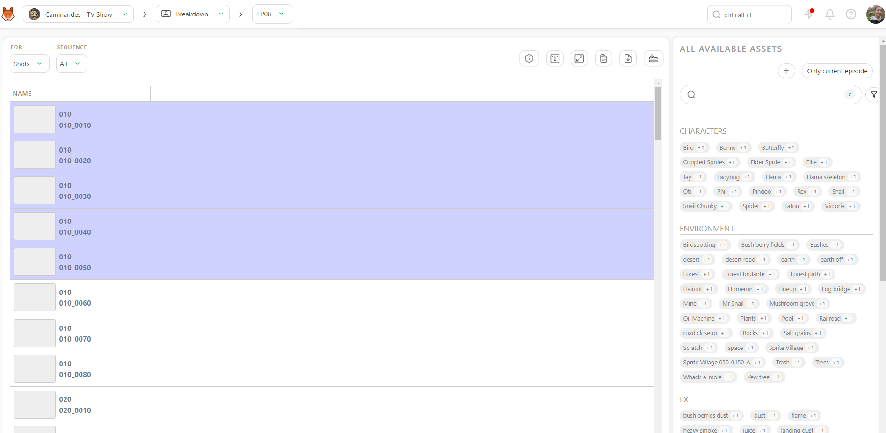

次に、割り当てたいアセットをクリックします。
キャラクター、背景など、右側部分（3）から選択します。
複数のマップを選択した場合、選択した内容は多数のマップに適用されます。

アセットが入力されたマップをコピーし、このアセット選択を別のマップに貼り付けます。

アセットの上にカーソルを移動させると、**+1** または **+10** と表示されます。これは、
そのアセットを追加した回数を表します。必要なだけクリックできます。

レベルやマップを指定せずに、すべてのアセットをテレビ番組のチャプターにリンクすることもできます。

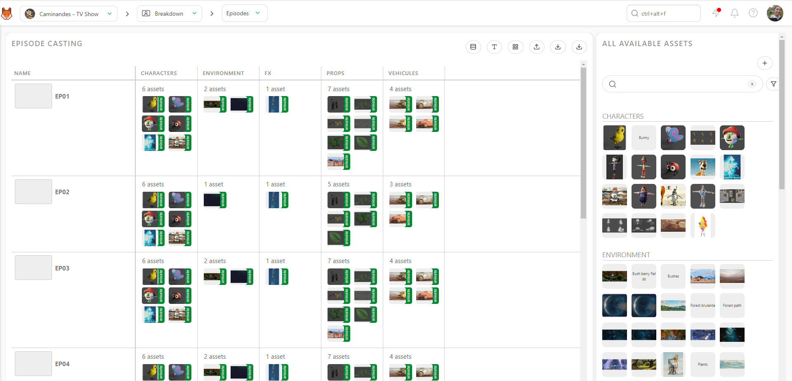

この方法では、ストーリーボード/アニマティックの段階の前に、すべてのアセットを1つまたは複数のチャプターにリンクすることができます。

画面の中央にアセットが表示されているのが確認できます（2）。
アセット名の隣には、追加された回数が表示されています。この
例では、キャラクターアセット「Llama」を2回追加しています。

誤ってアセットを2回追加してしまった場合は、画面の中央部分でこのマップのアセットを選択する必要があります（2）。そこから、**-1**をクリックします。
このマップの作業が完了したら、他のマップの作業を進めてください。
選択した内容は自動的に保存されます。

ストーリーボードの作成中に新しいアセットが作成された場合は、アセットページに戻り
（ドロップダウンメニューを使用）、必要なアセットを作成します。以前に作成したタスクは、これらの新しいアセットに即座に適用されます。
ただし、割り当てを行う必要があり、その後、
ブレークダウンを継続できます。

これで、**Breakdown**ページは以下のようになります。

アセットを組み立てて個々のパーツを追跡する必要がある場合は、アセットのブレークダウンリストを作成することもできます。

画面左上にある**FOR**の下のドロップダウンメニューで**asset**を選択します。

次に、2番目のドロップダウンメニューにアクセスして、アセットの種類を選択します。キャラクター、環境、小道具、特殊効果など

アセットの分類ページは、マップと同様の方法で作成できます。まず、左側の部分で1つまたは複数のアセットを選択し、次に右側の部分の要素を追加します。

::: 詳細 CSVファイルからブレークダウンリストを作成する

すでにスプレッドシートファイルに内訳リストが用意されているかもしれません。Kitsuでは、それをインポートする方法が2つあります。1つ目は、.csvファイルを直接インポートする方法、2つ目は、データを直接Kitsuにコピー＆ペーストする方法です。

まず、Kitsuの推奨に従って、スプレッドシートを「.csv」ファイルとして保存します。

インポート]ボタンをクリックします！[インポート]ボタン（../img/getting-started/import.png）

「CSVからデータをインポート」というポップアップウィンドウが開きます。「参照」をクリックして、`.csv`ファイルを選択します。

結果を確認するには、「プレビュー」ボタンをクリックします。

データのプレビューで列の名前を確認し、調整することができます。

注：**「チャプター」**列は、**「テレビ番組」**制作の場合のみ必須です。

すべてが適切であることを確認したら、**「Confirm」**ボタンをクリックしてデータをKitsuにインポートします。

これで、ブレークダウンがKitsuにインポートされました。

:::

::: 詳細 スプレッドシートファイルをコピー＆ペーストしてブレークダウンリストを作成

スプレッドシートを開き、データを選択してコピーします。

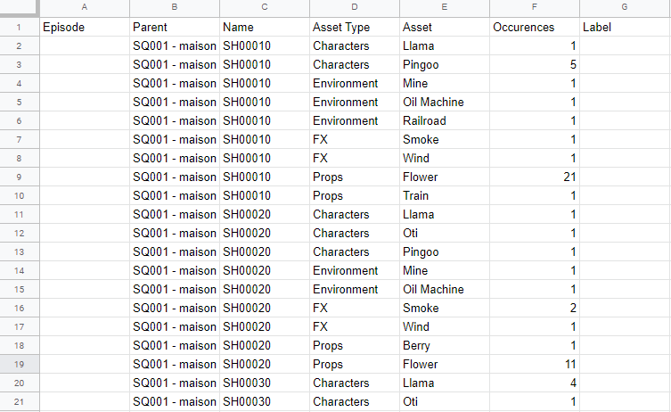

次に、Kitsuのブレークダウンページに戻り、**インポート**アイコンをクリックします 
。

ポップアップウィンドウ「**CSVからデータをインポート**」が開きますので、「**CSVデータを貼り付け**」タブをクリックします。

以前に選択したデータを貼り付け、**[プレビュー]**ボタンで結果を確認できます。

データのプレビューで列の名前を確認し、調整できます。

注：**[チャプター]**列は、**[テレビ番組]**制作の場合のみ必須です。

すべてが正しく入力されたら、**Confirm**（確認）ボタンをクリックしてデータをKitsuにインポートします。

これで、すべてのアセットがKitsuにインポートされました。

:::

## アセットの状態の紹介：使用可能

ほとんどの場合、アセットのタスクが承認されるのを待たなくても、マップタスクで使用することができます。

例えば、アセットが**コンセプト**段階で承認された場合、**ストーリーボード**段階で使用することができます。
次に、**モデリング**段階で承認された場合、**レイアウト**段階で使用することができます。

まさにアセットの状態「**準備完了**」がやっていることです。アセットのタスクの状態を知らせ、マップタスクでの使用可能性を比較します。

ブレークダウンを記入したので、どのアセットがすべてのマップで使用されているかが正確にわかります。

まず、タスクの状態と関連するアセットの状態を定義する必要があります。セルをクリックして**準備完了**を変更することができます。マップタスクのドロップダウンメニューが表示されます。

::: ヒント
**自動化**を使用して、重労働を軽減することができます。

**準備完了**トリガーで自動化を設定できます。 
:::

アセットの状態をいくつか**準備完了**に変更したので、マップページで結果を確認できます。

いくつかの白いボックスが**緑色**になっていることに気づくでしょう。このマップ内のすべてのアセットが、この特定のタスクの準備ができていることを示しています。

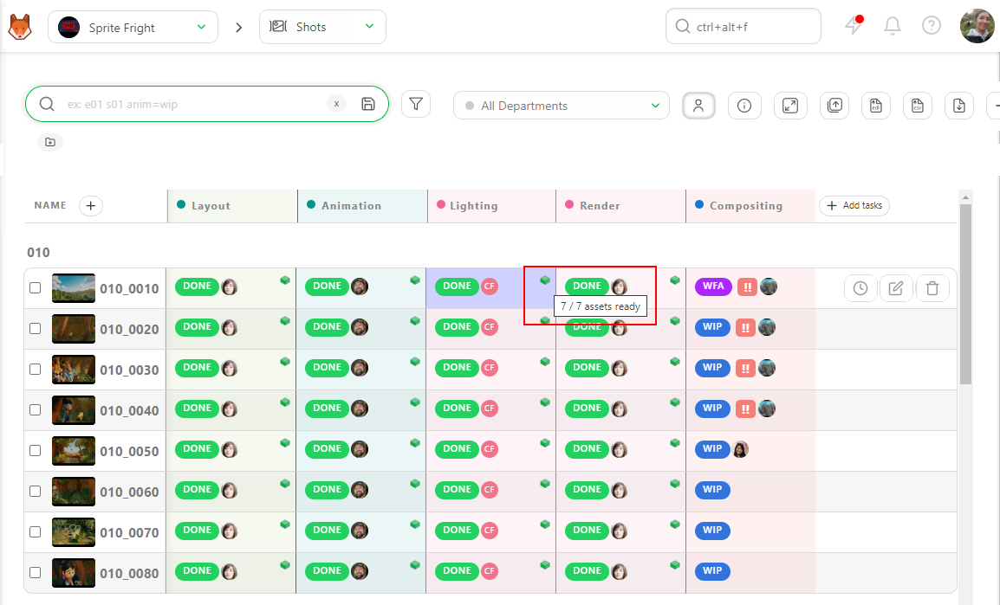

白いボックスが表示されている場合、Kitsuは、このタスクに何個のアセットが準備されているかを示します。

::: ヒント
ボックスが表示されていない場合、このマップにはアセットがキャストされていません。
:::

次に、マップの名前をクリックして詳細ページに移動します。
すると、このマップにキャストされたすべてのアセットとそのステータスが表示されます。

特定のタスク用のマップを開始できるかどうかを判断する最も簡単な方法です。
