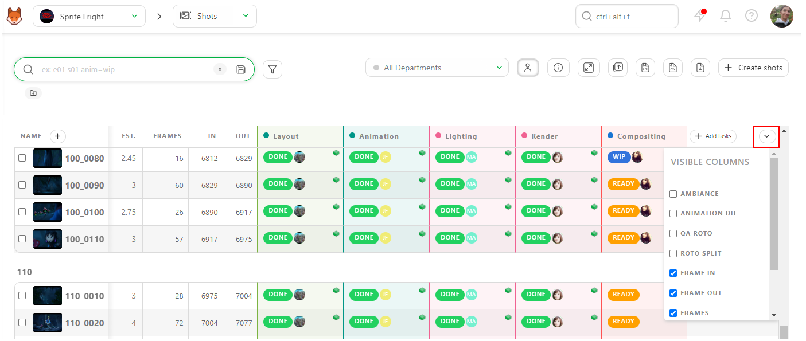

# Meta Columns

## Create Metadata Columns

To add more information on the general spreadsheet pages, you can create a **Metadata Column**.

Metadata columns alow you to track additional information related to your production. Some examples could include a metadata colum to track the percieved difficulty of a task, or a column to try custom tags that help you identify certain aspects of a task. Custom metadata columns can store data in a veriety of formats for easier data entry, filtering and validation.

To add a new custom metadata column, click on the **+** icon next to the Name column.

First, choose the name you prefer for your field. Then, select the appropriate **Type** based on your needs:

- **Text**: 
  - This type accommodates text based input, including both letters and numbers. It offers flexibility in storing information such as descriptions, comments, or textual content.

- **Number**: 
  - Reserved solely for numerical data. It's recommended for tracking information exclusively comprised of numerical values, such as framerates, dates, or times.

- **Checkbox**: 
  - This option allows you to mark items as either on or off. It's suitable for tracking data with only two possible states, like indicating shots intended for a trailer cut.

- **List of values**: 
  - With this type, you define a list of options from which only one unique element can be selected. It's ideal when you need to track data with a limited number of choices. For instance, for tracking camera movements, options like "Static," "Pan," "Tilt," or "Zoom" could be included.

- **List of tags**: 
  - Here, you can define multiple tags. Unlike a list of values, which allows selecting only one item, this type enables selecting multiple entries from the list. 

- **Checklist**: 
  - This type presents a list of options, each accompanied by its own checkbox. It's useful for tracking minor sub-tasks associated with a shot or asset, which don't warrant their own task in the production pipeline.

:::warning 
When creating **Text** and **Number** metadata types, a default value is not required upon creation.

However, when using the **List of value**, **List of tags**, and **Checklist**, you have to specify which values you want to include at the point of creation.

Type the list elements below **Available values**, and confirm them by clicking on **Add value**.
:::

You can also link the **metadata column** to one or several **departments**.

::: tip
Link a metadata column to a department. The artists/supervisors will see it on their to-do page and in the department-filtered view.

To create more departments, see [Create Departments](../configure-kitsu/README.md#create-departments).

You can link the metadata column to one or more departments. Click on the department from the list and then click on **add** to make it effective.

Here, the VFX column is linked to two departments.

:::

::: details How to edit your metadata column
On the global page of the asset or the shot, click on the arrow on the direct right of your metadata column and click on **Edit**.

:::

Congratulations, your newly created metadata column should now be available from your global page.

::: tip Batch Updates
If you want update multiple items with the same values, first check the items you want to include as shown below, and then update the value. The value you entered will then be updated across all items.

:::

::: details Editing Entities
While you can make updates to entities in the spreadsheet directly, you can also use the edit button  to update multiple metadata columns.

Once selected, you can fill out or adjust values for all metadata columns for that specific entity. Remember to press the **Confirm** button when you are done.

:::

If you need to edit or delete the metadata column from the general spreadsheet page next to the name of your metadata column, click on the arrow . 

::: tip
In additional to editing or deleting metadata columns, from here you can also **sort** your global page with this new column by clicking on **Sort By**.

Additionally you can also **Stick** the metadata column, meaning that it will stay locked to the left and remain visible while scrolling through a large dataset.
:::

## Display or Hide all Metadata Columns

To keep your global spreadsheet tidy, you can choose to hide any non-essential columns. Note that this action does not delete the column; it simply hides it from view but retains it in other areas where it is used.

To do this, click on the **Hide Additional Information**
 button on the top right of the page.

 

To make the information reappear, click on the same button,
 it won't be highlighted in grey.

 

## Display or Hide a single Metadata Column

You may need to hide or display a specific **Metadata Column** on a global page.

To hide your metadata column, click on the arrow on the right border of the global page.

You can choose which column you want to **hide** or **display**.

## Sticky Columns

If a piece of information is frequently referred to, you can **Stick** this column next to the shot name.

Click on the arrow to the right of the column to open the column menu, then choose **Stick**.

