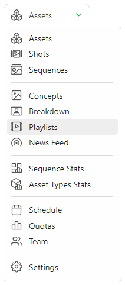
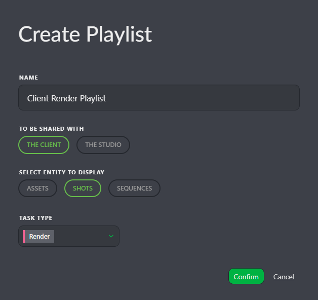
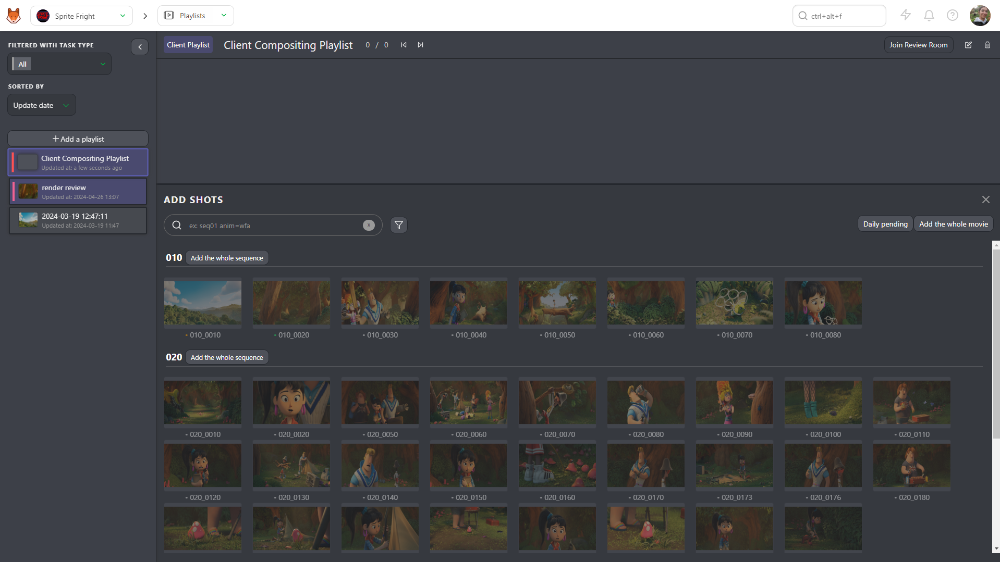
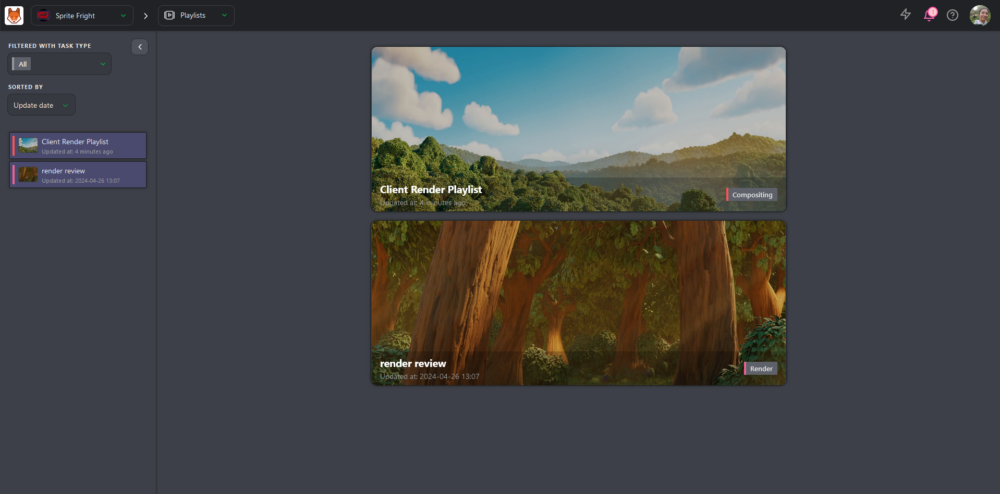
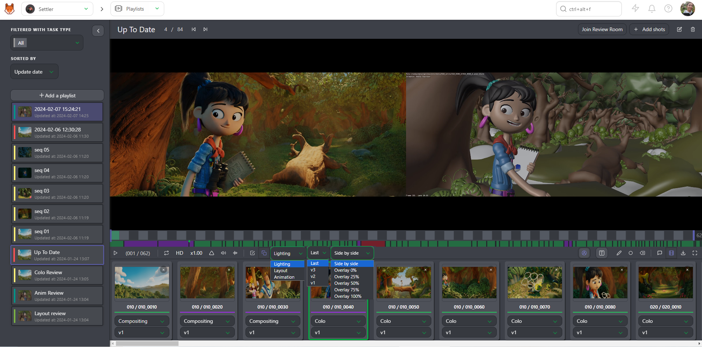

# Client Playlists

## Create a Playlist for your Client

You can find the **Playlists** page on the drop-down menu.

The **playlist** page is separated into two parts:

- (1) The playlist list where you can **create** a playlist or load an existing one.
- (2) The last created playlists and the last modified playlists

Start by creating a **Playlist**
. 

Your default name
is the date and the hour. You can change it immediately. 

You need to select the playlist has shared with **The Client** and if it's a  **Assets**, **Shots** or **Sequences** playlist.
You can also add a **Task Type** tag to the playlist.

Once the playlist created, via the search/filter bar, you can select which shots to add
to your playlist.

::: tip
 Kitsu will automatically load **the latest uploaded version** of the task type.
:::

You can also choose to **add whole movie**, and it will add all the shots of the movie.

Otherwise, you can **Add the whole sequence** if you want to focus only on a particular sequence.

You can use the same **filter** than on the global shot/asset page. For example, you can select all the
**Done** tasks for the render stage.
You can type your research **render=done** in the search bar or use the filter builder button. 

Valid your selection with the **Add selection** button.

Kitsu will select the shots that have the **Done** status at the **Compositing** stage.

The shots appear on the top part of the screen. Every change are
automatically saved.

## Presentation of the Client Playlist

Once you have created a playlist; you can warn you client.

::: warning
Your client will only access the production if the client is part of the team, and only see the **client playlist**.
:::

The client has several option to control the playlist.

::: danger Client Permission
- Clients are able to see all the versions of all the taks type
- Clients only see their own comment, and your replies. They are not able to see your internal commments
- Client only see when a revision has been published, but can't see who puclish it
- Client can only see and use the status with the **Is client Allowed** tag
:::

Clients can (from left to right):
* Play or Pause the video
* Loop on one element
* Switch between LD (low definition) to HD (High definition)
* Change the speed, double speed (x2), full speed (x1), half of the speed (x0.50), or a quarter of the speed (x0.25)
* Display annotations during the play
* Mute or unmute the sound
* Display the sound wave
* Change the task type of all the elements of the playlist
* Use the compare tool
* Text and drawing option, and delete selection
* Display the comment section
* Hide the elements of the playlist
* Download the playlist as a **Zip** files with all the separated elements, a **.csv** text file, or **Build .mp4** to create the whole movie (only for shots)
* Fullscreen

::: tip
Client can navigate frame per frame on the preview with the arrows **left** and **right** on the Keyboard.
:::

Client can also:
* Navigate from element to element by clicking on it
* See the color status and lenght of each element compare to the total
* See the position of the selected element compare to the total with the green dot

## Client Review

For each playlisted shot/asset, the client can choose the **task** and the
**version** they want to see.

They can also play side by side two tasks of a shot.

They can click on the **Compare** button  and choose the second task type.

::: tip
The primary purpose of the playlist is to help the client with the review of the shots and assets.

They can comment on the shots directly from the previews.
:::

They need to click on the **comment** button.

They now have access to the right panel, with the history of their comments and status, but no access to the internal comment and status

They can draw or type on the video  with the **draw** button 

and write a comment at the same time.

You can see the drawing comment on the video (the red dot below the timeline).

::: warning 
Only supervisor and production manager will be able to see the client comments.
Artists will only see the status.

Supervisor and production manager, can copy the client comment and/or modify it and publish it for the team

:::

## Review Room

On top of the playlist you have a button to **Join Review Room**. The review room will synchronize all the participants.

Everybody in the review room will see in real time the play and pause, the shots and frame selection.

The people in the review room will also see the drawing annotation synchronized.

