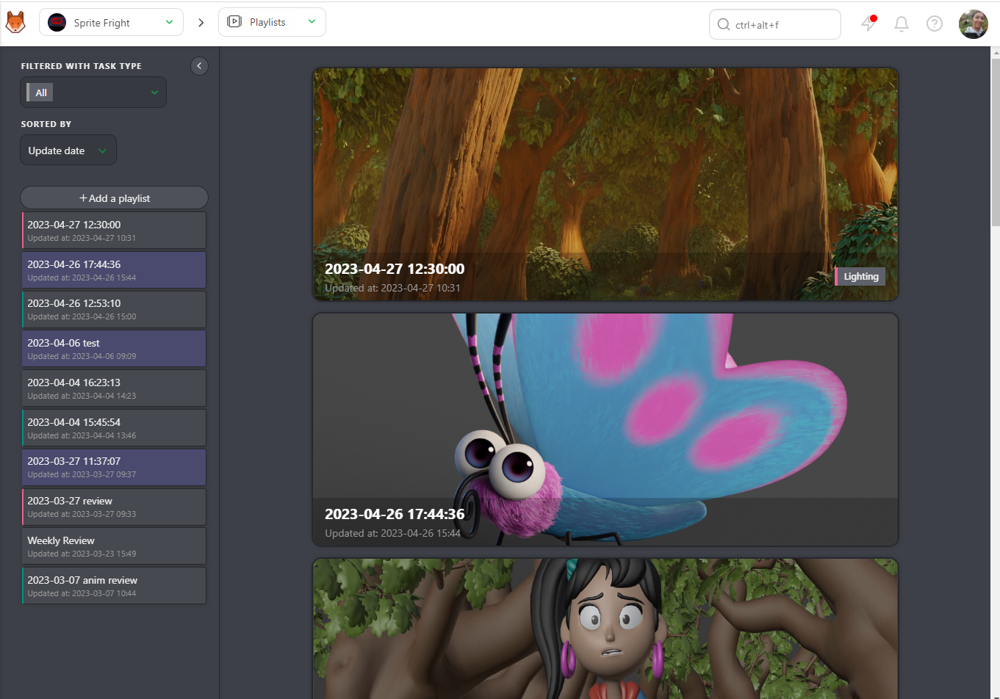

# Playlists

## Create a playlist

You can find the **Playlists** page on the drop-down menu.

The **playlist** page is separated into two parts:

- (1) The playlist list where you can **create** a playlist or load an existing one.
- (2) The last created playlists and the last modified playlists

Start by creating a **Playlist**
. Your default name
is the date and the hour. You can change it immediately. You can choose if the playlist
will be shared with the **studio** or the **client** and if it's a **shot** or **asset** playlist.
You can also add a **Task Type** tag to the playlist.

Once the playlist created, via the search/filter bar, you can select which shots to add
to your playlist.

You can also choose to **add whole movie**, and it will add all the shots of the movie.

You can select **Daily pending**, which will add all the **WFA** tasks of the day.

Otherwise, you can **Add the whole sequence** if you want to focus only on a particular sequence.

You can use the same **filter** than on the global shot/asset page. For example, you can select all the
WFA short for the animation stage.
You have to type **animation=wfa** in the search bar. Valid your selection with the **Add selection** button.
Kitsu will select the shots that have the **WFA** status at the **Animation** stage, but Kitsu will automatically load **the latest uploaded version**.

The shots appear on the top part of the screen. Every change are
automatically saved.

## Review and validations

Once you have created a playlist; you have several options:

* Play or Pause
* Navigate from element to element
* See the position of the selected element compare to the total number of elements
* Mute or unmute the sound
* Change the speed, double speed (x2), full speed (x1), half of the speed (x0.50), or a quarter of the speed (x0.25)
* Loop on one element
* Display the sound wave
* Display annotations during the play
* TC of the element compared to the TC of the whole playlist
* Number of frame
* Navigate frame per frame on the preview. You can also do it with the arrow on the Keyboard.
* Compare tool

* Undo and Redo option for the drawing comment
* Text and drawing option, and delete selection

* Change the task type of all the elements of the playlist
* Display the comment section
* Hide the elements of the playlist
* Switch between LD (low definition) to HD (High definition)
* Download the playlist as a **Zip** files with all the separated elements, a **.csv** text file, or **Build .mp4** to create the whole movie (only for shots)
* Fullscreen

For each playlisted shot/asset, you can choose the **task** and the
**version** you want to see.

You can also play side by side two tasks of a shot.

Click on the **Compare** button  and choose the second task type.

The primary purpose of the playlist is to help you with the review of the shots and assets.

You can comment on the shots directly from the preview.

Click on the **comment** button.

You now have access to the right panel, with all the history of the comments and status.

You can see the drawing comment on the video (the red dot below the timeline).

You can draw or type on the video (same than
[Perform a review](../getting-started-production/README.md#perform-a-review)), with the **draw** button 

## Review Room

On top of the playlist you have a button to **Join Review Room**. The review room will synchronize all the participants.

Everybody in the review room will see in real time the play and pause, the shots and frame selection.

The people in the review room will also see the drawing annotation synchronized.

