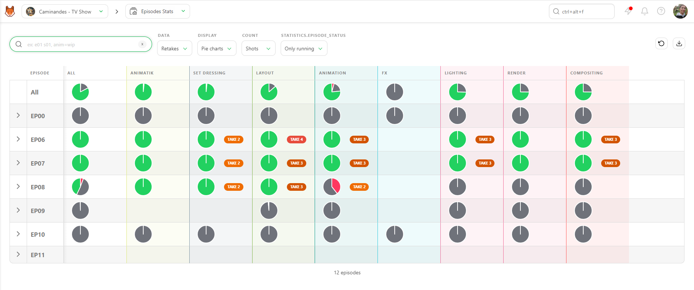
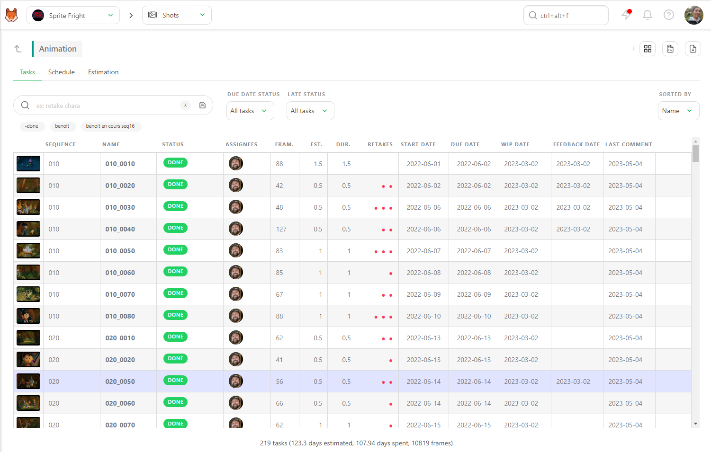
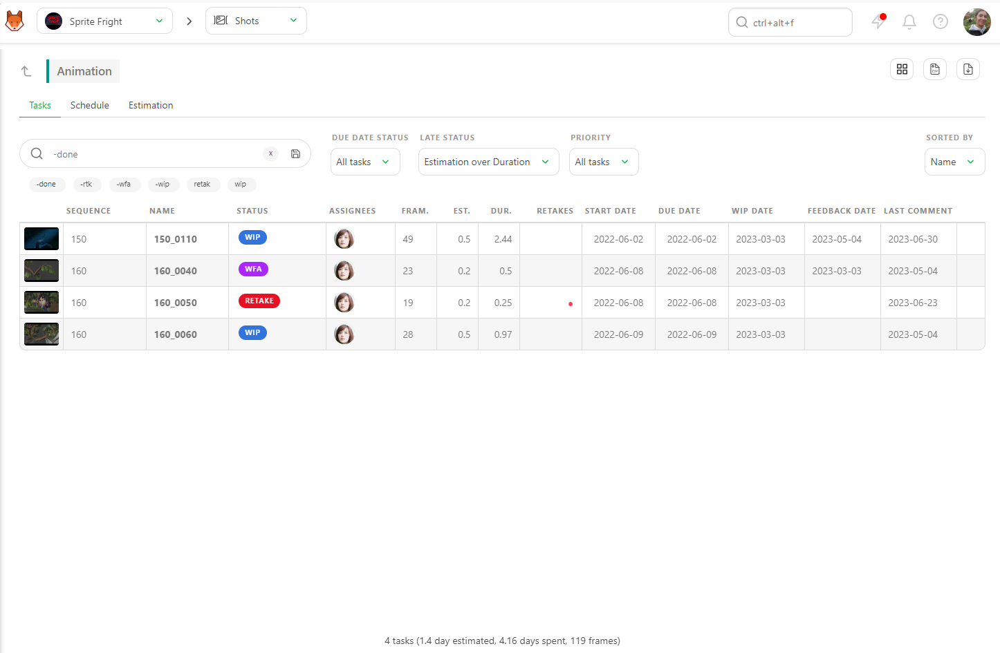
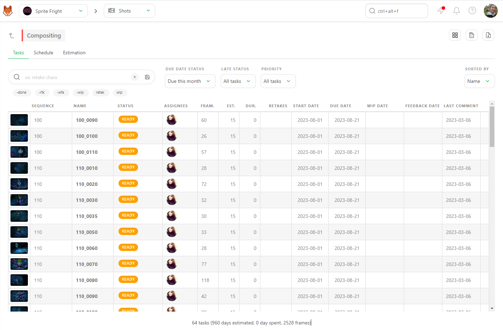
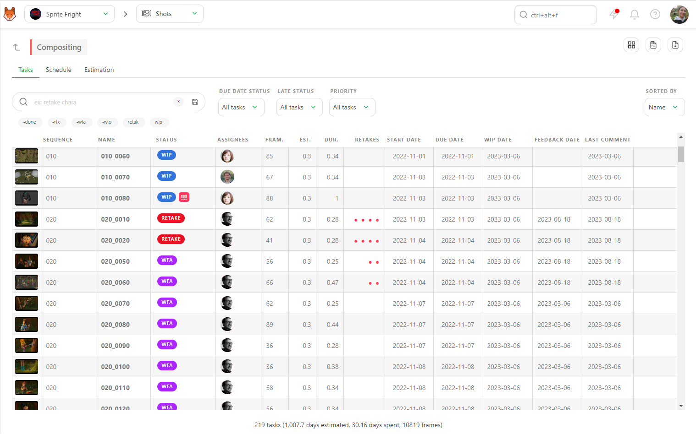
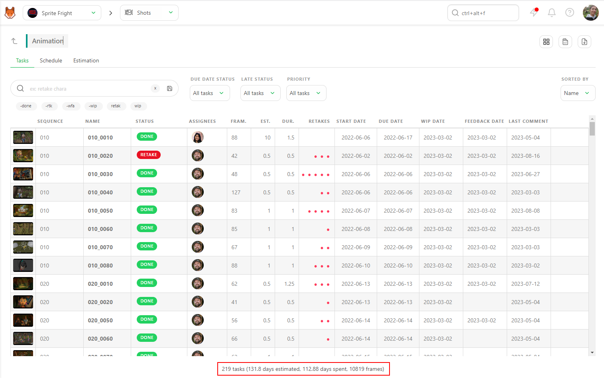
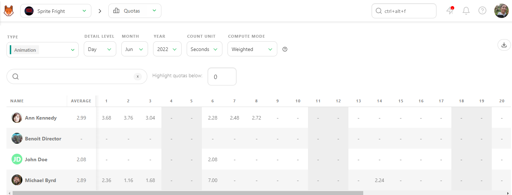
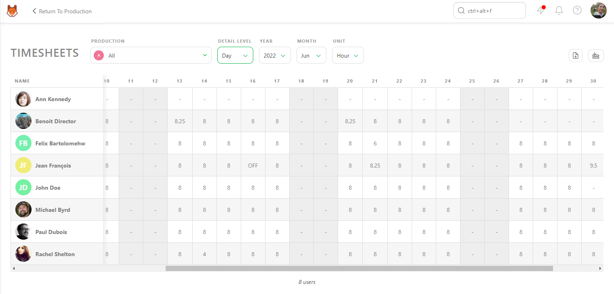
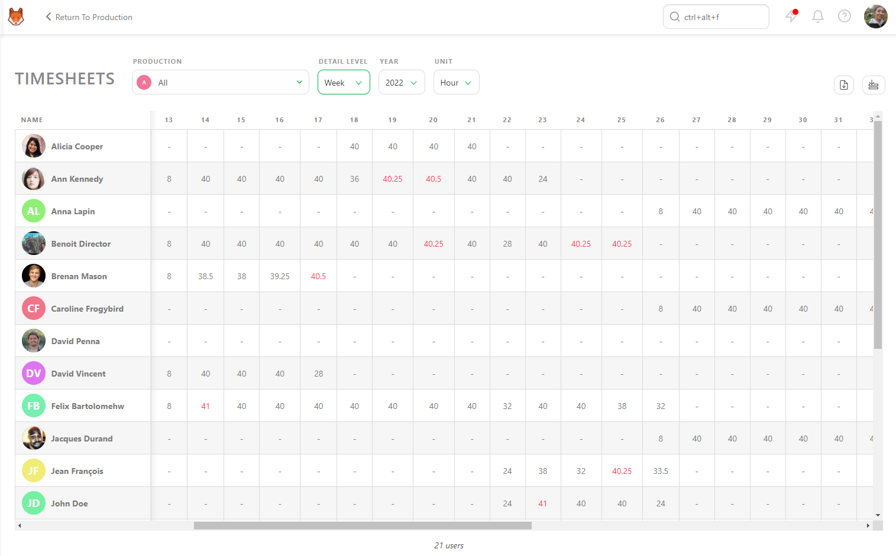

# Build your Production Report

## Know Everything that is Happening in the Production

As a Producer, you need to know everything.

Usually, it's done by knowing everything by heart all the time. This means you notice that a status has 
changed because you remember the previous state.

Otherwise, you could subscribe to all the tasks and be drowned by the notification, which will get you out of
 focus every time you stop what you are doing to read them.

The perfect solution will be to have all the **production status** changes on one page, always up-to-date.

Welcome to the New Feed page.

Here, you can see all the status changes minute by minute.

::: tip
On the right part of the screen, you always see the sum of the number of news items, the total number, and the per-status number.
:::

You can filter the list per **Task Status**, **Task Type**, and per **Person**.

If you click into a line, the comment panel will open on the right and give you all the information you need.

With the **Filters Builder** button, you can define the time frame for displaying the information.

For example, if you want to focus on a supervisor for a specific month, select its name and then pick a date in the **From** box.

## Know the Current State of the Production - Short / Feature

As a Producer, it is important to know the Status of your Production anytime, anywhere.

So once again, you can learn everything by heart or look at the **Statistic pages**.

With the **Sequence Stats** page, you have access to the pie charts of the whole Production on a single page,
 sequence per sequence.

 The **color scheme** of the pie charts is the same as **the status**. So, with a glance, you know immediately what is
the state of your Production.

The first line is **all sequences**, which means the whole Production, and the first column, **All**, includes all the tasks simultaneously.

If you focus on this first pie chart, you will see the exact state of your Production. If you need more detail, you can look at the rest of the line for a global view of each task type state.

You have the same level of information for the asset with the **Asset Types Stats**.

You can also display data as **Counts**. This way, you'll see the exact number of assets/shots/frames with the percentage per status.

Export this page as a `.csv`text file and import it into spreadsheet software.

## Know the Current State of the Production - TV Show
 
You can access an extra information level on a TV show: **Episodes Stats**.

You can display data on this page in two ways. The first one is **Retakes**, which is the default setting.

The **Retakes** display lets you see the number of retakes (back and forth) for each episode 
on each task type. Only three colors are displayed: 
- the **validated as Green**, 

- the **retakes as Red**, 

- and the **in progress as Grey** tasks.

 

 If you unfold an episode, you will see the percentage of each take and the evolution of the retakes versus validation.

It helps you see the progress of each episode per Task.

 Usually, the first episodes have many back-and-forths, but it should get better then.

But, if late episodes still have many retakes, something must be fixed. It's time to discuss the issue with the director and the Supervisor.

The second option for data display is the **Status**.

This status display works like the **Sequence** / **Asset Type** Stats page.

You can also display data as **Counts**. This way, you'll see the exact number of shots / Frames with the percentage per status.

Export this page as a `.csv` text file and import it into spreadsheet software.
 

## How to Know if a Task Type is Late

You need two things to know if a task needs to be on time. 

- Know the **Task Type** of the task
- Enter an **Estimation** (Bid) in several days, and an estimate **Start date** and **Due date** for the task.

When you are done, you can **compare estimation to reality** on the Task Type page.

You can do it in two ways : 
- By filtering **Due Date Status**
- By looking at the **Gant Diagram**

::: tip
Kitsu will automatically grab the date and status of the **WIP** and **WFA**. You can now compare your
 **estimate start date** versus **when the Artist really starts**, and compare the **estimate due date** to **when the Artist ask for a validation**.
:::
 
On the **Tasks** tab, the first filter you see is **Due Date Status**. 

Set it to **Due before today**. Kitsu will display all the tasks with a **Due date** set **Due Before Today**.

Once this filter is applied, you must sort out what is finished and still needs to be finished.

You can use the filter **-Done** to filter all the tasks except those finished.

You can now see all the late tasks with the two filters applied, meaning they are only validated after the **Estimated Due Date**.

The sum-up is at the bottom of the page, and it updates in real time depending on the filter applied.

 
You can export this page as a `CSV` file and open it using spreadsheet software.

You can also use the **Late Status** filter built into the page.

With this filter, you can immediately see which tasks took more time than estimated **Estimation over Duration**

You can filter the late tasks using the **Due date late** option.

We have two ways to calculate if a task is late: the first has **estimated due date** versus **Feedback**, and the second is versus **Done**. Depending on how you calculate it in your studio, you will always have the answer with Kitsu.

 On the **Task type Page**, go to the **Schedule** tab.

As set on the production schedule, the **Start** and **End** dates of this task type are visible at the top of the screen.

The **Gantt Diagram** will be dark grey before and after these dates. Visually, you immediately
know if you are too soon or too late.

The final step is to change the **Coloring**. By default, it's set on **Status color**, meaning all the bars will be colored according to their actual status (blue = wip, green = done, etc.).

You will only see two colors with the **Late in Red**: **Grey** if the Task is still on time and **Red** if the Task is late.

You can return to the **Tasks** tab for more details. Kitsu will keep you filtered from tab to tab.

  
## How to Know if a Task Type may be late
 
Realizing that a task is late is good, but knowing if it may be late is better. As Production, you always need to be ahead.

On the **Task Type** page, use the **Due Date Status** filter.

Depending on how much you want to know, you can focus on the **Due this week** and the **Due this month** filters.

You now have a global view of what will happen next. For a more precise view, feel free to use the Status filter.

For example, if you are on the **Due this week** view, you may want to see if there are still **Todo** or **Ready** tasks. 
There will likely be late if a task needs to be finished this week and has yet to start. 

To be sure, you must also check the amount of work assigned to the artists who still need to start.
Go to the **Estimation** tab with your filters still active.

The sum-up of your artists is on the **Estimation** tab on the right part of the screen.

The first line shows the total number of tasks assigned to the Artist since the beginning of the Production. The second line, **Remaining, ** shows what the Artist has left to do. 

The artist may miss the deadline if he still has plenty of tasks. If he still needs to start to do it, there is still a chance. But you need to keep an eye on those tasks.

## How to Know Why a Task is Late

Now that you know which tasks are late or will be late, you need to understand **why**.

There are several reasons why a task is late: 
- The Artist is overwhelmed and has too many tasks to do at the same time
- There is too much back-and-forth on this Task
- The task must be underestimated and be easier to finish on time.
- The previous Task was already late

To check an artist's number of tasks, you can filter the **Task Type** page by the artist's name under the **Task** tab.

You can also add the **-done** filter to see what the Artist has left to do. Then add the **Due Date Status** filter to **Due previous week** or **Due this week** (depending on what you are looking for).

You can now see how many tasks your Artist has to do.

To identify the number of Back-and-forth, look at the Retakes column on the Tasks tab.

Each **Red Dot** is a **retake**. Click on the line to open the **Comment panel** and read the whole task history. 

It's the best way to understand what is happening. The artist misunderstood the brief, or maybe the brief changed with each version.

The next step is to check if the Task is not under-estimated. You can go back to the global page, click on the name of the shot or asset, and see the casting and all the extra information. 

Maybe there are too many characters in the scene, and maybe this is a big action scene.

Lastly, you can check the previous Task while viewing the asset/shot in detail. 
If you click on it, you will go to the dedicated **Task Type** page, where you can find detailed information about what was happening before.

## Duration over Estimation

It's time to focus on the big picture and have a global view of the **Bid**.

On all the pages, you can see the sum-up at the bottom of the page of estimation **Person days** VS the reality **Days Spent**.

On the shot's global page, you can see the sum-up of all the estimations vs. duration. But you can also use a filter. 

For example, you can focus on a specific sequence by filtering your global page with the sequence's name. The sum-up will be updated at the bottom.

This way, you will know the **Duration** versus **Estimation** for this **Sequence**.

You can also filter the global asset page.

For example, you can filter on a specific **Asset Type**  as the **Character**. 

Once the global page is filtered, the sum-up at the bottom will update and give you the estimation vs. duration for this asset type.

## Duration over Estimation for a Task Type

Now that you know how to see the global view, it's time to focus on details.

You can click on the name of a task type and notice that the sum-up at the bottom of the screen shows **Duration** versus **Estimation** for this level of detail.

You can get the global view or focus on a **specific status** or **Artist's name**. As on the global page, the sum-up will update at each filter.

## Duration over Estimation for an Asset / Shot

To examine the details more closely, you can display **Estimation** and **Time Spent** columns (duration) for each asset and shot in Kitsu.

You can now see the sum-up of each Task for this specific asset or shot. If something looks wrong, click on the asset's name or shot and go to the detail page.

On the detail page, at the top left of the screen, you have the sum-up of the asset/shot life. You also have the details of each **Status**, **Estimation**, **Duration**, **Start and due date**, and ** Assignation **.

## How to Check Quotas

Kitsu has two ways to calculate the quotas per **shot Task Type**.

The first is linked to the **Timesheet**:

- Shots are considered to have ended on the first feedback request. Then, quotas are weighted according to the time spent on the Task (when the Artist fills out his timesheet).

In this example, Kitsu has weighted the daily quota linked to the timesheet.

Kitsu will split the done frames among all business days between the start and the end and grab the number of frames (or seconds, or tasks) submitted per day/week/month per Artist.

You can click on a number and see its details on the right panel anytime.

::: danger 
If no timesheet is filled, then Kitsu considers that:

- The Task was started when the first status change was made to WIP.

- The Task was done the day the feedback request was made.
:::

## Check the Timesheet of the Team

::: warning
All of the previous chapters are based on the fact that **Estimation** and **Duration** are filled for each Task.
:::

Everybody has to do their part. You and the supervisor will estimate, and your team will fill out their timesheets.

You can go to the main menu and see the Timesheet page.

On this page, you can see each team member's timesheet per day, whether they fill it out every day, whether they took a day off, and, more importantly, whether they are working extra time.

If you have a question about a timesheet, click on it and see the details of the Production, task type, and Task.

Once everything is good at the day level, you can change the **Detail Level** from Day to Week, Month, and Year.

You can also see all the Productions you manage at once or view Production per Production.

As with all other pages in Kitsu, you can export this page as a  CSV file and open it on spreadsheet software.
