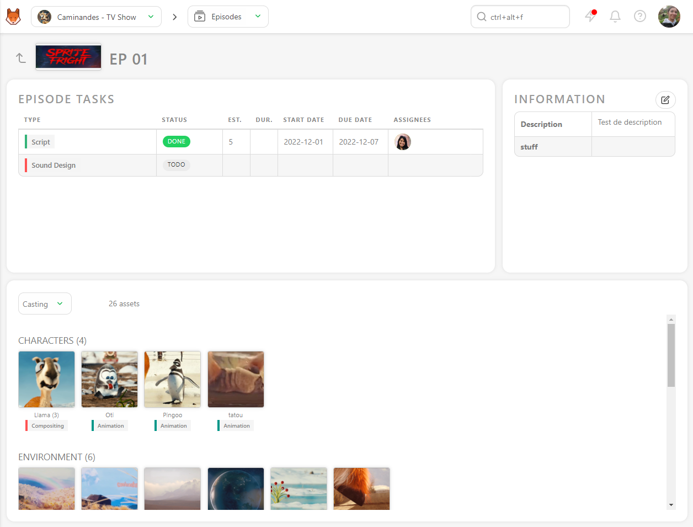
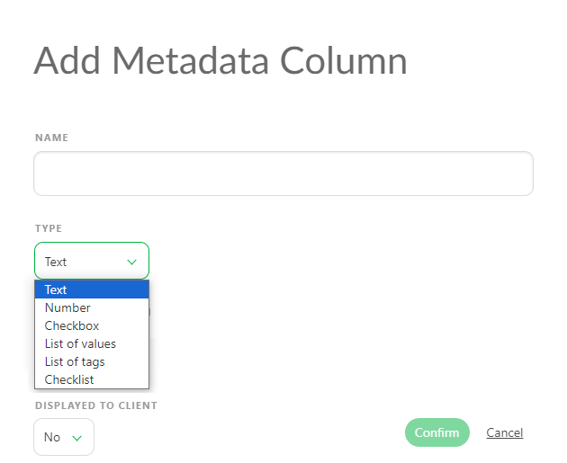
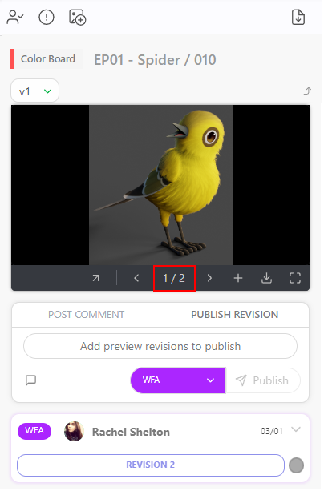
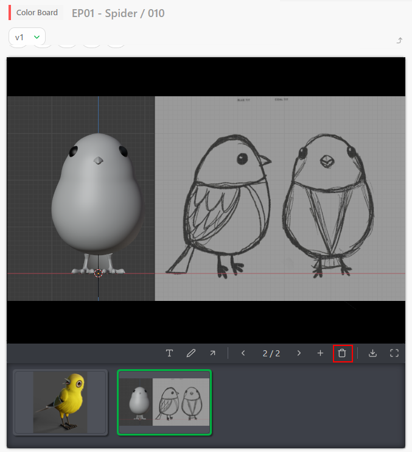
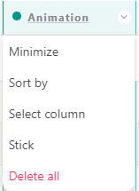
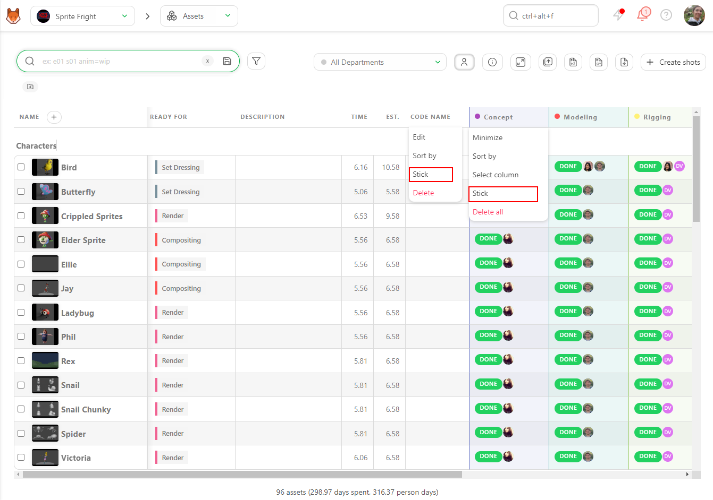
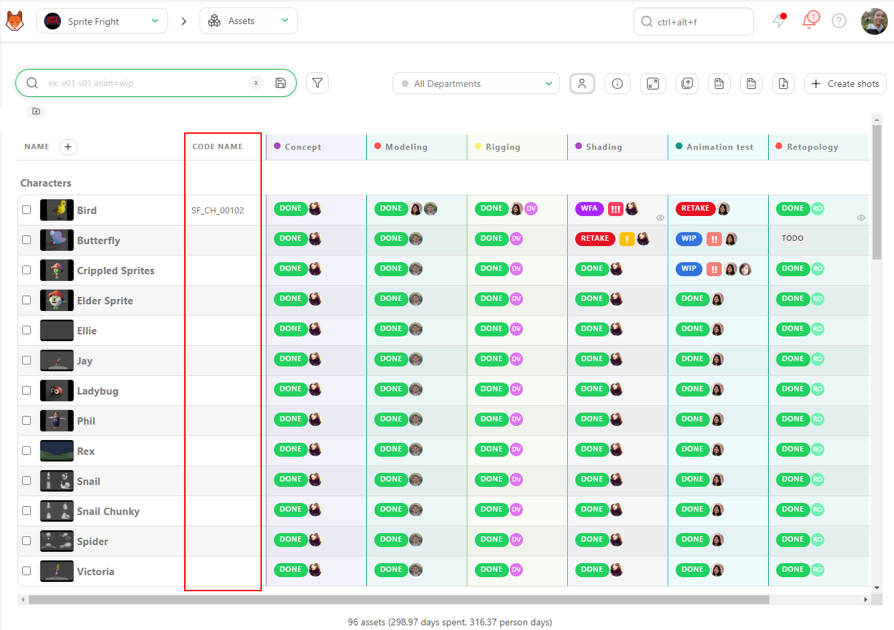

# Create a Production - Advanced

## Create Task for Episode

When you are in a TV Show production, you can create specific **Task type** for the episode. It's especially useful when
you have macro task to track, like script, SFx, editing, mix etc.

To use this page your need to first create dedicated task type on your **Global Library**
 with the **Episode** attribute.

See **Pipeline customization** Section to create new **Task Type**.

[Pipeline customization](../customization-pipeline/README.md)

Once you have create your **Task Types**  on your **Global Library**, and add them to your
**Production Library**, you will see the **Episodes** displayed on the navigation drop-down menu.

This new page behave like the asset and shot global page. You can add your tasks with the
 button.

You can add custom metadata column, fill the description, etc.

You can **Rename** and **Delete** the Episodes entity on this page, as for the asset and shot entity.

If you click on the name of an episode, you will see the detail page of this episode.

On the detailed page, you have access to the casting of the episode.
You can see all the assets used on the whole episode.

You also have access to the schedule, Preview Files, Activity and Timelog of the episode **tasks**.

## Create Task for Sequence

When you are in a production, you can create specific **Task type** for the sequences. It's especially useful when
you have macro tasks to track, like Story and color Board, Color Grading etc.

To use this page your need to first create dedicated task type on your **Global Library**
 with the **Episode** attribute.

See **Pipeline customization** Section to create new **Task Type**.

[Pipeline customization](../customization-pipeline/README.md)

Once you have create your **Task Types**  on your **Global Library**, and add them to your
**Production Library**, you will see the **Sequences** displayed on the navigation drop-down menu.

This new page behave like the asset and shot global page. You can add your tasks with the
 button.

You can add metadata column, fill the description, etc.

You can **Rename** and **Delete** the Sequence entity on this page, as for the asset and shot entity.

If you click on the name of a sequence, you will see the detail page of this sequence.

On the detailed page, you have access to the casting of the sequence.
You can see all the assets used on the whole sequence.

You also have access to the schedule, Preview Files, Activity and Timelog of the sequence **tasks**.

## Create Task for Edit

When you are in a production, you can create specific **Task type** for the Edit. It's especially useful when
you have several to track, like Story and color Board, Color Grading etc.

To use this page your need to first create dedicated task type on your **Global Library**
 with the **Edit** attribute.

See **Pipeline customization** Section to create new **Task Type**.

[Pipeline customization](../customization-pipeline/README.md)

Once you have create your **Task Types**  on your **Global Library**, and add them to your
**Production Library**, you will see the **Edit** displayed on the navigation drop-down menu.

This new page behave like the asset and shot global page. You can add your tasks with the
 button.

You can add metadata column, fill the description, etc.

You can **Rename** and **Delete** the Edit entity on this page, as for the asset and shot entity.

## Create Custom Metadata Columns

To add more information on the general spreadsheet pages, you have to create a custom **metadata column**.

Click on the **+** near the Name column.

You may have extra information to add on your pages as the **level of difficulties**,
the **name of the studios**, when a production is split, the shot order, etc.

You can store all kinds of text information in the custom metadata column:
a free **text**, a **number**, a **checkbox**, a **list of value**, or a **Checklist**.

The **text**, **number** and **checkbox** fields are different for each entity.

The **list of value** and **Checklist** give you the same choice for each entity. Moreover, it has to be filled now.

Type the list elements below **Available values**, and confirm them by clicking on **Add value**.

You can also link the metadata column to one or several departments.

If you link a metadata column to a department, the artists will see this column on their todo page, and on their department filtered view.

Validate the creation of the metadata column with the **Confirm** button.

Back on the global spreadsheets page, you can fill this information directly on the global page.
The cases are editable.

You can also modify the information with the edit button .

You now see a new line on the edit pop-up. You can select the information from the list,
alternatively, enter the free text or number, check a box, or use the checklist, depending on your previous choice.

Don't forget to press the **Confirm** button when you are done.

If you need to **edit** or **delete** the metadata column, go back to the general spreadsheet page.
Nearby the name of your metadata column, click on the arrow .

You can now **sort** your global page with this new column. For example, let's create a **Sort Order** metadata column.

Then click on the arrow on the right of the column name to open his menu. Then click on **Sort By**

Now the shots are not sorted by name but by the metadata column information.

You can also select in the menu if you want to edit the name of the metadata column and its information or if you want to delete it.

You can also use the **CSV Import** to fill your custom metadata column quickly.
First, you need to create your **Metadata column** into Kitsu, add it to your spreadsheet, and copy-paste your data into the **CSV Import**.

[Update Shots information with CSV Import](../batch-action/README.md#update-shots-information-with-csv-import)

## Add Multiple Preview as one Version

You can add multiple images simultaneously, or once you have uploaded an image, you can add another one.

The **Add preview** pop-up opens and asks you to choose a file.

You can navigate through the pictures uploaded.

You can change the preview order if you click on the number, then drag and drop them.

To delete an additional preview, you need to enlarge the comment panel by dragging it and click on the numbers of versions.

And then click on the 

## See Detail of an Asset

If you want to see a detail of an asset, click on its name.

A new page opens with the list of the tasks, the assignation, and the list
of shots where this asset appears on this shot (**Casting**).

You can click on the status of each task to open the comment panel and see the history of the comments and the different versions.

## See Detail of a Shot

If you want to see a detail of a shot, click on its name.

A new page opens with the list of the tasks, the assignation, and the list
of assets that appear on this shot (**Shot casting**).

You can click on the status of each task to open the comment panel and see the history of the comments and the different versions.

## Change Priorities

At some point in the production, you may want to prioritize some tasks, and
pinpoint these urgent tasks to your team.

For this, we use the same technique as before. Click on the space
near a status task (1).

The action box appears.

Click on the icon of the action menu to choose
**Change priority**.

There are four levels of priority: **Normal**, which is the fundamental level of all the
tasks, **High**, **Very High**, or **Emergency**. Save the changes with the
**Confirm** button.

As we have done for the assignation or the status, select the shots (1), select
the level of priority (2), and apply with **Confirm** (3).

You can now see next to the status of the task some **exclamation marks**. The
more there are, the more urgent the task is.

* (1) is **Normal**,
* (2) is **High**,
* (3) is **Very High**
* (4) is for **Emergency**.

## Change Status per Batch

Alternatively, you can do it per **batch**.

You can select multiple shots or assets by pressing the **ctrl** or
**shift** key.

Then go to the **Change status** section on the action menu.

Choose the new status for your selected tasks (1). You can also add a comment for all the selected tasks (2)
You validate the new status with the **Confirm** button.

## Simplify the Global Page

You may need to reduce a task type column on a global page. For example, you may be
only interested in layout and animation but not so much in the shipment for the client.

Close to each task type name, you can click on the arrow
 to unfold a submenu.

You can choose to **Minimize** **Sort by**, **Select column**, **Stick** or **Delete All** the task type.

Once the column is minimized, only colored dots show the status.

You can also choose which **Metadata column** you want to display.

To hide your metadata column, click on the arrow on the right border of the global page.

Here you can choose which column you want to **hide** or **display**.

You can also hide all the non-essential columns, like **Description**, **Metadata column**,
even the minimized columns.

Just click on the **Hide additional information**
 button on the top right of the page.

To make the information reappear, click on the same button,
 it won't have the grey highlight.

## Sticky Columns

If an information is very important for you, you can **Stick** this column next to the shot name.

It can be a **Task Type** column, or a **Meta Data** column.

Click on the arrow on the left of the column to open the column menu, then choose **Stick**.

Once a column is sticked, it will stay displayed even if the page is simplified.

