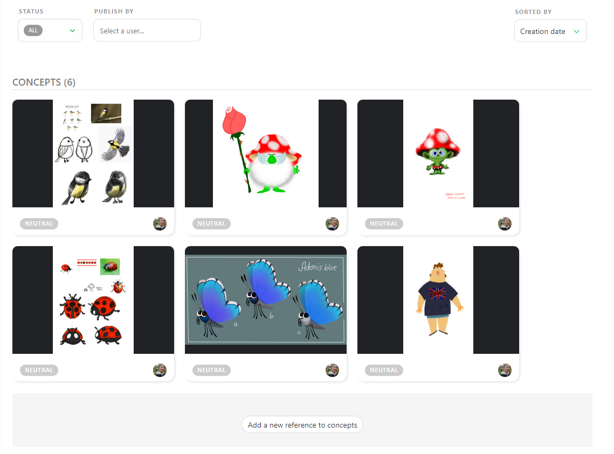
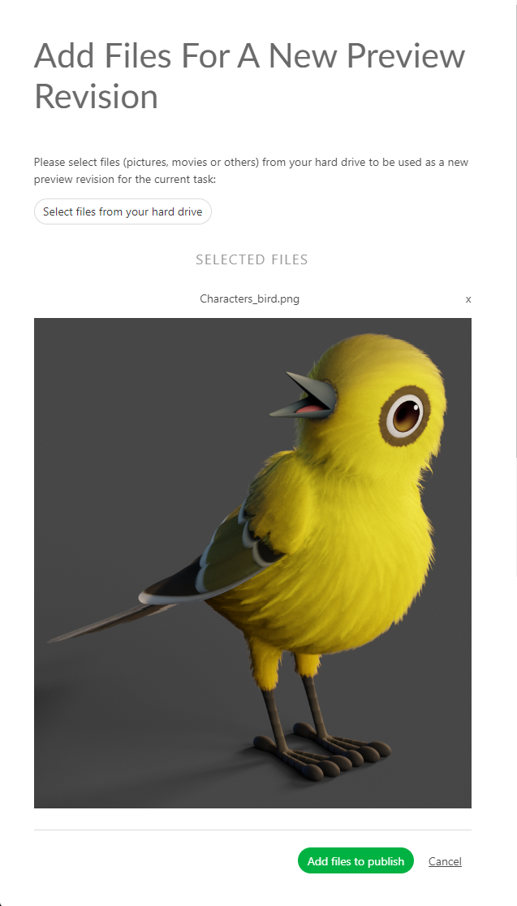

# Publish

## Publishing a Concept

To publish a **Concept**, navigate to the **Concepts** page from the project navigation menu.

To upload a concept, click the **Add a new reference to concepts** button. You can upload one or several concepts simultaneously.

After the upload is complete, previews will be generated and visible from your concepts page.

Click on the thumbnail to see an enlarged preview of your concept, or click on the status to open the **Comment Panel** on the right.

With the comment panel open, you have two options: 

1) You can link a concept with an existing asset / delete and existing link. 
2) You can comment and change the status of the concept.

It is good practice to only have one version per **Concept**. If the concept is not approved and requires additional changes, then it's better to version-up that concept.

## Linking a Concept to an Asset

Once concepts are uploaded, you can link them to assets.

The name of the linked asset is displayed below the thumbnail of the concept, and above the status. If no asset is linked, this area will be blank.

Click on the status of the concept to open the comment panel on the right.

From here you can adjust what the concept is linked to, or delete it. In our example below, the concept is not currently linked to an asset.

To link an asset, click on the **Link**  button.

Kitsu will display all the **Assets** available to link with the uploaded concept.

Select the assets from the list that you want to link to. The linked asset names will then appear at the top of the screen and will also display under the concept's thumbnail.

Once a concept is linked to an asset, it can be seen and referenced from the asset's detail page. Return to the asset page and click on the asset which you just linked to your concept.

By default, the casting detail is displayed on the second part of the screen. Use the dropdown menu to choose the concept.

Once in the concept section, you will see all the concepts created for this asset. You can filter them by status.

## Publish a Preview as a Version
To publish a preview, picture, or video, access the task's comment panel and select the **PUBLISH REVISION** tab.

Kitsu automatically switches to the **Publish Revision** tab when using a status with the **IS FEEDBACK REQUEST** option, such as the **WFA** Status.

You can add one or several previews to any comments. These can be a picture (`.png`, `.jpg`, `.jpeg`, `.gif`), a video (`.mp4`, `.mov`, `.wmv`), or a `.glb` file. Additionally, you can review all the previews from the browser or mix everything. 

You can also review a `.glb` file as a wireframe or add a `.HDR` file to check the lighting. See the **Customization** section for more details.

[Pipeline Customization](../configure-kitsu/README.md#3d-backgrounds)

Other files like `.pdf`, `.zip`, `.rar`, `.ma`, or `.mb` cannot be viewed in the browser and need to be downloaded to be reviewed.

Then, click on the **Add preview revision to publish** button. The explorer opens, allowing you to choose your file or several files.

You can also **copy-paste a screenshot** from your clipboard into this upload dialogue, without needing to download it first. Once your file is selected, you will see its name near the **Add files to publish** button.

You can also **drag & drop** files that you wish to upload into the comment section to automatically start the upload process.

On top of your preview, you can add a **Comment**. Click the **Leave a Comment** button to unfold the comment section.

You can then select your status and publish your preview with the **Post** Button.

For more information on using publishes as thumbnails, [see this section here on thumbnails](../thumbnails/README.md).

## Add Multiple Previews as One Version

You can add multiple images simultaneously, or once you have uploaded an image, you can add another one.

The **Add preview** pop-up asks you to choose a file. You can navigate through the pictures uploaded.

You can change the preview order by clicking the number and then dragging and dropping them.

To delete an additional preview, enlarge the comment panel, click on the number of versions, and then click on the .

