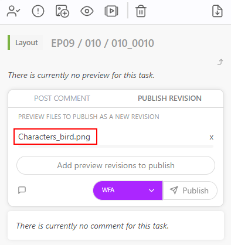
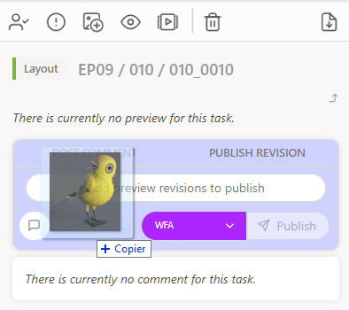
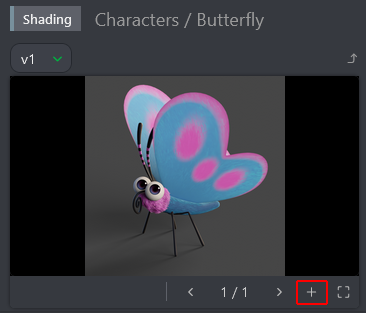
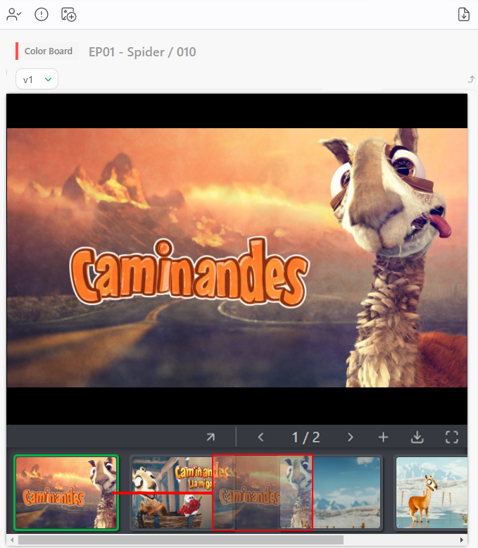

# Thumbnail and Publish

## Publish a Concept

To publish a **Concept**, go to the **Concept** page with the navigation menu.

To upload a concept, click the **Add a new reference to concepts** button.

You can upload one or several concepts at the same time.

Once you upload your previews, the concept page will look like this.

You can interact with the concept in two ways: click on the picture to see an enlarged view.
The second is to click on the status part to open the **Comment Panel** on the right.

You have two options on the comment panel: link a concept with an existing asset or delete the concept.
You can also comment and change the status of the asset.

The idea is to have one version per **Concept**. If it's not validated, you need to upload a new concept, not to have multiple versions of the same concept.

One concept is one task.

## Link a Concept to an Asset

Once concepts are uploaded, you can link them to the assets.

You can see the links on the status part of the assets.

Click on the status part of the concept; it will open the comment panel on the right.

On the comment panel, you have two options on top of the panel: Link a concept to an asset and delete the concept.

To link an asset, click on the **Link**  button.

Kitsu will display all the **Assets** available to link with the concept uploaded.

On top of the comment panel, Kitsu will list the linked assets. For now, there are **No Links**.

To link an asset, you have to click on it. You will see the name of the assets linked on the top of the screen, but also under the preview of the concept.

Once a concept is linked to an asset, you can see the concepts on the detail page of an asset.

Return to the asset page, and click on the asset name you want to see the concept.

Per default, the casting detail is displayed on the second part of the screen. 
Use the dropdown menu to choose the concept.

Once in the concept section, you will see all the concepts created for this asset. You can filter them per status.

## Publish a Preview as a Version

To publish a preview, picture, or video, select the **PUBLISH REVISION** tab on the comment panel of the task.

Kitsu will automatically switch to the **Publish Revision** tab when you use status with the option **IS FEEDBACK REQUEST**, like the **WFA** Status.

You can add one or several previews to any comments. It can be a picture (`.png`, `.jpg`, `.jpeg`, `.gif`), a video (`.mp4`, `.mov`, `.wmv`),
or an `.glb` file. You can review all the previews from the browser or mix everything.

For the `.glb` file you can also review it as wireframe, or add a `.HDR` file to check the lighting. 

See the **Customization** section for more details.
[Pipeline Customization](../customization-pipeline/README.md)

Other files like `.pdf`, `.zip`, `.rar`, `.ma`, or `.mb`, however, need to be
downloaded to be reviewed.

Then, click on the **Add preview revision to publish** button. The explorer opens and lets you choose your file or several files.

You can also **copy-paste a screenshot** to this screen.

You will see a preview of the attached files.

Once your file is selected, you will see its name near the **Attach preview** button.

You can also **drag & drop** the file in the comment section.

On top of your preview, you can add a **Comment**.

Click the **Leave a Comment** button to unfold the comment section.

You can select your status and publish your preview with the **Post** Button.

## Add a Thumbnail by hand

To define a preview as a thumbnail, the preview MUST have been uploaded as a revision. 

To publish a preview, picture, or video, select the **PUBLISH REVISION** tab on the comment panel of the task.

You can use the preview as a **thumbnail** on the asset or shot task. It
helps to recognize the assets/shots on the main pages.
On the list page, click on the status you want, then on the right panel, click the **Preview** button (1).

Once you have clicked on the button, you can choose if you want to pick the first or any frame; once the frame is selected, you see the thumbnail appear, and the button turns gray.

## Apply thumbnail automatically

On the production, user the navigation menu to go to the setting page

On the **Parameters** tab, you can choose to **set new preview as entity thumbnail automatically**.

Don't forget to **Save**, now as soon as you will upload a preview, it will be used automatically as a thumbnail.

## Add Multiple Previews as one Version

You can add multiple images simultaneously, or once you have uploaded an image, you can add another one.

The **Add preview** pop-up asks you to choose a file.

You can navigate through the pictures uploaded.

You can change the preview order by clicking the number and then dragging and dropping them.

To delete an additional preview, you need to enlarge the comment panel by dragging it and clicking on the number of versions.

And then click on the 

## Batch Upload Previews (as Thumbnails)

You can use the **Add Thumbnails** button  on the global page to massively import thumbnails.

A new pop-up opens and asks you to choose which task types the thumbnails are linked.

**Thumbnails batch import accept images files and video files**.

For the video files, only the first frame is used as the thumbnail.

You have to name your thumbnails as sequence_shot.
