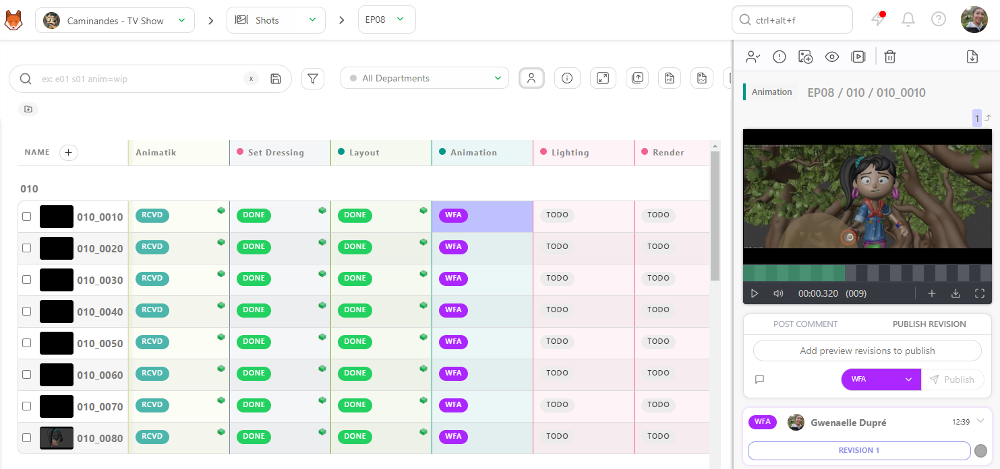
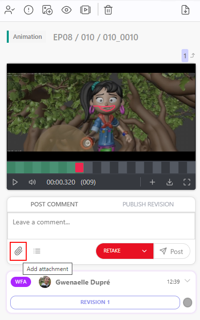
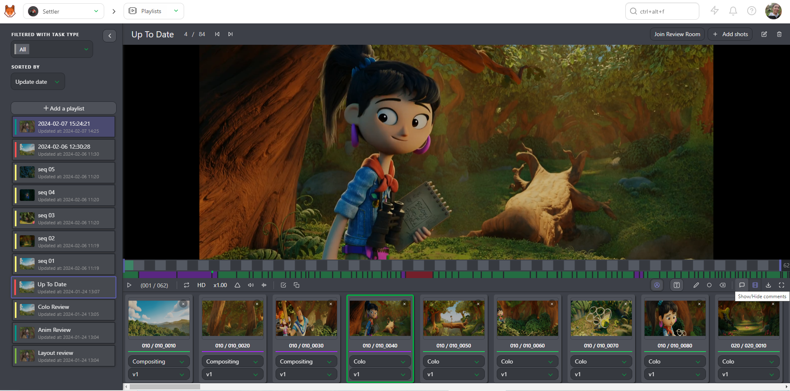

# Review

## Perform a Review

When an artist needs a **review**, he changes the status of his task, too .

Click on status to open the right panel and start the review.

You can watch the version from the right panel, enlarge it by grabbing the side of the panel, or even go fullscreen .

You can also review the 3D file (`.glb` file) as a wireframe or add a `.HDR` file to check the lighting. 

You can move around the 3D file by dragging and dropping your cursor and zooming in or out with the scroll.

See the **Customization** section for more details.
[Pipeline Customization](../customization-pipeline/README.md)

You can draw directly on the preview with the **Pencil** tool and select a color .

You can also add **text** on the frame.

If you need to see the preview without your comment, **hide your annotation**, you can click on the **Fountain Pen** button.

You can tag a frame (whatever version you are in), type the `@`and it opens a sub-menu with the team list, and start typing **frame**.

You can also export your drawings on each frame by attaching the **screenshots as attachments**.

Click on the **Add attachment** button.

You can also choose to **Attach snapshots from your annotation** on the attachment option.

Once you click the button, Kitsu will grab all the frames with annotation and display the result. You can publish them with **Confirm**.

If you need to delete your line, click the pencil icon again. The cursor changes to a multi-directional cross, and then you can select your line and move it around.

Select the line with the directional cross, then press the **delete** icon 

If you go into **Full-Screen**, you can compare two task types or versions side by side when you click on the **Compare** button
.

From there, you can change the status too if you want the Artist to perform some changes.

Alternatively, you can change it to  to notify the Artist that his work is validated.

## Review a Concept

Once your artists upload the concept, you can review it with the supervisor or the director.

To review the concept, you use the navigation menu at the top of the screen and select the concept page.

You can see all the concepts uploaded and the status, assignation, and linked assets.

To review a concept, click the status part to open the comment panel. You can enlarge the comment panel or go fullscreen.

Then, write a comment, select the status **Approved** or **Rejected**, and validate with the **Post** button.

You can filter the page with the **Status** filter to display all the **Neutral** status concepts.

You can also filter by artist and change the order of sorts.

## Playlists

## Create a Playlist

You can find the **Playlists** page on the drop-down menu.

The **playlist** page is separated into two parts:

- (1) The playlist list where you can **create** a playlist or load an existing one.
- (2) The last created playlists and the last modified playlists

Start by creating a **Playlist**
. Your default name
is the date and the hour. You can change it immediately. You can choose if the playlist
will be shared with the **studio** or the **client** and if it's a **shot** or **asset** playlist.
You can also add a **Task Type** tag to the playlist.

Once the playlist is created, via the search/filter bar, you can select which shots to add
to your playlist.

You can also choose to **add the whole movie**, and it will add all the shots of the movie.

You can select **Daily pending**, which will add all the **WFA** tasks of the day.

Otherwise, you can **Add the whole sequence** if you want to focus only on a particular sequence.

You can use the same **filter** than on the global shot/asset page. For example, you can select all the
WFA is short for the animation stage.
You have to type **animation=wfa** in the search bar. Valid your selection with the **Add selection** button.
Kitsu will select the shots with the **WFA** status at the **Animation** stage. Still, Kitsu will automatically load **the latest uploaded version**.

The shots appear on the top part of the screen. Every change are
automatically saved.

## Review and Validations

Once you have created a playlist, you have several options:

* Play or Pause
* Navigate from element to element
* See the position of the selected element compared to the total number of elements
* Mute or unmute the sound
* Change the speed, double speed (x2), full speed (x1), half of the speed (x0.50), or a quarter of the speed (x0.25)
* Loop on one element
* Display the sound wave
* Display annotations during the play
* TC of the element compared to the TC of the whole playlist
* Number of frames
* Navigate frame per frame on the preview. You can also do it with the arrow on the Keyboard.
* Compare tool

* Undo and Redo option for the drawing comment
* Text and drawing option, and delete selection

* Change the task type of all the elements of the playlist
* Display the comment section
* Hide the elements of the playlist
* Switch between LD (low definition) to HD (High definition)
* Download the playlist as a **Zip** files with all the separated elements, a **.csv** text file, or **Build .mp4** to create the whole movie (only for shots)
* Fullscreen

For each playlisted shot/asset, you can choose the **task** and the
**version** you want to see.

You can also play two tasks of a shot side by side.

Click on the **Compare** button  and choose the second task type.

The primary purpose of the playlist is to help you review the shots and assets.

You can comment on the shots directly from the preview.

Click on the **comment** button.

You now have access to the right panel, which has a history of the comments and their status.

You can see the drawing comment on the video (the red dot below the timeline).

You can draw or type on the video (same than
[Perform a review](../getting-started-production/README.md#perform-a-review)), with the **draw** button 

## Review Room

You have a button to **Join Review Room** at the top of the playlist. The review room will synchronize all the participants.

Everybody in the review room will see the play, pause, shots, and frame selection in real-time.

The people in the review room will also see the drawing annotation synchronized.

