# Status, publish and review

## Publish a Concept

To publish a **Concept**, go to the **Concept** page with the navigation menu.

To upload a concept, click the **Add a new reference to concepts** button.

You can upload one or several concepts at the same time.

Once you upload your previews, the concept page will look like this.

You can interact with the concept in two ways: click on the picture to see an enlarged view.
The second is to click on the status part to open the **Comment Panel** on the right.

You have two options on the comment panel: link a concept with an existing asset or delete the concept.
You can also comment and change the status of the asset.

The idea is to have one version per **Concept**. If it's not approved, you need to upload a new concept, not to have multiple versions of the same concept.

One concept is one task.

## Link a Concept to an Asset

Once concepts are uploaded, you can link them to the assets.

You can see the links on the status part of the assets.

Click on the status part of the concept; it will open the comment panel on the right.

On the comment panel, you have two options on top of the panel: Link a concept to an asset and delete the concept.

To link an asset, click on the **Link**  button.

Kitsu will display all the **Assets** available to link with the concept uploaded.

On top of the comment panel, Kitsu will list the linked assets. For now, there are **No Links**.

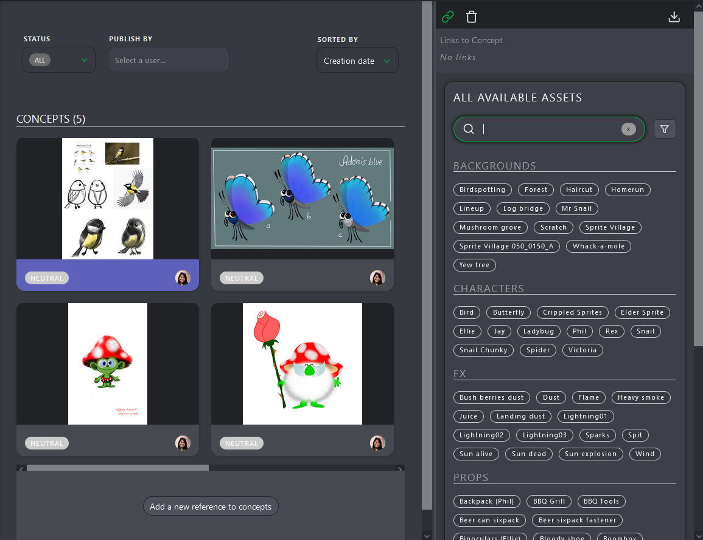

To link an asset, you have to click on it. You will see the name of the assets linked on the top of the screen, but also under the preview of the concept.

Once a concept is linked to an asset, you can see the concepts on the detail page of an asset.

Return to the asset page, and click on the asset name you want to see the concept.

Per default, the casting detail is displayed on the second part of the screen. 
Use the dropdown menu to choose the concept.

Once in the concept section, you will see all the concepts created for this asset. You can filter them per status.

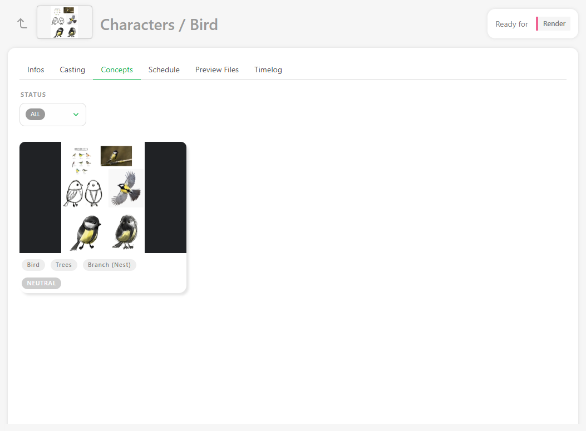

## Change Status and Add a Comment

To change the status of a task and write a comment, you need to click on the
status of the task.

It makes a panel appear on the right, and here, you can write a comment, change the status, and attach a file.

The **Commen Panel** is split into 2 tabs : 
- POST COMMENT
- PUBLISH REVISION

To change the **Status**, stay in **POST COMMENT** tab.

The comment uses the **Markdown** language. If you need specific syntax, feel free to look at the markdown guide website: https://www.markdownguide.org/basic-syntax/

On the **Leave a Comment...** section, you can **tag** someone on the team in the comments. Type the `@`and it opens a sub-menu with the list of the team.

You can also **tag** a full department by typing '@' and the department's name.

You can add a **checklist** to your comments.

You need to click on the **Add checklist** button, and the first item of the checklist appears.

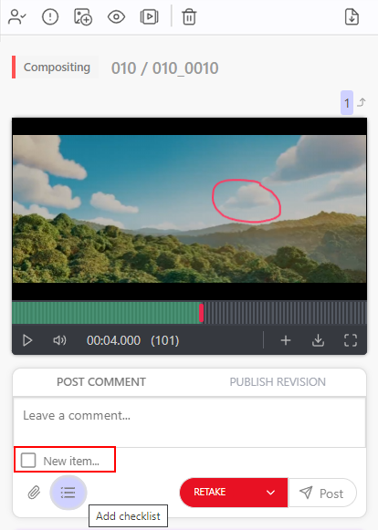

Type your comments, hit the **Enter** key to add another line to your checklist, or click the **Add Checklist** button again.

Besides your comment, you can also attach a file as a picture. Click on the **Add attachment** button.

Select a **file from your hard drive** or past a **screenshot** here.

Validate the attachment by clicking on **Add file as attachment**.

Then select the **Status** that you need on the dropdown menu. 

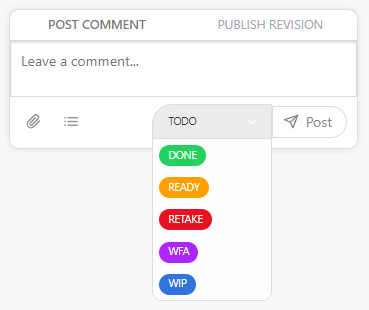

Then click the **Post** button to post it to the world.

## Publish a Preview as a Version

To publish a preview, picture, or video, select the **PUBLISH REVISION** tab on the comment panel of the task.

Kitsu will automatically switch to the **Publish Revision** tab when you use status with the option **IS FEEDBACK REQUEST**, like the **WFA** Status.

You can add one or several previews to any comments. It can be a picture (`.png`, `.jpg`, `.jpeg`, `.gif`), a video (`.mp4`, `.mov`, `.wmv`),
or an `.glb` file. You can review all the previews from the browser or mix everything.

For the `.glb` file you can also review it as wireframe, or add a `.HDR` file to check the lighting. Other files like `.pdf`, `.zip`, `.rar`, `.ma`, or `.mb`, however, need to be
downloaded to be reviewed.

Then, click on the **Add preview revision to publish** button. The explorer opens and lets you choose your file or several files.

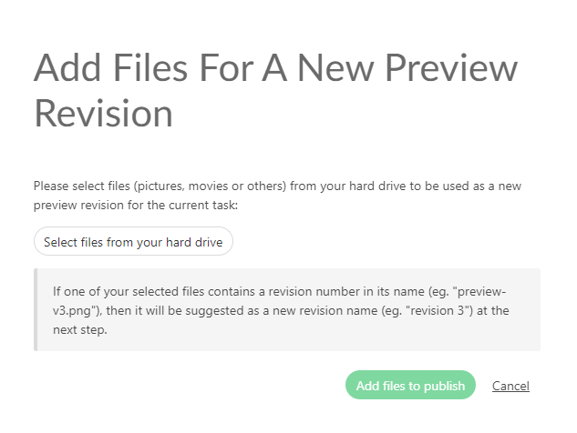

You can also **copy-paste a screenshot** to this screen.

You will see a preview of the attached files.

Once your file is selected, you will see its name near the **Attach preview** button.

You can also **drag & drop** the file in the comment section.

On top of your preview, you can add a **Comment**.

Click the **Leave a Comment** button to unfold the comment section.

You can select your status and publish your preview with the **Post** Button.

## Add a Thumbnail

To define a preview as a thumbnail, the preview MUST have been uploaded as a revision. 

To publish a preview, picture, or video, select the **PUBLISH REVISION** tab on the comment panel of the task.

You can use the preview as a **thumbnail** on the asset or shot task. It
helps to recognize the assets/shots on the main pages.
On the list page, click on the status you want, then on the right panel, click the **Preview** button (1).

Once you have clicked on the button, you can choose if you want to pick the first or any frame; once the frame is selected, you see the thumbnail appear, and the button turns gray.

## Perform a Review

When an artist needs a **review**, he changes the status of his task, too .

Click on status to open the right panel and start the review.

You can watch the version from the right panel, enlarge it by grabbing the side of the panel, or even go fullscreen .

For the 3D file (`.glb` file) you can also review it as wireframe, or add a `.HDR` file to check the lighting. 

You can move around the 3d file with a drag and move with your cursor, and zoom in or out with the scroll.

You can draw directly on the preview with the **Pencil** tool and select a color .

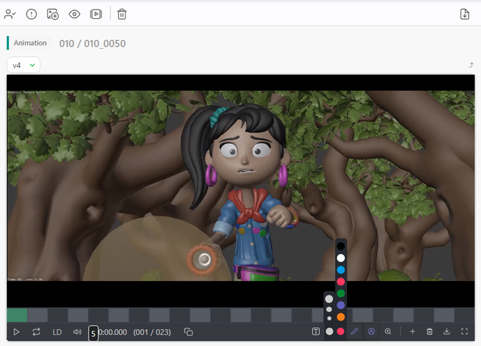

You can also add **text** on the frame.

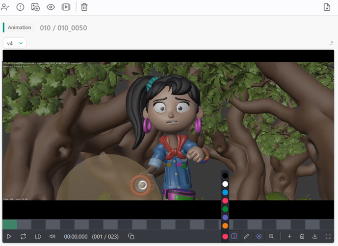

If you need to see the preview without your comment, **hide your annotation**, you can click on the **Fountain Pen** button.
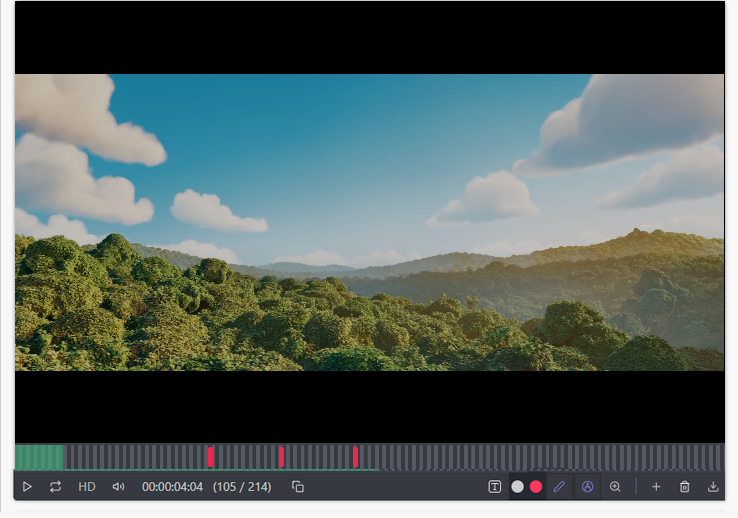

You can tag a frame (whatever version you are in), type the `@`and it opens a sub-menu with the team list, and start typing **frame**.

You can also export your drawings on each frame by attaching the **screenshots as attachments**.

Click on the **Add attachment** button.

You can also choose to **Attach snapshots from your annotation** on the attachment option.

Once you click the button, Kitsu will grab all the frames with annotation and display the result. You can publish them with **Confirm**.

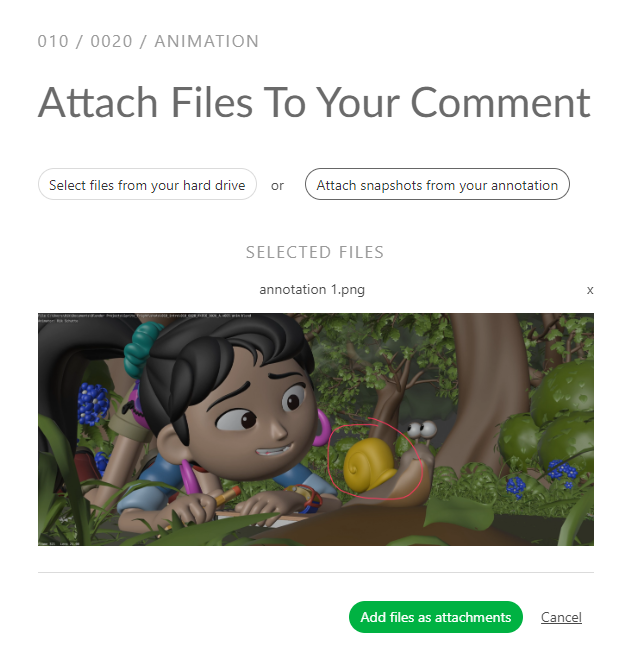

If you need to delete your line, click the **pencil** icon again, and the cursor changes to a multi-directional cross , and then you can select your line and move it around.

Select the line with the directional cross, then press the **delete** icon 

If you go into **Full-Screen**, you can compare two task types or versions side by side when you click on the **Compare** button
.

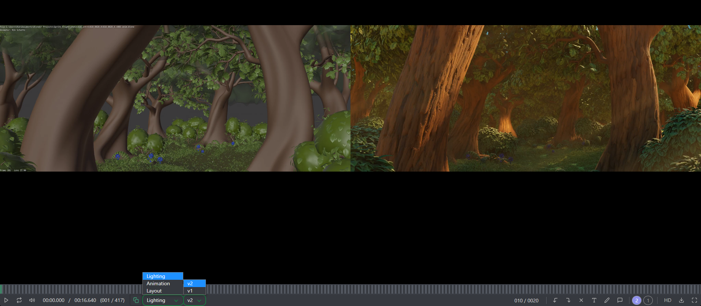

From there, you can change the status too if you want the Artist to perform some changes.

Alternatively, you can change it to  to notify the Artist that his work is approved.

## Review a Concept

Once your artists upload the concept, you can review it with the supervisor or the director.

To review the concept, you use the navigation menu at the top of the screen and select the concept page.

You can see all the concepts uploaded, the status, assignation, and linked assets.

To review a concept, click the status part to open the comment panel. You can enlarge the comment panel or go fullscreen.

Then, write a comment, select the status **Approved** or **Rejected**, and validate with the **Post** button.

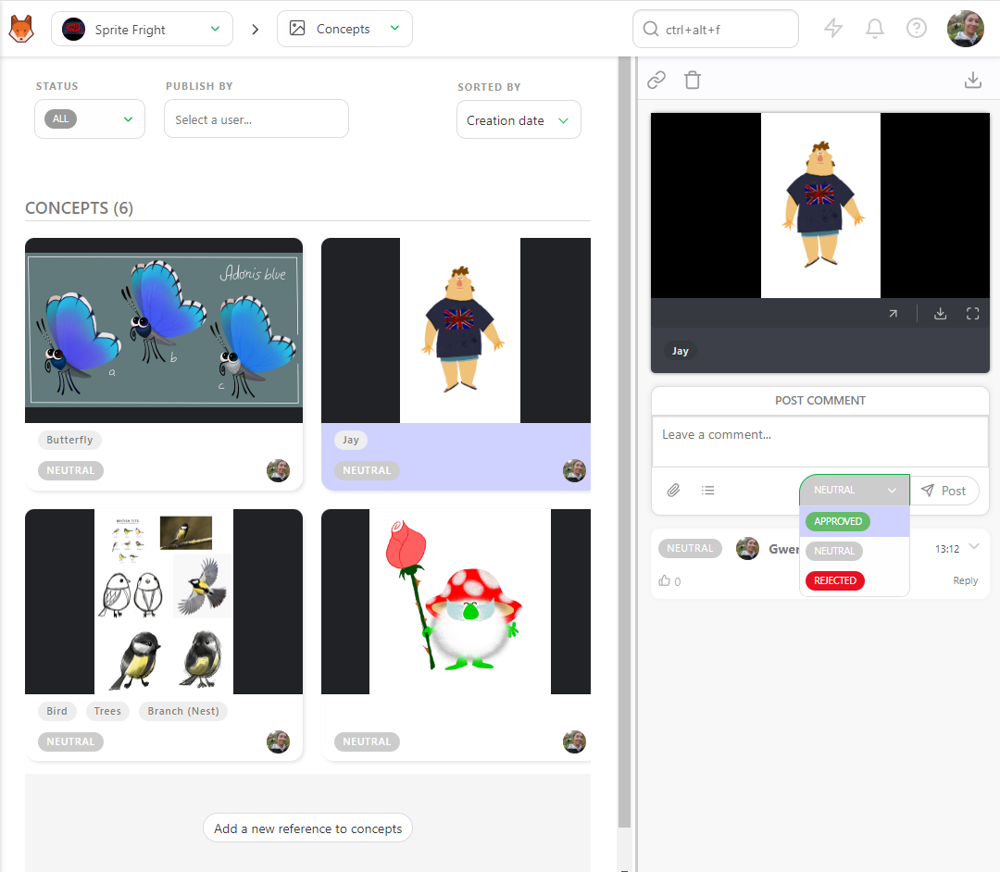

You can filter the page with the **Status** filter to display all the **Neutral** status concepts.

You can also filter per artist and change the order sort.

## Add Multiple Previews as one Version

You can add multiple images simultaneously, or once you have uploaded an image, you can add another one.

The **Add preview** pop-up asks you to choose a file.

You can navigate through the pictures uploaded.

You can change the preview order by clicking the number and then dragging and dropping them.

To delete an additional preview, you need to enlarge the comment panel by dragging it and clicking on the number of versions.

And then click on the 

## Change Status per Batch

Alternatively, you can do it per **batch**.

You can select multiple shots or assets by pressing the **ctrl** or
**shift** key.

Then, go to the **Change status** section on the action menu.

Choose the new status for your selected tasks (1). You can also add a comment for all the selected tasks (2)
You validate the new status with the **Confirm** button.

The shots are not sorted by name but by the metadata column information.

You can also select in the menu if you want to edit the name of the metadata column and its information or if you want to delete it.

You can also use the **CSV Import** to fill your custom metadata column quickly.
First, you must create your **Metadata column** into Kitsu, add it to your spreadsheet, and copy-paste your data into the **CSV Import**.

[Update Shots information with CSV Import](../feature/README.md#update-your-shots)

# Playlists

## Create a Playlist

You can find the **Playlists** page on the drop-down menu.

The **playlist** page is separated into two parts:

- (1) The playlist list where you can **create** a playlist or load an existing one.
- (2) The last created playlists and the last modified playlists

Start by creating a **Playlist**
. Your default name
is the date and the hour. You can change it immediately. You can choose if the playlist
will be shared with the **studio** or the **client** and if it's a **shot** or **asset** playlist.
You can also add a **Task Type** tag to the playlist.

Once the playlist created, via the search/filter bar, you can select which shots to add
to your playlist.

You can also choose to **add whole movie**, and it will add all the shots of the movie.

You can select **Daily pending**, which will add all the **WFA** tasks of the day.

Otherwise, you can **Add the whole sequence** if you want to focus only on a particular sequence.

You can use the same **filter** than on the global shot/asset page. For example, you can select all the
WFA short for the animation stage.
You have to type **animation=wfa** in the search bar. Valid your selection with the **Add selection** button.
Kitsu will select the shots that have the **WFA** status at the **Animation** stage, but Kitsu will automatically load **the latest uploaded version**.

The shots appear on the top part of the screen. Every change are
automatically saved.

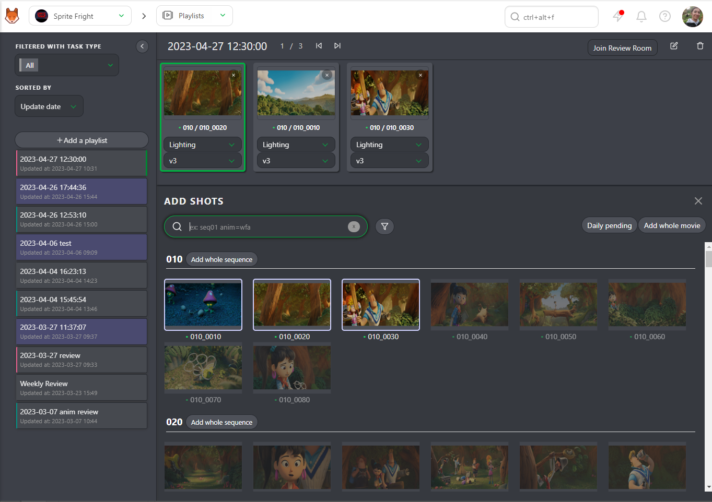

## Review and Validations

Once you have created a playlist; you have several options:

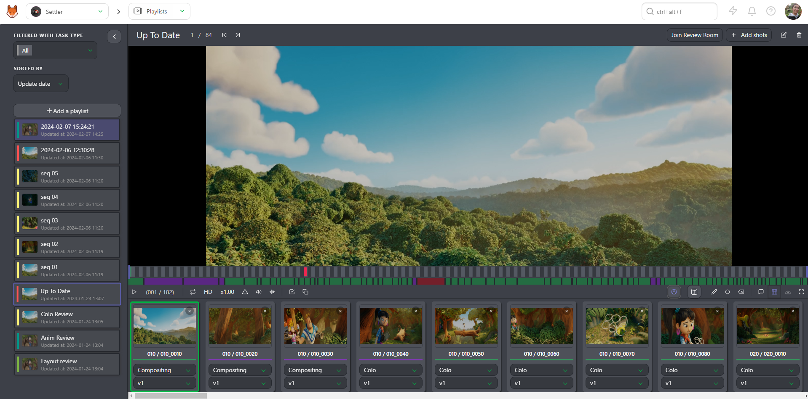

* Play or Pause
* Navigate from element to element
* See the position of the selected element compare to the total number of elements
* Mute or unmute the sound
* Change the speed, double speed (x2), full speed (x1), half of the speed (x0.50), or a quarter of the speed (x0.25)
* Loop on one element
* Display the sound wave
* Display annotations during the play
* TC of the element compared to the TC of the whole playlist
* Number of frame
* Navigate frame per frame on the preview. You can also do it with the arrow on the Keyboard.
* Compare tool

* Undo and Redo option for the drawing comment
* Text and drawing option, and delete selection

* Change the task type of all the elements of the playlist
* Display the comment section
* Hide the elements of the playlist
* Switch between LD (low definition) to HD (High definition)
* Download the playlist as a **Zip** files with all the separated elements, a **.csv** text file, or **Build .mp4** to create the whole movie (only for shots)
* Fullscreen

For each playlisted shot/asset, you can choose the **task** and the
**version** you want to see.

You can also play side by side two tasks of a shot.

Click on the **Compare** button  and choose the second task type.

The primary purpose of the playlist is to help you with the review of the shots and assets.

You can comment on the shots directly from the preview.

Click on the **comment** button.

You now have access to the right panel, with all the history of the comments and status.

You can see the drawing comment on the video (the red dot below the timeline).

You can draw or type on the video (same than
[Perform a review](../getting-started-production/README.md#perform-a-review)), with the **draw** button 

## Review Room

On top of the playlist you have a button to **Join Review Room**. The review room will synchronize all the participants.

Everybody in the review room will see in real time the play and pause, the shots and frame selection.

The people in the review room will also see the drawing annotation synchronized.

## Batch Upload Previews (as Thumbnails)

You can use the **Add Thumbnails** button  on the global page to massively import thumbnails.

A new pop-up opens and asks you to choose which task types the thumbnails are linked.

**Thumbnails batch import accept images files and video files**.

For the video files, only the first frame is used as the thumbnail.

You have to name your thumbnails as sequence_shot.

