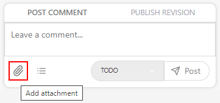
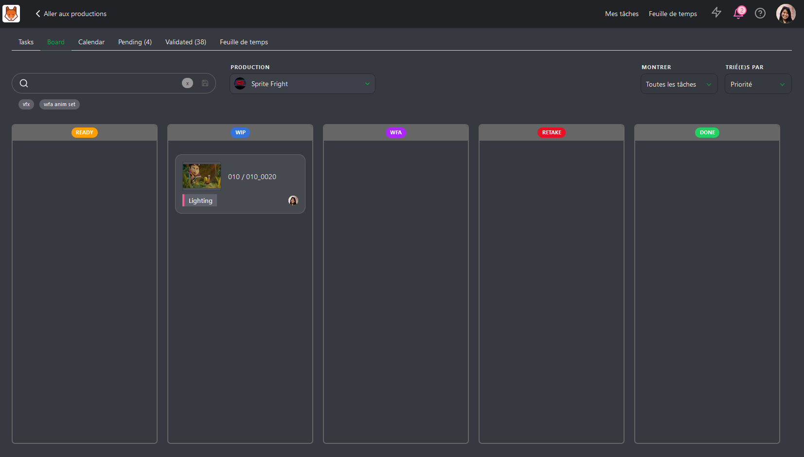

## Change Status and Add a Comment

In Kitsu, statuses serve as indicators reflecting the current state or progress of a task. You can easily see the current status at a glance and add comments to update team members when a status changes.

To change the status of a task and write a comment, click on the status of the task.

A panel will appear on the right where you can write a comment, change the status, and attach a file.

The **Comment Panel** is split into two tabs:
- POST COMMENT
- PUBLISH REVISION

You can change the **Status**, from the **POST COMMENT** tab.

Comments support the use of **Markdown**, which is a markup language used for formatting plain text in a simple, readable way. It allows users to add basic formatting elements such as headings, lists, bold and italic text, links and much more. For specific syntax, you can refer to the markdown guide website: [Markdown Guide](https://www.markdownguide.org/basic-syntax/).

You can also **tag** a team member in the comments to notify them directly. To do this, type `@`, which will open a submenu with a list of team members. Select the person you wish to notify, and upon submitting your comment, they will receive a notification.

You can also **tag** an entire department by typing '@' followed by the department's name.

You can also add checklist items to keep track of miscellaneous items that don't warrant their own task. To add a **checklist** to your comments, click the **Add checklist** button. The first item of the checklist will appear.

Hit **Enter** or click the button again to add more checklist items, and give each one a name.

To attach a file as a picture, click on the **Add attachment** button.

Select a **file from your hard drive** or paste a **screenshot**.

Validate the attachment by clicking on **Add file as attachment**.

Next, select the **Status** you wish to change the task to from the dropdown menu.

Finally, click the **Post** button to submit your comment and status update.

## Changing Statuses In Bulk

You can also change the status for multiple tasks at once.

Select multiple shots or assets by pressing **Ctrl / Cmd** or **Shift** and select the tasks you wish to include.

Then, go to the action menu's **Change status** section.

Choose the new status for your selected tasks (1). You can also add a comment for all the selected tasks (2). Save the new status with the **Confirm** button.

<!-- Everything from this point onward until the next comment doesn't make sense here. Previously we were talking about changing statuses in bulk, but now we're talking about sorting tasks and editing metadata columns. Is this supposed to be here? At the very least we should give it it's own heading or move it somewhere else -->

The shots are sorted by the metadata column information instead of by name.

In the menu, you can also choose to edit the name of the metadata column and its information or delete it.

You can quickly fill your custom metadata column using the **CSV Import**. First, create your **Metadata column** in Kitsu, add it to your spreadsheet, and copy-paste your data into the **CSV Import**.

[Update Shots information with CSV Import](../batch-action/README.md#update-shots-information-with-csv-import)

<!-- . -->

## Customize Statuses on the Artist Board Page

When you assign a task to an artist, it will appear on their to-do page when they log in.

While the default view shows their tasks in a traditional list view, they can also choose to display their tasks in a board view. Each **Status** will be be represented by a column, and the assigned tasks will be cards that can be dragged from status to status as the tasks progress.

To customize the board view, go to the settings page of your production.

Then go to the Task Status tab. You will see a list of the statuses used in your production.

These statuses will be used as the columns on the board page. You can drag and move the statuses to change their order as they appear in the board view.

Next, click on the **Board Status** section.

Here you can customize which permission roles can see what statuses on their **Board** page. 

To access this view, select the **Board** tab from the **My Tasks** page. Your team will see a page that looks similar to this

::: tip
Customizing which statuses appear in the **Board** view is set per permission role. It cannot be customized on an individual user basis. 
:::
<!-- pretty sure this is correct but want to verify -->
