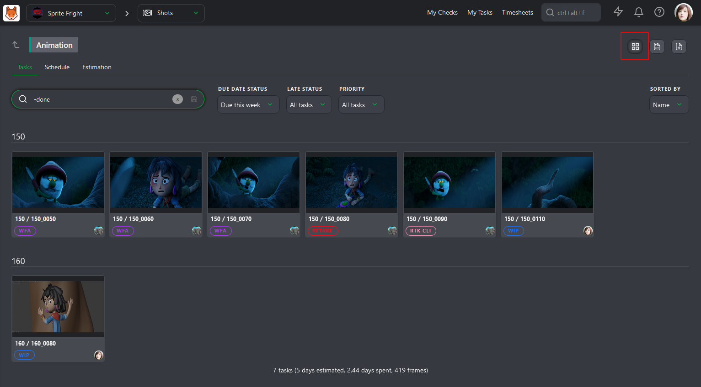

# Check and Supervise Your Tasks

## Check Your Tasks

A supervisor will typically have tasks assigned to them in addition to supervising your department. This means you need to split your time between completing your work and managing your team. Here's how to effectively manage what tasks you need to do.

When you log into Kitsu, you'll notice the **My Tasks** button at the top of the screen. This provides direct access to your **to-do list**. By default, the list is sorted by priority, so the task at the top are the ones recommended address first.

On the My Tasks page, you can filter the task list by Production, Task Type, Status, and other criteria.

To view more details about a task, click on its **Status** to open the comment panel. Here, you can comment on the task and publish a new revision if needed.

You can also use the Board to quickly update the status of multiple tasks by dragging and dropping into each status column.

## Check the Previews of Your Department

Now that everyone in your team knows what to do, you need to review their work. Typically, when an artist finishes a task, they will call you for a review. Frequent interruptions can be unproductive and make it difficult to maintain focus. To avoid this, set a specific timeframe for reviews. This approach benefits both you and your team by providing a structured schedule. Artists will know when they can expect feedback and can plan their work accordingly, while you can dedicate uninterrupted time to your own tasks.

<!-- Is this neccessary here, since it doesn't relate to Kitsu? -->

Click the **My Checks** button at the top of the screen to see a list of all your department's **WFA** tasks.

This list covers all relevant **Productions**, **Task Types**, and **Task Statuses**. As with other pages in Kitsu, you can click on a **Status** to open the **Comment Panel** on the right and review tasks one by one.

Alternatively, you can use the **Build playlist from list** button to create a playlist with all the tasks on the list. This playlist has the same options as other views, allowing you to open the comment panel, compare versions and task types, and add annotations.

Another option is to go to the **Task Type Page** and change the **Display as contact sheet**. For example, you can filter by **Due Date Status** and select **Due this week**.

From here, you can click on the contact sheet to open the comment panel or select several tasks to create a playlist.

## Check a Concept

When your artists upload a concept, you can review it through the navigation menu at the top of the screen by selecting the **Concepts** page.

On this page, you can see all uploaded concepts along with their status, assignment, and linked assets.

To review a concept, click on its status to open the comment panel. You can enlarge the comment panel or enter fullscreen. You can then write a comment, set the status as **Approved** or **Rejected**, and confirm your changes with the **Post** button.

You can narrow down the page using the **Status** filter to display all concepts with a **Neutral** status.

Additionally, you can filter by artist and change the sort order to better hone in on the data you need to review.