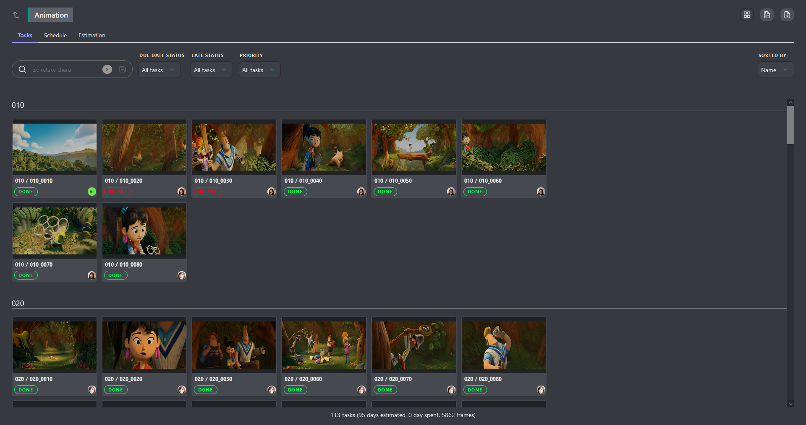
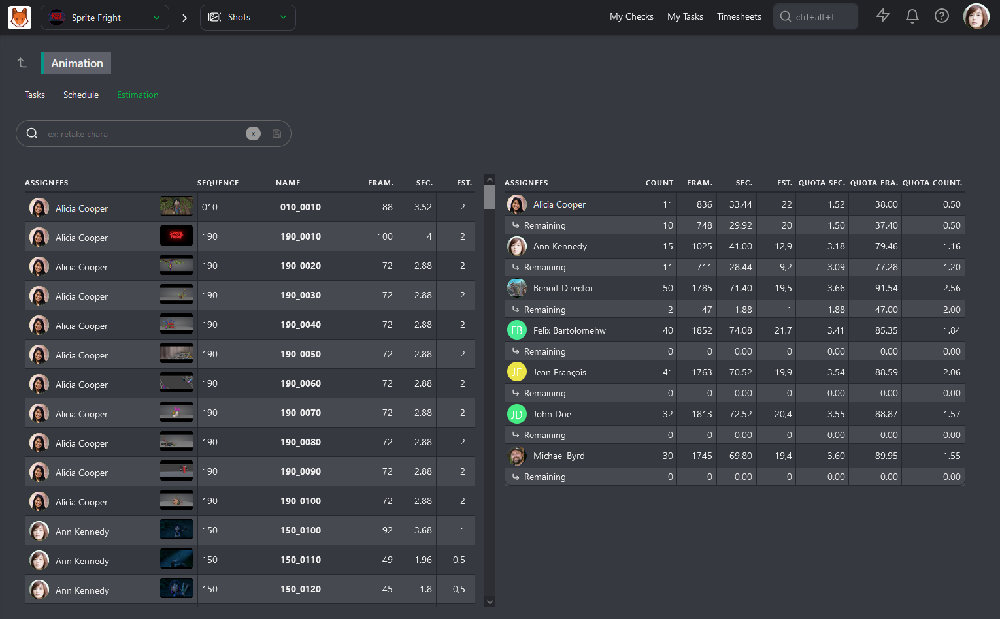
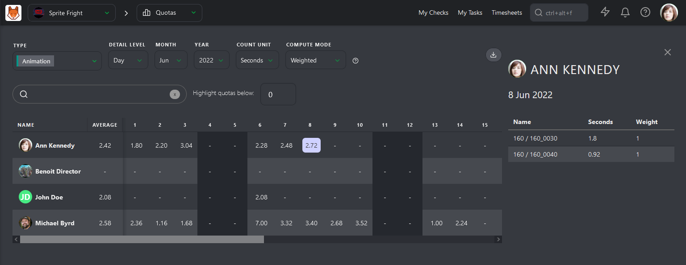

# Manage Your Department(s)

A supervisor's role is to oversee the creative and technical aspects of visual effects production, ensuring that the final output meets the project's artistic vision, quality standards, and deadlines. A key aspect of this is to ensure your team knows what they are working on.

## Assign and Estimate Tasks for Your Department

From the global shots / asset page, your view is automatically filtered by **My Department**. This shows you tasks from your departments **Task Type** and the **Custom Columns** linked to your department.

When you assign one or several tasks to someone, you will notice that you only have access to people from your department. This makes it faster to find the right artist for the task.

Now that you have assigned tasks to all your artists, it's time to fill in the **Estimates** for each task.

Click on the name of a **Task Type** column to open its dedicated page. On this page, you can access three tabs: **Tasks**, **Schedule**, and **Estimation**. We will focus on the last one.

The **Estimation** page is split into two parts. On the left, you have all the tasks sorted by artist, along with their number of frames and seconds. On the right, you have a summary of your team, with one line per artist showing the total number of assigned tasks, total number of frames and seconds, and the updated total number of estimated days.

With this information, Kitsu can calculate different estimated **Quotas**: **per Second**, **per Frame**, and **per Task**.

You can now fill the **Estimation** column on the left and see the result on the right. As soon as you fill in an **Estimation** for a task, the artist's row will update on the right.

This allows you to ensure the distribution of tasks among your team members is equal and helps to understand their estimated quotas for production. You should consider artist's experience and the difficulty of each task when doing this.

## Daily Supervision Tasks

Once the assignments and estimates are done, you can focus on the day-to-day operations. To easily see an overview of tasks from your department, you can click on your task type name from any page.

Once on the detail page, your first action is to click on the **Display tasks as a contact sheet**  button.

Now, you can easily hone in on tasks that require your attention using the built-in filters. For example, say you want to see only the tasks that are yet not complete yet. In this case, you can filter our tasks with the **-done** status, along with adding a **Due Date Status** filter, to show tasks that are **Due This Week**.

You can easily enable / disable filters to quickly hone in on the right information.

::: tip
If you need more information about a task, click on it's name to open the comment panel on the right.

:::

## Managing Your Department's Schedule

As a Supervisor, you can access your team's schedule from the main menu under the **Studio > Team Schedule** section.

From this page, you can see all the artists in your current department working on your project. You can expand a person's schedule to see the details of their tasks.

From there, you can:
- Move tasks to change their start and due dates.
- Adjust the length of tasks.
- Drag and drop tasks to reassign them to different team members.
- See days off.

<!-- Need to include screenshot here -->

## Managing Department Quotas

A quota refers to the specific amount of work or number of tasks an artist is expected to complete within a given timeframe, ensuring that the project progresses according to schedule and meets production deadlines.

At the beginning of production, while setting estimates for each task, you can also define estimated quotas for each of your artists. Once a task is approved, the remaining line on the Estimation tab of the Task Type page will update and display the remaining number of tasks and the updated estimated quotas.

You can monitor each team member to see if their estimated quotas stay within the initially established range.

To check their **Actual Quotas**, go to the **Quotas** page.

Kitsu has two ways to calculate quotas. The first is based on daily timesheets filled out by the artists. Quotas are calculated from when the artist fills out their first timesheet on a task until they stop.

The second way is based on status. The calculation starts with the **WIP** status and ends with the **WFA** status. This is **First Take** quotas, meaning that back-and-forth comments are not included in the calculation.

The first column, **Average**, is the most important. Kitsu calculates the average quotas for each artist per **Day**, **Week**, or **Month**.

## Supervise the Timesheets of Your Department

As a Supervisor, you may also be responsible for monitoring your team's hours. The Timesheet page shows how many hours they work daily, weekly, and monthly.

It's important to highlight abnormal patterns such as extra hours, sick days, or lack of vacation. The timesheet view can provide a high-level overview of where artists are spending their time, which can help you take care of your team to ensure they are not burning out.

