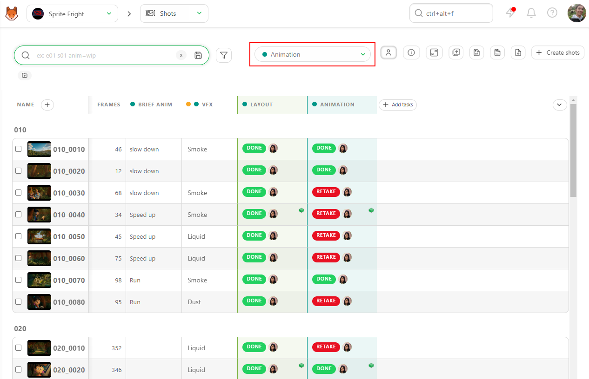
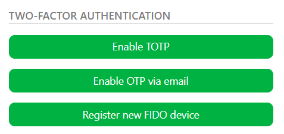

# Preparation of your Team

 Now that you have defined your workflow, 
 it's time to organize your team, so you have people to assign your Tasks to.

 We will learn how to add users to kitsu, link them to departement, give them permission, and finally add them to a production's team.

## Add Users and Link them to Departments

To assign tasks to people, you need first to create them an account into Kitsu.

::: warning Definition
As all the other elements in Kitsu, there is two libraries for the users.
The **People Page** (Global Library) is here to determine permission, contracts and department, the **Team Page** (Production Library) is here to give access to the production.
:::

Go to the **Main Menu** , and under the **STUDIO**
section, choose **People** page.

Then, click on the  button.

A creation window opens. You can enter the 
- first Name **MANDATORY** (1) 
- last name (2),
- Email **MANDATORY** (3), 
- and the phone number (4).

::: danger Important!
Unique email adress is **mandatory** to create an account
:::

You can add the new user to a **Department** (or several) (5).
::: details Departements details
Once someone is linked to a department, the user will directly access their department view on the global page.

The department supervisor will be able to comment on all the tasks from their department and assign only people from the same department(s).

Department will also affect the **My Check** page, and only display task related to your departement.

The timesheet page will also be filterd according to your deparment.
:::

Then you need to define the **role** of the user (6).

- **Artist**
::: details Artist Permission
Artists can only display the production of which they are part of.
They can only comment tasks, upload media, and change their status when they are assigned to it. They only have access to a limited number of status as the Studio manager defines it.

They can:

* Create personal filters on the global page and Task Type page.
* Edit their own comment
* Check the checklist on their assigned task
* Create playlist-on-the-fly for every shots or assets, but won't be able to save this playlist.
* Can't see client comments.

The first page of an Artist in Kitsu is their todo page.

::: tip
The Artist has access to all the features of the production, but only for display.

:::

- **Supervisor**
::: details Department Supervisors Permission
Department supervisors inherit Artist permissions.

Department supervisors have read and write access to their department(s) they work on:
assets, shots, tasks, assignations, statistics, breakdown, and playlists.

They can:

* Assign task to their team artist (same department)
* Post comment on all tasks or their department(s)
* Check a checklist on their own department
* Pin a comment
* Edit its own comment
* Add/edit a playlist for the studio or the client.
* See the client comments and validations.
* See comment on other departments.
* See the timesheets of his/her team departement(s)

They are not allowed to access the studio team, the main timesheets, and the
production list. They can't define task types, task statuses, and asset types
neither.
they can't comment on other departments than theirs, they can't assign artist from other department.
:::

- **Production Manager**
::: details Production Manager Permission
Production managers inherit Department supervisor permissions.

Production managers have read and write access to their production they work on:
assets, shots, tasks, assignations, statistics, breakdown, and playlists.

They can:

* Create assets and shots, per hand, or CSV batch import.
* Post comment on all tasks
* Edit any comment
* Check any checklist
* Pin any comment
* Add a task column
* Delete or add a task.
* Add/edit a playlist for the studio or the client.
* See the client comments and validations.

They are not allowed to access the studio team, the main timesheets, and the
production list. They can't define task types, task statuses, and asset types
neither.
:::

- **Studio Manager**
::: details Studio Manager AKA Administrator
Admin has read and write access to everything.

#### Create and edit a production

The Studio Manager can create a new production, define its type,
FPS, Ratio, and Resolution, and add a cover picture. He can also edit 
and delete any production.

#### Manage the studio

The Studio Manager sees everything in the studio:

* all the productions
* the global timesheets page
* the people in the studio
* the main schedule

In the People page, The Studio Manager **defines the permission of each user**.

They can also:

* Customize Kitsu: add and modify the task types, the task status, and the asset types.
* Set permission roles (artist, client and status).
* Customize the studio information as name Kitsu as the studio, add the company logo, and define the number of hours per day of work.
* Choose to use the original filename to download the media or not.

#### Manage productions

They have full access to all productions:

* They have same permission as the supervisor.
* And they can add a task column but can also delete one.
* They are allowed to create custom metadata columns.
:::

- **Vendor**
::: details Vendor Permission
Vendors have similar permissions than artists. The only difference is that they see only the tasks they are assigned to.

:::

- **Client**
::: details Clients Permission
The client can only display the production of which they are part of.

They see:

* The global page of the assets/shots.
* The stats pages.
* Client playlists with limited access to task status when they post a comment
* Only the Supervisors and the Studio Manager can see the Client retake or validation.

They don't see:

* assignations
* comments that they didn't write
:::

If the user is working right now, keep
him active; otherwise, select no. Validate by clicking the **Confirm** button.

::: danger Important!
Each user required an account to login into Kitsu. 
:::

::: details Add Employees from a CSV Spreadsheet File

You may already have your employee list ready in a spreadsheet file.
With Kitsu, you have two ways to import them; the first is to import a `.csv` file directly, the second is to copy-paste your data directly into Kitsu.

First, save your spreadsheet as a `.csv` file.

Then, go back to the people page on Kitsu, and click on the **Import** icon.

A pop-up window **Import data from a CSV** opens, click on **Browse** to pick your `.csv` file.

To see the result, click on the **Preview** button.
  
You can check and adjust the name of the columns with the preview of your data.

NB: the **Role** column is not mandatory.
 

Once everything is good, click on the **Confirm** button to import your data into Kitsu.

Now, you have all your people imported into Kitsu.

:::

## TWO-FACTOR AUTHENTICATION

Each user can choose if he wants to use the **TWO-FACTOR AUTHENTICATION** to login into Kitsu.

Users need to click on their avatar on the top right of the screen, then select **Profile**.

at the bottom of the page, they will find the **Two-factor Authentication**

## Add a User to the Team
Once you have your production created, you need to add usesr to a Team's production to allow them access. 
Being part of team also allows **assignation**.

::: tip
You don't need to add Studio manager to a team to give him access permission, but you won't be able to assign them a task.
:::

On a production, use the **navigation** dropdown menu (at the top of the page), select the **TEAM** page.

On the **Team** page, you can see all the assignees for a specific project.
Switch to the page's top if you want to check another project team.

